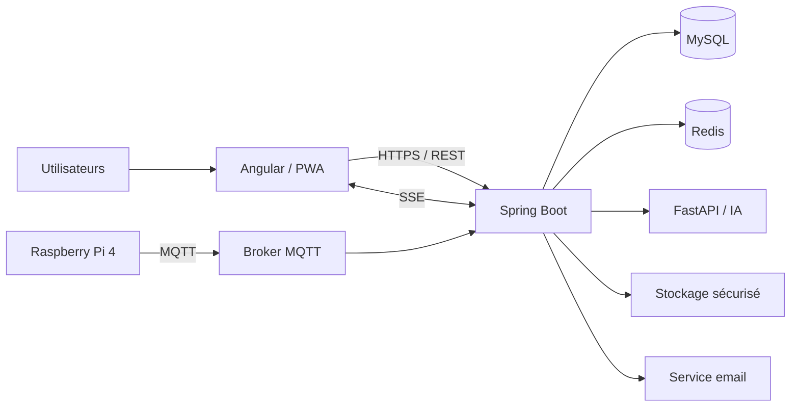
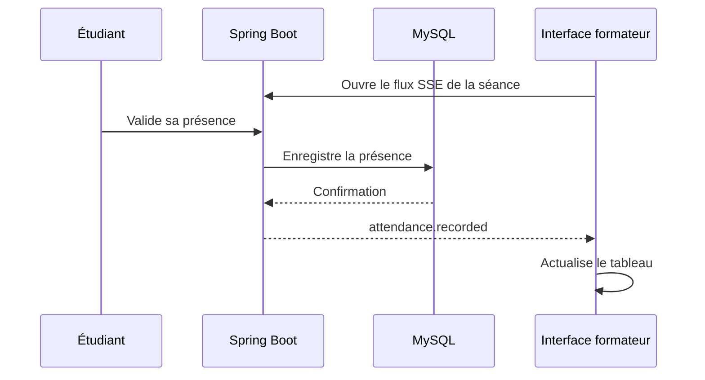
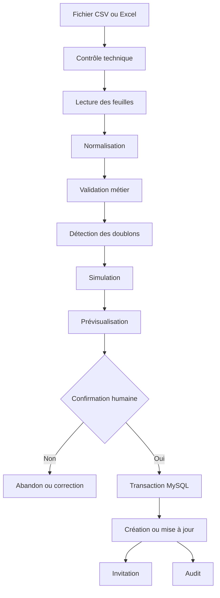
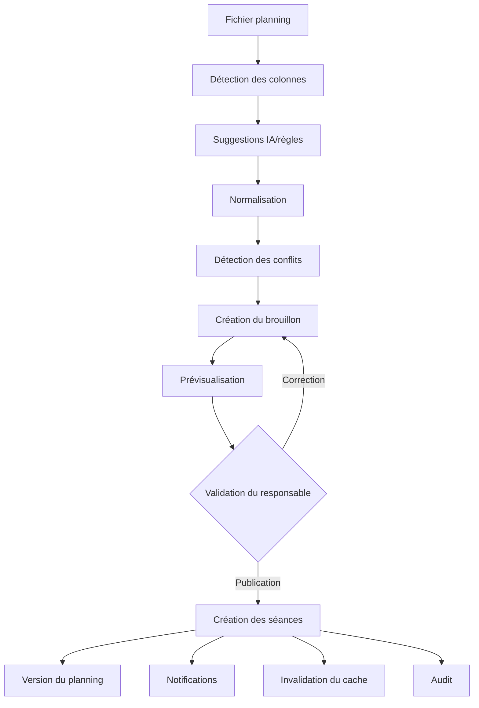
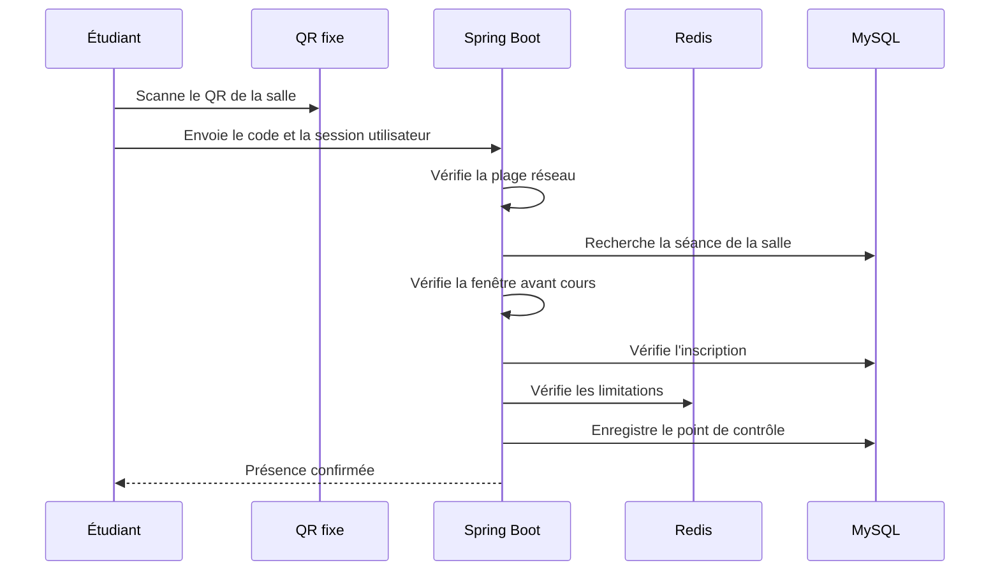
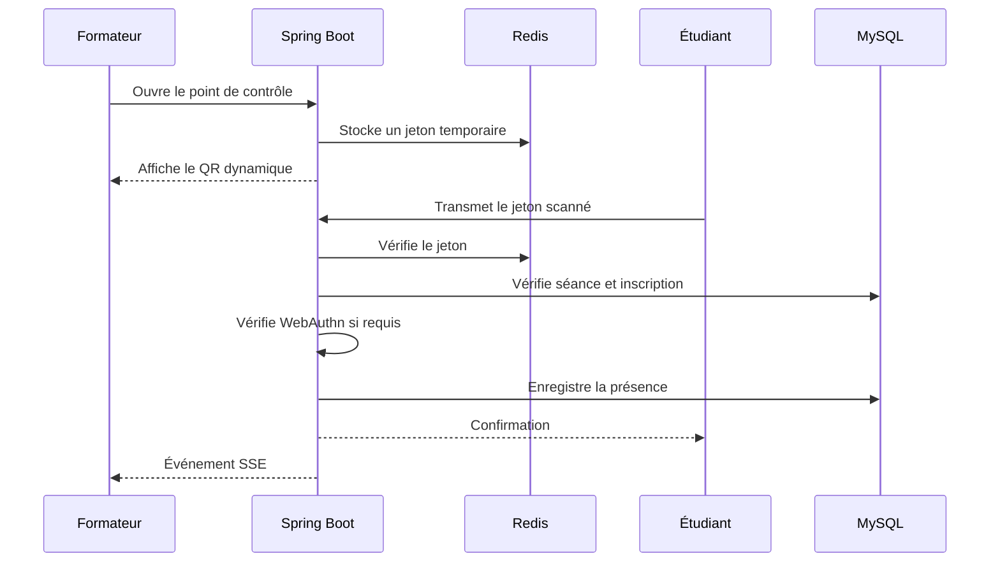
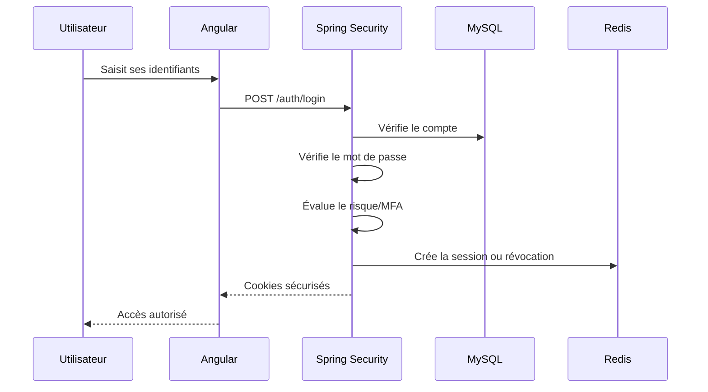
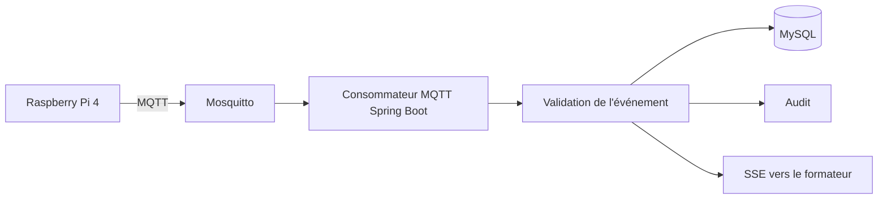
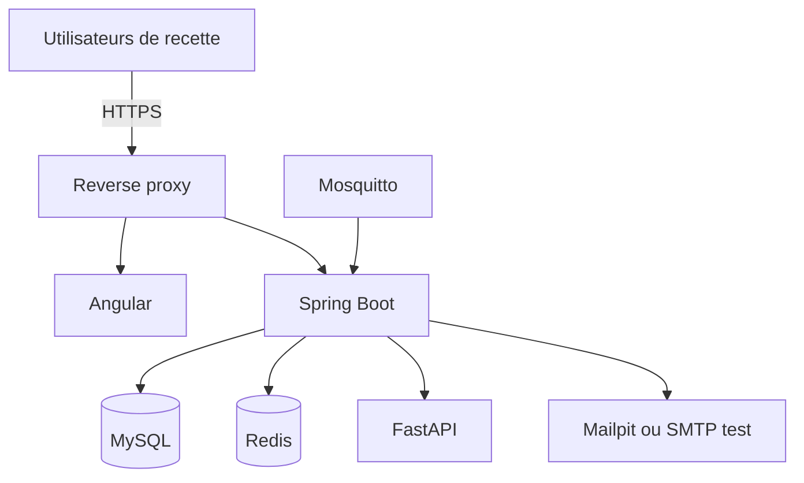
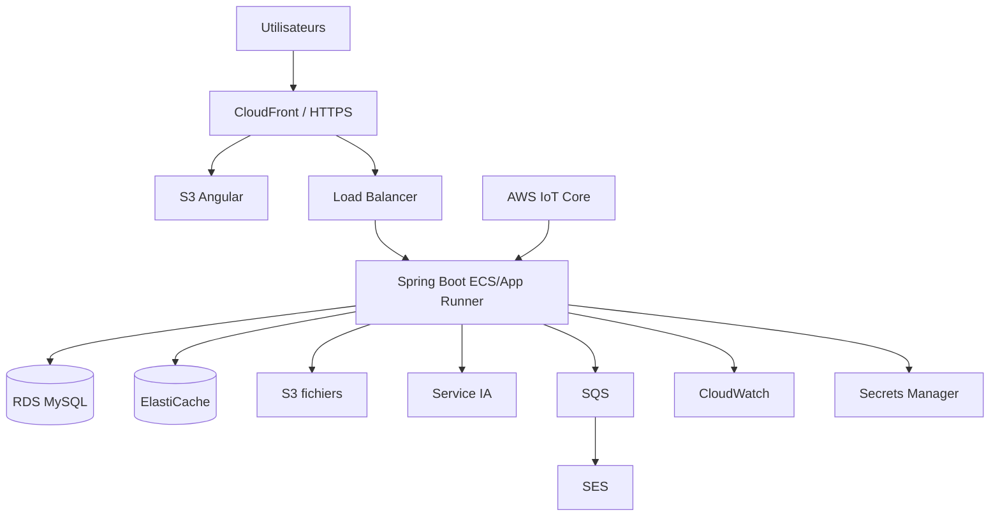

# Architecture du système — ESIC Connect

## Métadonnées

| Élément | Valeur |
|---|---|
| Projet | ESIC Connect |
| Type de document | Dossier d’architecture |
| Porteur | Abubacar AFOLABI |
| Certification | RNCP 39394 — Expert en systèmes d’information et sécurité |
| Version | 1.0 |
| Date | 27 août 2026 |
| Statut | Architecture de référence à valider |
| Dossier source | `projet_final` |
| Package Java | `com.esic.connect` |
| Architecture applicative | Monolithe modulaire en trois tiers |
| Déploiement initial | Local avec Docker Compose |
| Staging cible | VM cloud compatible Docker |
| Production cible | AWS |

---

# 1. Objet du document

Ce document décrit l’architecture fonctionnelle, applicative, technique,
logicielle, réseau et de déploiement d’**ESIC Connect**.

Il doit permettre :

- de comprendre les composants du système ;
- d’expliquer les choix techniques au jury ;
- de guider le développement ;
- de limiter les dépendances entre les modules ;
- de sécuriser les échanges ;
- de préparer les environnements ;
- de faciliter une future migration vers le cloud ;
- de garantir la cohérence avec le cahier des charges.

Les besoins métier restent définis dans :

- `docs/01-cadrage.md` ;
- `docs/02-cahier-des-charges.md`.

---

# 2. Synthèse de l’architecture retenue

ESIC Connect utilise :

- une architecture logique en trois tiers ;
- un monolithe modulaire pour le back-end ;
- une API REST sécurisée ;
- une PWA Angular pour l’interface ;
- MySQL comme source de vérité ;
- Redis pour le cache et les données temporaires ;
- FastAPI pour l’intelligence artificielle ;
- MQTT pour la Raspberry Pi ;
- SSE pour l’affichage en temps réel des présences ;
- Docker Compose pour la portabilité ;
- quatre environnements : local, test, staging et production.



---

# 3. Principes architecturaux

## 3.1 Séparation des responsabilités

Chaque composant possède une responsabilité principale :

| Composant | Responsabilité |
|---|---|
| Angular/PWA | Interface et expérience utilisateur |
| Spring Boot | Sécurité, règles métier et orchestration |
| MySQL | Données durables et cohérentes |
| Redis | Cache, sessions, jetons et limitations |
| FastAPI | Assistance IA |
| Mosquitto/MQTT | Communication avec la Raspberry Pi |
| Stockage de fichiers | Justificatifs et pièces jointes |
| Mailpit | Simulation locale des emails |

## 3.2 Source de vérité

MySQL est la source de vérité pour :

- les utilisateurs ;
- les rôles ;
- les formations ;
- les classes ;
- les inscriptions ;
- les plannings ;
- les séances ;
- les présences ;
- les corrections ;
- les justificatifs ;
- les réclamations ;
- les audits.

Une donnée présente uniquement dans Redis ne doit pas être considérée
comme une donnée métier définitive.

## 3.3 Sécurité côté serveur

Angular améliore l’expérience utilisateur, mais ne constitue pas une
barrière de sécurité.

Spring Boot doit contrôler :

- l’authentification ;
- les rôles ;
- le périmètre pédagogique ;
- la propriété des données ;
- les fenêtres d’émargement ;
- les fichiers ;
- les imports ;
- les rapports ;
- les actions sensibles.

## 3.4 Faible couplage

Les modules doivent communiquer :

- par leurs interfaces publiques ;
- par des services applicatifs ;
- ou par des événements métier.

Un module ne doit pas accéder directement aux classes internes d’un
autre module.

## 3.5 Portabilité

Les composants doivent pouvoir fonctionner :

- sur le poste local ;
- dans un pipeline de test ;
- sur une VM de staging ;
- dans une architecture AWS.

Les configurations spécifiques doivent être externes au code.

---

# 4. Architecture en trois tiers

## 4.1 Définition

Une architecture trois tiers sépare le système en trois couches
principales :

```text
Présentation
    ↓
Logique métier
    ↓
Données
```

## 4.2 Tier de présentation

Technologies :

- Angular ;
- Angular Material ;
- PWA ;
- TypeScript.

Responsabilités :

- afficher les écrans ;
- collecter les saisies ;
- appeler l’API ;
- afficher les erreurs ;
- recevoir les événements SSE ;
- gérer le cache non sensible du navigateur ;
- offrir une interface responsive et accessible.

Le front-end ne doit pas :

- décider seul des autorisations ;
- calculer seul le statut définitif d’une présence ;
- contenir des secrets ;
- se connecter directement à MySQL ou Redis.

## 4.3 Tier métier

Technologie :

- Java 21 ;
- Spring Boot ;
- Spring Security ;
- Spring Data JPA ;
- Flyway ;
- Spring Modulith ;
- OpenAPI ;
- Actuator.

Responsabilités :

- authentifier ;
- autoriser ;
- appliquer les règles métier ;
- valider les imports ;
- créer les séances ;
- calculer l’assiduité ;
- générer les jetons ;
- auditer les actions ;
- produire les rapports ;
- orchestrer l’IA, les emails et l’IoT.

## 4.4 Tier de données

Technologies :

- MySQL ;
- Redis ;
- stockage local sécurisé pour les fichiers.

Responsabilités :

- assurer la persistance ;
- garantir les contraintes ;
- conserver les historiques ;
- accélérer certaines lectures ;
- stocker les données temporaires ;
- conserver les pièces jointes hors de l’espace public.

---

# 5. Style applicatif : monolithe modulaire

## 5.1 Définition du monolithe

Un monolithe est une application back-end déployée sous la forme d’une
seule unité.

ESIC Connect possède donc :

- un seul projet Spring Boot ;
- un seul processus Java principal ;
- une seule API ;
- une seule configuration de sécurité ;
- une base MySQL principale.

## 5.2 Définition du monolithe modulaire

Le back-end est unique, mais il est divisé en modules métier
indépendants.

```text
Spring Boot
├── identity
├── academic
├── enrollment
├── planning
├── attendance
├── reporting
├── audit
├── notification
├── ai
└── iot
```

## 5.3 Raisons du choix

Ce choix est adapté parce qu’il offre :

- un déploiement simple ;
- des transactions locales ;
- une sécurité centralisée ;
- un débogage plus facile ;
- moins de configuration réseau ;
- une structure compréhensible ;
- une évolution possible vers des services séparés.

## 5.4 Pourquoi ne pas choisir des microservices

Les microservices ajouteraient :

- plusieurs projets ;
- plusieurs déploiements ;
- plusieurs configurations ;
- des appels réseau ;
- des transactions distribuées ;
- une observabilité plus complexe ;
- une gestion des erreurs plus difficile ;
- une surface d’attaque plus importante.

Ils ne sont pas nécessaires pour le volume initial d’ESIC Connect.

## 5.5 Évolution future

Un module pourra être extrait si :

- sa charge devient indépendante ;
- son cycle de déploiement devient différent ;
- son équipe devient autonome ;
- sa technologie exige une séparation ;
- ses données nécessitent une isolation.

Candidats possibles :

- intelligence artificielle ;
- notifications ;
- génération des rapports ;
- ingestion IoT ;
- intégrations Microsoft.

---

# 6. Utilisation de Spring Modulith

## 6.1 Objectif

Spring Modulith doit aider à :

- identifier les modules ;
- vérifier leurs dépendances ;
- éviter les cycles ;
- empêcher l’accès aux classes internes ;
- tester les modules ;
- documenter l’architecture.

Spring Modulith peut vérifier l’absence de cycles entre les modules et
contrôler l’accès à leurs interfaces publiques. ([docs.spring.io](https://docs.spring.io/spring-modulith/reference/1.3/verification.html?utm_source=openai))

## 6.2 Organisation des packages

Package racine :

```text
com.esic.connect
```

Modules proposés :

```text
com.esic.connect
├── identity
├── academic
├── enrollment
├── alternation
├── planning
├── room
├── coursesession
├── attendance
├── justification
├── claim
├── notification
├── reporting
├── audit
├── security
├── ai
├── iot
└── shared
```

## 6.3 Structure interne d’un module

Exemple :

```text
attendance/
├── AttendanceFacade.java
├── AttendanceEvent.java
├── package-info.java
└── internal/
    ├── AttendanceController.java
    ├── AttendanceService.java
    ├── AttendanceRepository.java
    ├── AttendanceEntity.java
    ├── AttendanceMapper.java
    └── dto/
```

Les éléments accessibles aux autres modules sont placés dans le package
principal.

Les détails internes sont placés dans `internal`.

## 6.4 Vérification architecturale

Un test doit vérifier la structure :

```java
class ModularityTest {

    @Test
    void verifiesApplicationModules() {
        ApplicationModules.of(EsicConnectApplication.class).verify();
    }
}
```

La vérification doit détecter :

- les cycles ;
- les accès illégaux aux packages internes ;
- les dépendances non autorisées.

## 6.5 Règles de dépendance proposées

```text
identity       → shared
academic       → identity, shared
enrollment     → identity, academic, shared
alternation    → academic, enrollment, shared
planning       → academic, enrollment, room, shared
coursesession  → planning, academic, identity, room, shared
attendance     → coursesession, enrollment, identity, shared
justification  → attendance, identity, shared
claim          → identity, attendance, coursesession, shared
notification   → identity, coursesession, planning, shared   (G1-D : consomme leurs événements publics)
reporting      → academic, enrollment, attendance, shared
audit          → identity, shared
ai             → planning, shared
iot            → attendance, coursesession, shared
```

## 6.6 Interdictions

- `attendance` ne doit pas modifier directement les tables du planning ;
- `reporting` ne doit pas modifier les données métier ;
- `notification` ne décide pas des règles métier ;
- `ai` ne publie pas directement un planning ;
- `iot` ne crée pas directement une présence sans validation métier ;
- aucun module ne contourne `identity` et `security`.

---

# 7. Modules du back-end

> **État réel d'implémentation (audit documentaire du 2 septembre 2026 —
> `main` = HEAD = `d3450e6`, lot G1 fusionné par la PR #40).**
>
> Les sous-sections §7.1 à §7.16 décrivent le **découpage cible** issu de
> la conception initiale. Le code réellement fusionné contient
> **14 modules Spring Modulith** (`ModularityTests` vert — aucune
> dépendance vers un package `.internal` d'un autre module, aucun cycle) :
>
> | Module réel (`com.esic.connect.`) | §7 correspondant | Migration(s) |
> |---|---|---|
> | `identity` | §7.1 | V1, V2, V3 |
> | `organization` | **remplace §7.6 `room`** (site / bâtiment / salle / plage réseau CIDR) ; écrans Angular livrés en G1-A | V4 |
> | `academic` | §7.2 (+ affectations pédagogiques et `AcademicScopeGuard`) | V5, V6 |
> | `enrollment` | §7.3 | V7 |
> | `alternation` | §7.4 | V8 |
> | **`planning`** | **§7.5 — implémenté au bloc G1-B** : import CSV, simulation sans écriture métier, conflits, publication atomique versionnée, création des séances via un **port public** | V12, V13 |
> | `coursesession` | §7.7 — séances manuelles **et** issues d'un planning publié (G1-B) ; cycle `PLANNED → OPEN → CLOSED` / `CANCELLED` (G1-C.1) ; remplacements de formateur (G1-C.2) | V9, V10, V13, V14 |
> | `attendance` | §7.8 (+ le justificatif de §7.9, **pièces jointes incluses** depuis G1-E : port `JustificationFileStorage`, contenu hors base et hors webroot ; et une partie du reporting de §7.12) | V9, V10, V16 |
> | `studentimport` | **nouveau** — import CSV contrôlé des apprenants (parcours d'import de §7.3) | V11 |
> | `notification` | §7.11 — email d'activation **+ centre de notifications persistantes** (G1-D : table `notification`, listeners `AFTER_COMMIT`, idempotence `dedup_key`, API `/api/v1/me/notifications`). **Pas de file persistante ni de DLQ, pas de push ; audience formateur uniquement** | V15 |
> | **`dashboard`** | **nouveau (G1-F)** — `GET /api/v1/me/dashboard` typé par rôle, lecture seule, agrégats bornés via ports publics, contexte de rôle vérifié côté serveur. Répond à CDC §25 de façon **partielle** | — |
> | `audit` | §7.13 | V1 |
> | `bootstrap` | **nouveau** — amorçage `demo` (6 comptes fictifs dont `SUPER_ADMIN`, profil `demo` uniquement) | — |
> | `shared` | §7.16 | — |
>
> **Architecture cible non implémentée** (aucun package, aucune table,
> aucun endpoint) :
>
> - **§7.9 `justification`** comme module **autonome** — le justificatif
>   et ses pièces jointes sont portés par `attendance` (le contenu des
>   fichiers vit sur le système de fichiers via le port
>   `attendance.JustificationFileStorage`, jamais en base).
> - **§7.10 `claim`** — réclamations / messagerie.
> - **§7.12 `reporting`** comme module autonome — les rapports et
>   l'export CSV vivent dans `attendance` ; pas d'export Excel, pas de
>   mise en page « officielle », pas de PDF.
> - **§7.14 `ai`** — service FastAPI, mapping de colonnes, score
>   d'anomalie. Le module `planning` livré est **CSV strict, sans
>   assistance IA** (CDC §13.10 reste une cible).
> - **§7.15 `iot`** — broker Mosquitto démarré par `compose.yaml`,
>   **aucun code back-end**.
>
> **Frontières réelles entre modules** (vérifiées par `ModularityTests`) :
> aucun module n'accède au repository ou à l'entité JPA d'un autre. Les
> échanges passent par des **ports publics** (interfaces + records
> d'UUID publics) et des **événements** :
>
> | Port public | Fournisseur → consommateur(s) | Objet |
> |---|---|---|
> | `coursesession.PlanningSessionWriter` | `coursesession` → `planning` | créer / réutiliser / superséder des séances à la publication (`DEC-G1-001`) |
> | `coursesession.CourseSessionDirectory` | `coursesession` → `planning`, `notification`, `dashboard` | fenêtres de séances, destinataires, séances à venir |
> | `academic.AcademicScopeDirectory`, `academic.ClassGroupDirectory` | `academic` → `planning`, `dashboard`, `studentimport` | périmètre pédagogique, résolution de classes **par lot** |
> | `enrollment.EnrollmentDirectory`, `enrollment.StudentEnrollmentProvisioner` | `enrollment` → `attendance`, `studentimport` | inscription active, création d'inscription à l'import |
> | `identity.StudentAccountProvisioner`, `identity.TeacherDirectory`, `identity.UserDirectory`, `identity.CurrentUserResolver` | `identity` → `studentimport`, `planning`, `notification`, `dashboard` | provisionnement de comptes, résolution d'utilisateurs |
> | `attendance.JustificationFileStorage` | port **sortant** de `attendance` → adaptateur local | stockage du contenu des pièces jointes hors base (`DEC-G1-008`) |
> | `alternation.AlternationDirectory` | `alternation` → `attendance`, `planning` | contexte `SCHOOL` / `COMPANY` / `UNKNOWN` |
> | `attendance.AttendanceDashboardDirectory`, `studentimport.StudentImportDashboardDirectory`, `identity.AccountStatsDirectory`, `organization.SiteDirectory` | → `dashboard` | agrégats bornés |
>
> | Événement public | Émetteur | Consommateur(s) |
> |---|---|---|
> | `planning.PlanningPublishedEvent` | `planning` | `notification`, `audit` |
> | `coursesession.CourseSessionChangeEvent` (+ `AttendanceCheckpointChangeEvent`) | `coursesession` | `notification`, `audit`, `attendance` |
> | `attendance.AttendanceChangeEvent`, `attendance.JustificationReviewedEvent` | `attendance` | `notification`, `audit` |
> | `identity.*Event`, `academic.AcademicChangeEvent`, `enrollment.*`, `alternation.*`, `organization.*`, `studentimport.StudentImportChangeEvent` | modules métier | `audit` |
>
> **Transactionnalité des événements** : `planning`, `coursesession`,
> `studentimport` et `notification` publient / consomment en
> `@TransactionalEventListener(AFTER_COMMIT)` — un rollback métier ne
> laisse **ni** notification **ni** trace d'audit de succès. **8 des 9
> listeners d'audit** restent des `@EventListener` **synchrones** en
> `REQUIRES_NEW` : dette assumée, décrite dans
> `docs/CURRENT-STATE.md`.
>
> Les §6.2, §6.5 et §6.6 (listes de modules et règles de dépendance)
> décrivent également le découpage cible et ne sont pas alignées sur les
> 14 modules réels ci-dessus.

## 7.1 `identity`

Responsabilités :

- utilisateurs ;
- rôles ;
- comptes ;
- activation ;
- suspension ;
- authentification ;
- WebAuthn ;
- MFA ;
- appareils de confiance.

## 7.2 `academic`

Responsabilités :

- formations ;
- niveaux ;
- promotions ;
- années scolaires ;
- classes ;
- matières ;
- responsabilités pédagogiques.

## 7.3 `enrollment`

Responsabilités :

- inscriptions ;
- historique des classes ;
- importation des apprenants ;
- changements de classe ;
- apprenants provisoires.

## 7.4 `alternation`

Responsabilités :

- rythmes d’alternance ;
- semaines école/entreprise ;
- exceptions collectives ;
- exceptions individuelles ;
- calcul des périodes attendues.

### État d’implémentation (lot TR-021, migration V8)

Module Spring Modulith `com.esic.connect.alternation` livré et testé
(voir `docs/CURRENT-STATE.md`) :

- agrégat `work_study_pattern` (modèle réutilisable de rythme :
  `THREE_DAYS_SCHOOL_TWO_DAYS_COMPANY`, `ONE_WEEK_SCHOOL_OUT_OF_FOUR`,
  `TWO_WEEKS_SCHOOL_OUT_OF_FOUR`, `CUSTOM` ; `configuration_json` validé
  et canonicalisé, aucune acceptation silencieuse d’une entrée
  incohérente) ;
- `class_work_study_pattern` : affectation historisée d’un rythme à une
  classe, avec `cycle_start_date` (l’ancre du cycle est portée par
  l’affectation, pas par le modèle), non-chevauchement des périodes
  ACTIVE d’une classe (adjacence stricte autorisée) et unicité SQL de
  l’affectation ACTIVE « ouverte » ;
- `student_schedule_exception` : exceptions individuelles rattachées à
  une inscription (`REMOTE_ALLOWED`, `ON_SITE_REQUIRED`,
  `COMPANY_PERIOD`, `VALIDATED_UNAVAILABILITY` ; annulation sans
  suppression) ;
- résolution du contexte `SCHOOL` / `COMPANY` / `UNKNOWN` pour une classe
  ou une inscription et une date (déterministe, bornes inclusives).
  **Mise à jour F2** : les modules `coursesession` et `attendance`
  **existent** (V9/V10, fusionnés) et le reporting d'assiduité consomme
  la résolution de contexte via le port `alternation.AlternationDirectory`
  (contexte `COMPANY` exclu du dénominateur). En revanche le module
  `planning` **n'existe toujours pas** : les « demi-journées attendues »
  reposent sur des séances exceptionnelles saisies à la main, et la
  résolution effective applique la seule priorité *structurelle* d'une
  exception individuelle sur le rythme.

Dépendances inter-modules, **uniquement via ports publics** (frontières
vérifiées par `ModularityTests`) :

- `identity.CurrentUserResolver` (auteur des écritures) ;
- `academic.ClassGroupDirectory` (résolution d’une classe et de son année
  scolaire) ;
- `academic.AcademicScopeDirectory` — **port ajouté par ce lot** :
  expose au module `alternation` le périmètre pédagogique effectif de
  l’appelant (`hasGlobalScope`, `isClassInScope`, `visibleClassGroupIds`)
  sans importer `AcademicScopeGuard`, qui reste interne à `academic` ;
- `enrollment.EnrollmentDirectory` — **port ajouté par ce lot** :
  résout une inscription (classe, année, statut exploitable) pour y
  rattacher une exception de calendrier, sans partage d’entité JPA.

Publie `alternation.AlternationChangeEvent`, consommé par `audit`
(`audit.internal.AlternationAuditListener`, catégorie `ALTERNATION`).

## 7.5 `planning`

Responsabilités :

- importation du planning ;
- simulation ;
- versions ;
- brouillons ;
- publication ;
- détection des conflits ;
- mapping intelligent.

## 7.6 `room`

Responsabilités :

- salles ;
- capacités ;
- QR fixes ;
- plages réseau autorisées ;
- équipements.

## 7.7 `coursesession`

Responsabilités :

- séances ;
- ouverture ;
- clôture ;
- annulation ;
- remplacement ;
- distanciel ;
- hybride ;
- points de contrôle.

Le nom `coursesession` évite toute confusion avec les sessions
d’authentification.

## 7.8 `attendance`

Responsabilités :

- jetons d’émargement ;
- QR dynamiques ;
- validations ;
- retards ;
- demi-journées ;
- corrections ;
- présences manuelles.

## 7.9 `justification`

Responsabilités :

- dépôt ;
- validation ;
- refus ;
- pièces jointes ;
- transformation d’une absence en absence excusée.

## 7.10 `claim`

Responsabilités :

- réclamations ;
- conversation ;
- transfert ;
- réouverture ;
- historique.

## 7.11 `notification`

Responsabilités :

- notifications internes ;
- emails ;
- préférences ;
- files de traitement ;
- nouvelles tentatives.

**État réel (bloc G1-D, 1er septembre 2026).** Le module est
**implémenté** pour les notifications internes persistantes : table
`notification` (`V15`, `dedup_key` UNIQUE), listeners
`@TransactionalEventListener(AFTER_COMMIT)` sur `planning.PlanningPublishedEvent`
et `coursesession.CourseSessionChangeEvent` (`CANCELLED` /
`SUBSTITUTION_ADDED` / `SUBSTITUTION_ENDED`), écriture idempotente
`REQUIRES_NEW` **par ligne** (`NotificationWriter` → `NotificationRowWriter`),
API `/api/v1/me/notifications` (liste paginée, `unread-count`, `read`,
`read-all`), front cloche + centre. **Destinataires dérivés serveur =
formateurs** (principal + remplaçants `ACTIVE` + remplaçant tout juste
terminé via `CourseSessionChangeEvent.affectedUserPublicIds`, G1-D.1).

**Garantie de livraison (audit G1-D.1).** Le modèle est **« au mieux »
après commit** : aucune notification sans commit métier, aucun rollback
métier sur échec de notification, aucune duplication (`dedup_key`
UNIQUE), **isolation par destinataire** (l'échec d'un destinataire
n'interrompt pas les suivants) — mais **pas de reprise** après crash JVM
entre le commit et l'écriture (dette **G1-D-OUTBOX** :
`notification_outbox` transactionnelle + worker `@Scheduled` idempotent).
`EF-NOTIF-002` / `RG-033` = `PARTIAL`.

Restent **non implémentés** : notifications aux **apprenants /
responsables pédagogiques** (nouveaux ports `enrollment` / `academic`
requis — dette **G1-D-AUDIENCE**), **préférences** par type (non
exigées), **email métier**, **push PWA**, **file persistante / DLQ** et
**purge / rétention** (`À_DÉFINIR`, `R-G1-30`) — dettes documentées dans
`docs/CURRENT-STATE.md`
(§ « Audit G1-D.1 ») et `docs/05-product-backlog.md` §9bis.

## 7.12 `reporting`

Responsabilités :

- rapports ;
- statistiques ;
- exports CSV ;
- exports Excel ;
- tableaux de bord.

## 7.13 `audit`

Responsabilités :

- piste d’audit ;
- consultation sécurisée ;
- traçabilité ;
- événements critiques.

## 7.14 `ai`

Responsabilités :

- appel du service FastAPI ;
- mapping de colonnes ;
- score de confiance ;
- décisions humaines ;
- journalisation des propositions.

## 7.15 `iot`

Responsabilités :

- dispositifs ;
- événements MQTT ;
- protection contre le rejeu ;
- télémétrie ;
- accusés de réception.

## 7.16 `shared`

Contenu limité :

- objets de valeur réellement communs ;
- erreurs communes ;
- types techniques transversaux ;
- identifiants ;
- horodatage.

Le module `shared` ne doit pas devenir un emplacement général contenant
toute la logique du projet.

---

# 8. Communication entre les modules

## 8.1 Appels synchrones

Les appels synchrones sont utilisés lorsqu’un résultat immédiat est
nécessaire.

Exemple :

```text
attendance
→ vérifie l’inscription dans enrollment
→ vérifie la séance dans coursesession
→ enregistre la présence
```

## 8.2 Événements métier

Les événements sont utilisés pour les réactions secondaires.

Exemple :

```text
AttendanceRecorded
├── notification envoie une confirmation
├── reporting invalide un calcul en cache
└── audit conserve la trace
```

## 8.3 Événements proposés

- `UserImported` ;
- `UserActivated` ;
- `SchedulePublished` ;
- `SessionModified` ;
- `TeacherSubstituted` ;
- `CourseSessionOpened` ;
- `AttendanceRecorded` ;
- `AttendanceCorrected` ;
- `JustificationAccepted` ;
- `ClaimTransferred` ;
- `SecurityAlertDetected`.

## 8.4 Transactions

La règle métier principale et la création de l’événement doivent être
effectuées dans une transaction cohérente.

Les traitements secondaires peuvent être différés.

---

# 9. Architecture front-end Angular

## 9.1 Organisation

```text
frontend/src/app/
├── core/
├── shared/
├── auth/
├── student/
├── teacher/
├── pedagogical-manager/
├── school-administration/
├── admin/
└── super-admin/
```

## 9.2 `core`

Contient :

- configuration ;
- client HTTP ;
- intercepteurs ;
- session ;
- gestion globale des erreurs ;
- service de notification ;
- connexion SSE.

## 9.3 `shared`

Contient :

- composants réutilisables ;
- tableaux ;
- dialogues ;
- formulaires ;
- validateurs ;
- types partagés.

## 9.4 Espaces par rôle

Chaque espace contient ses écrans métier.

Le chargement peut être différé avec le lazy loading.

## 9.5 Gestion des rôles

Angular peut masquer les éléments non autorisés.

Cependant, Spring Boot doit toujours contrôler l’autorisation réelle.

## 9.6 PWA

La PWA doit permettre :

- l’installation sur smartphone ;
- l’ajout à l’écran d’accueil ;
- la mise en cache des ressources statiques ;
- la consultation limitée du planning récent hors connexion ;
- la réception future de notifications push.

Les présences hors connexion ne doivent pas être définitivement validées
avant une vérification serveur.

---

# 10. Communication API

## 10.1 REST

Angular communique avec Spring Boot en HTTPS au moyen d’une API REST.

Format principal :

```text
JSON
```

Préfixe :

```text
/api/v1
```

## 10.2 OpenAPI

L’API doit fournir :

- la description des routes ;
- les paramètres ;
- les schémas ;
- les réponses ;
- les erreurs ;
- les exigences d’authentification.

## 10.3 Erreurs

Format proposé :

```json
{
  "timestamp": "2026-08-27T12:00:00Z",
  "status": 400,
  "code": "IMPORT_COLUMN_MISSING",
  "message": "La colonne email est obligatoire.",
  "path": "/api/v1/student-imports/simulate",
  "correlationId": "uuid",
  "details": []
}
```

## 10.4 Pagination

Les listes importantes doivent être paginées :

- utilisateurs ;
- apprenants ;
- séances ;
- audits ;
- réclamations ;
- notifications.

---

# 11. Mise à jour en temps réel avec SSE

## 11.1 Choix

SSE signifie **Server-Sent Events**.

Il permet au serveur d’envoyer des événements vers le navigateur sur une
connexion HTTP persistante.

## 11.2 Pourquoi SSE

Le besoin principal est unidirectionnel :

```text
Spring Boot → navigateur du formateur
```

Exemples :

- nouvelle présence ;
- correction ;
- apprenant provisoire ;
- clôture ;
- alerte.

SSE est plus simple qu’un WebSocket pour ce besoin.

## 11.3 Flux



## 11.4 Événements SSE

- `attendance-recorded` ;
- `attendance-updated` ;
- `guest-added` ;
- `session-closed` ;
- `anomaly-detected`.

## 11.5 Reconnexion

Le front-end doit :

- détecter la coupure ;
- se reconnecter ;
- actualiser les données ;
- éviter les doublons.

---

# 12. Architecture des données

## 12.1 MySQL

MySQL conserve les données métier durables.

Caractéristiques attendues :

- contraintes d’unicité ;
- clés étrangères ;
- transactions ;
- index ;
- migrations Flyway ;
- historique ;
- sauvegardes.

## 12.2 Redis

Redis conserve les données temporaires :

- jetons QR ;
- sessions ;
- rate limiting ;
- cache ;
- révocation ;
- codes courts ;
- permissions calculées.

## 12.3 Fichiers

Les justificatifs sont stockés :

- dans un dossier non public ;
- avec un nom technique ;
- avec des permissions limitées ;
- avec les métadonnées dans MySQL.

Chemin local indicatif :

```text
projet_final/data/uploads/
├── justifications/
└── claims/
```

Ce dossier ne doit pas être ajouté à Git.

## 12.4 Évolution cloud

En production, les fichiers pourront être placés dans :

- Amazon S3 ;
- ou un stockage objet compatible S3.

---

# 13. Architecture de l’importation

## 13.1 Import des apprenants



## 13.2 Import du planning



## 13.3 Principe de simulation

La simulation ne modifie pas les données définitives.

Elle produit un objet temporaire contenant :

- les lignes valides ;
- les avertissements ;
- les erreurs ;
- les créations ;
- les mises à jour ;
- les changements de classe ;
- les conflits.

---

# 14. Architecture de l’émargement

## 14.1 QR fixe de salle



## 14.2 QR dynamique



## 14.3 Génération du QR

Le QR visuel change toutes les 10 secondes.

Le jeton doit inclure ou référencer :

- la séance ;
- le point de contrôle ;
- une valeur aléatoire ;
- l’expiration ;
- une version.

Le serveur reste l’unique autorité de validation.

---

# 15. Architecture d’authentification

## 15.1 Connexion



## 15.2 Stockage

Les jetons sensibles sont placés dans des cookies :

- `HttpOnly` ;
- `Secure` en HTTPS ;
- `SameSite` adapté ;
- durée courte.

## 15.3 WebAuthn

WebAuthn est utilisé pour :

- enregistrer une passkey ;
- reconnecter un utilisateur ;
- confirmer une action sensible ;
- renforcer l’émargement.

Aucune donnée biométrique n’est transmise au serveur.

## 15.4 Authentification adaptative

Le système demande une preuve supplémentaire en cas de :

- nouvel appareil ;
- récupération du compte ;
- changement inhabituel ;
- modification d’un facteur ;
- action d’administration sensible.

---

# 16. Architecture de l’intelligence artificielle

## 16.1 Séparation du service

Le service IA est séparé du back-end principal :

```text
Spring Boot → HTTP interne → FastAPI
```

## 16.2 Justification

Python est retenu parce qu’il offre :

- pandas ;
- scikit-learn ;
- outils de normalisation ;
- bibliothèques d’analyse de fichiers.

## 16.3 Sécurité

Le navigateur ne communique pas directement avec FastAPI.

Seul Spring Boot appelle le service IA.

Spring Boot contrôle :

- les droits ;
- les données envoyées ;
- la validation ;
- la décision finale.

## 16.4 API interne indicative

```text
POST /internal/v1/import/mapping-suggestions
POST /internal/v1/import/normalize
POST /internal/v1/anomalies/score
GET  /internal/v1/health
```

## 16.5 Réponse indicative

```json
{
  "suggestions": [
    {
      "sourceColumn": "Nom complet",
      "targetColumn": "teacher_name",
      "confidence": 0.81,
      "status": "TO_REVIEW"
    }
  ],
  "warnings": []
}
```

## 16.6 Résilience

Si FastAPI est indisponible :

- l’import manuel reste possible ;
- le système affiche un avertissement ;
- la fonction IA est considérée comme une assistance ;
- aucune fonctionnalité métier critique ne doit être bloquée.

---

# 17. Architecture IoT

## 17.1 Flux



## 17.2 Raspberry Pi

La Raspberry Pi exécute un client Python léger.

Responsabilités :

- identification du dispositif ;
- publication d’un heartbeat ;
- publication d’un événement ;
- stockage local temporaire ;
- retransmission après reconnexion.

## 17.3 Broker MQTT

En local :

```text
Mosquitto
```

En production cible :

```text
AWS IoT Core
```

## 17.4 Sécurité des événements

Chaque événement doit contenir :

- `eventId` ;
- `deviceId` ;
- `sequence` ;
- `occurredAt` ;
- `eventType` ;
- référence pseudonymisée ;
- preuve d’authenticité.

Spring Boot doit contrôler :

- le dispositif ;
- le doublon ;
- la séquence ;
- la séance ;
- la fenêtre temporelle ;
- l’autorisation.

## 17.5 Absence de NFC

Le produit utilise :

- un bouton logiciel ;
- une page locale ;
- ou le téléphone comme déclencheur.

Un lecteur NFC sera ajouté ultérieurement.

---

# 18. Architecture des emails

## 18.1 Local

Mailpit permet :

- de capturer les emails ;
- de consulter les invitations ;
- de tester la réinitialisation ;
- d’éviter l’envoi réel.

## 18.2 Traitement asynchrone

```text
Événement métier
→ tâche email
→ worker
→ serveur SMTP
→ statut
```

## 18.3 Résilience

En cas d’échec :

- nouvelle tentative ;
- compteur ;
- dernière erreur ;
- statut ;
- future DLQ.

## 18.4 Production cible

Services possibles :

- Amazon SES ;
- Microsoft 365 ;
- prestataire SMTP approuvé.

---

# 19. Gestion des fichiers

## 19.1 Architecture locale

```text
projet_final/data/uploads/
```

Les fichiers sont montés comme volume Docker.

## 19.2 Métadonnées MySQL

MySQL contient :

- identifiant ;
- propriétaire ;
- type ;
- taille ;
- nom technique ;
- empreinte ;
- date ;
- statut ;
- durée de conservation.

## 19.3 Téléchargement

Le téléchargement passe toujours par Spring Boot.

Spring Boot contrôle :

- l’authentification ;
- le rôle ;
- la propriété ;
- le périmètre ;
- la présence réelle du fichier.

Aucun chemin interne ne doit être exposé.

---

# 20. Environnements

## 20.1 Vue générale

```text
local → test → staging → production
```

## 20.2 Local

Objectif :

- développer ;
- déboguer ;
- tester manuellement.

Configuration :

- Spring Boot lancé par Maven ;
- Angular lancé par npm ;
- MySQL dans Docker ;
- Redis dans Docker ;
- Mosquitto dans Docker ;
- Mailpit dans Docker ;
- FastAPI local ou Docker.

Profil Spring :

```text
local
```

## 20.3 Test

Objectif :

- tests automatisés ;
- tests d’intégration ;
- vérification des migrations ;
- vérification des modules.

Configuration :

- données temporaires ;
- services isolés ;
- Testcontainers si possible ;
- aucune dépendance aux données locales.

Profil Spring :

```text
test
```

## 20.4 Staging

Staging signifie préproduction.

Objectif :

- recette ;
- démonstration ;
- validation des conteneurs ;
- test du déploiement ;
- répétition avant production.

Le staging doit être proche de la production, mais utiliser :

- des données fictives ;
- des secrets distincts ;
- un domaine distinct ;
- une base distincte ;
- une messagerie de test.

Profil Spring :

```text
staging
```

## 20.5 Production

Objectif :

- utilisation réelle ;
- disponibilité ;
- sauvegardes ;
- supervision ;
- sécurité renforcée.

Profil Spring :

```text
prod
```

## 20.6 Isolation

Chaque environnement doit posséder :

- sa configuration ;
- sa base ;
- ses secrets ;
- ses URLs ;
- ses journaux ;
- ses fichiers.

Aucune donnée de production ne doit être copiée en test sans
anonymisation.

---

# 21. Configuration

## 21.1 Variables d’environnement

Exemples :

```text
SPRING_PROFILES_ACTIVE
MYSQL_HOST
MYSQL_PORT
MYSQL_DATABASE
MYSQL_USERNAME
MYSQL_PASSWORD
REDIS_HOST
REDIS_PORT
JWT_SECRET
AI_SERVICE_URL
MQTT_BROKER_URL
MAIL_HOST
MAIL_PORT
UPLOAD_DIRECTORY
ALLOWED_ORIGINS
```

## 21.2 Secrets

Les secrets ne doivent pas être stockés dans :

- Git ;
- `application.yml` versionné ;
- le code ;
- les images Docker.

Le dépôt contient seulement :

```text
.env.example
```

## 21.3 Profils Spring

```text
application.yml
application-local.yml
application-test.yml
application-staging.yml
application-prod.yml
```

Ces fichiers ne doivent pas contenir de secrets réels.

---

# 22. Docker et Docker Compose

## 22.1 Développement

Fichier principal :

```text
compose.yaml
```

Services d’infrastructure :

- MySQL ;
- Redis ;
- Mosquitto ;
- Mailpit.

## 22.2 Démonstration locale

Un fichier complémentaire peut conteneuriser :

- Spring Boot ;
- Angular ;
- FastAPI.

## 22.3 Staging

Docker recommande de pouvoir compléter la configuration Compose avec un
fichier spécifique à l’environnement, notamment pour le staging et la
production. ([docs.docker.com](https://docs.docker.com/compose/how-tos/production/?utm_source=openai))

Fichiers proposés :

```text
compose.yaml
compose.local.yaml
compose.staging.yaml
compose.production.yaml
```

Commande indicative :

```bash
docker compose \
  -f compose.yaml \
  -f compose.staging.yaml \
  up -d
```

## 22.4 Volumes

Volumes :

- données MySQL ;
- données Redis si persistance activée ;
- fichiers ;
- configuration Mosquitto ;
- journaux si nécessaire.

## 22.5 Réseau

Réseaux Docker :

```text
frontend-network
backend-network
data-network
iot-network
```

MySQL et Redis ne doivent pas être accessibles publiquement en staging
ou en production.

---

# 23. Arborescence du dépôt

```text
projet_final/
├── CLAUDE.md
├── README.md
├── .gitignore
├── .env.example
├── compose.yaml
├── compose.local.yaml
├── compose.staging.yaml
├── compose.production.yaml
│
├── backend/
│   ├── pom.xml
│   ├── Dockerfile
│   └── src/
│
├── frontend/
│   ├── package.json
│   ├── Dockerfile
│   └── src/
│
├── ai-service/
│   ├── requirements.txt
│   ├── Dockerfile
│   └── app/
│
├── iot-device/
│   ├── requirements.txt
│   ├── README.md
│   └── src/
│
├── infrastructure/
│   ├── nginx/
│   ├── mosquitto/
│   ├── mysql/
│   └── scripts/
│
├── data/
│   └── uploads/
│
├── docs/
│   ├── 01-cadrage.md
│   ├── 02-cahier-des-charges.md
│   ├── 03-architecture.md
│   ├── 04-modele-donnees.md
│   ├── 05-product-backlog.md
│   ├── 06-roadmap-six-mois.md
│   ├── 07-risques.md
│   ├── 08-securite-rgpd.md
│   ├── 09-strategie-tests.md
│   ├── 10-guide-utilisateur.md
│   ├── 11-guide-deploiement.md
│   ├── 12-prerequis-externes.md
│   ├── CURRENT-STATE.md
│   ├── demo-data/
│   └── diagrams/
│
├── tests/
└── scripts/
```

---

# 24. Architecture de staging gratuite

## 24.1 Choix initial

Le staging peut être déployé sur une VM cloud compatible Docker.

L’option initialement retenue est une VM Oracle Cloud Always Free, sous
réserve de disponibilité dans la région et du maintien des conditions de
l’offre.

Oracle documente toujours des ressources Always Free, dont les
ressources Compute éligibles signalées dans sa console. ([docs.oracle.com](https://docs.oracle.com/en-us/iaas/Content/FreeTier/freetier_topic-Always_Free_Resources.htm?trk=public_post_comment-text&utm_source=openai))

## 24.2 Déploiement de staging



## 24.3 Limites

Une offre gratuite peut avoir :

- des ressources limitées ;
- une indisponibilité régionale ;
- des conditions évolutives ;
- une suppression en cas d’inactivité ;
- une architecture ARM.

L’environnement de recette ne doit donc pas être l’unique support d’une démonstration.

Une démonstration locale et une vidéo de secours restent obligatoires.

---

# 24bis. État réel du déploiement (2 septembre 2026)

> Les §24, §25, §26, §28 et §29 décrivent des **cibles**. Rien n'en est
> déployé. L'état réel est le suivant :

| Sujet | Réel | Cible documentée |
|---|---|---|
| Exécution | **local uniquement** — `docker compose` (MySQL 8.4, Redis 7.4, Mailpit, Mosquitto) + `./mvnw spring-boot:run` + `ng serve` | §24 staging, §25 AWS |
| HTTPS / TLS | **aucun** — HTTP en clair sur `localhost` ; HSTS non exigé et non testé en HTTP | §26 |
| Redis | consommé **uniquement** pour les jetons d'émargement (jeton opaque + code court, TTL, rotation, purge après commit). Indisponibilité ⇒ `503 ATT_TOKEN_BACKEND_UNAVAILABLE`, **jamais** de validation dégradée | cache de planning, rate-limiting, droits calculés (§17 de `docs/02`) |
| Stockage de fichiers | **système de fichiers local**, répertoire `app.attendance.justification-storage-path` **hors webroot** (défaut `${UPLOAD_DIRECTORY}/justifications`). Clé opaque dispersée `aa/bb/<uuid>`, écriture temporaire + **déplacement atomique**, garde anti-traversal. **Non persistant sur un hébergement éphémère** : le port `attendance.JustificationFileStorage` est prévu pour un adaptateur objet (S3…) sans toucher au métier | §25 (S3) |
| Messagerie | SMTP local **Mailpit**, envoi asynchrone ; échec seulement journalisé | SES + file + DLQ |
| MQTT / IoT | broker Mosquitto **démarré**, **aucun code back-end** ne s'y connecte | §25 (IoT Core) |
| Supervision | `/actuator/health` seul, `show-details: never` | métriques, logs JSON structurés (§27) |
| Sauvegarde / restauration | **non outillée, jamais testée** | §28 |
| Haute disponibilité | **aucune** (instance unique) | §29 |
| CORS | **restrictif**, piloté par `APP_ALLOWED_ORIGINS`, jamais `*`, `allowCredentials=false` (le jeton circule dans `Authorization`) | — |
| En-têtes HTTP | `nosniff`, `X-Frame-Options: DENY`, anti-cache, **CSP** (`script-src 'self'`), `Referrer-Policy: no-referrer` — testés par `HttpSecurityHeadersIntegrationTests` | — |

Aucune de ces cibles ne doit être présentée comme livrée.

# 25. Architecture AWS cible

## 25.1 Vue cible



## 25.2 Services cibles

| Besoin | Service cible |
|---|---|
| Front-end | S3 + CloudFront |
| Back-end | ECS, App Runner ou EC2 |
| Base | RDS MySQL |
| Cache | ElastiCache/Valkey |
| Fichiers | S3 |
| Email | SES |
| File | SQS |
| DLQ | SQS DLQ |
| IoT | AWS IoT Core |
| Secrets | Secrets Manager |
| Logs | CloudWatch |
| Protection | WAF |
| Certificats | ACM |

## 25.3 Positionnement

Cette architecture est une cible professionnelle.

Elle ne doit pas être décrite comme réellement déployée tant que les
preuves de déploiement n’existent pas.

---

# 26. Sécurité réseau

## 26.1 Local

- ports ouverts uniquement si nécessaires ;
- mots de passe de démonstration ;
- données fictives ;
- accès Raspberry Pi limité au réseau local.

## 26.2 Staging

- HTTPS ;
- pare-feu ;
- MySQL non public ;
- Redis non public ;
- SSH limité ;
- secrets hors de l’image ;
- sauvegarde ;
- domaine de staging distinct.

## 26.3 Production

- sous-réseaux publics et privés ;
- principe du moindre privilège ;
- WAF ;
- rotation des secrets ;
- supervision ;
- alertes ;
- sauvegardes ;
- restauration ;
- journalisation centralisée.

---

# 27. Observabilité

## 27.1 Actuator

Endpoints contrôlés :

- santé ;
- informations ;
- métriques ;
- architecture des modules si activée.

Spring Modulith peut exposer la structure des modules via Actuator et
fournir de l’observabilité sur leurs interactions. ([docs.spring.io](https://docs.spring.io/spring-modulith/reference/production-ready.html?utm_source=openai))

## 27.2 Métriques

- temps de réponse ;
- taux d’erreur ;
- sessions actives ;
- connexions échouées ;
- taux de cache ;
- imports ;
- validations de présence ;
- événements MQTT ;
- emails en échec.

## 27.3 Corrélation

Chaque requête importante doit recevoir un identifiant de corrélation.

Cet identifiant doit pouvoir relier :

- la requête ;
- les logs ;
- l’audit ;
- les appels FastAPI ;
- les événements secondaires.

---

# 28. Sauvegarde et reprise

## 28.1 Données à sauvegarder

- MySQL ;
- fichiers ;
- configuration ;
- scripts de déploiement ;
- secrets par leur gestionnaire dédié.

## 28.2 Prototype

Une sauvegarde locale peut utiliser :

- `mysqldump` ;
- archive des fichiers ;
- script documenté.

## 28.3 Restauration

La procédure doit tester :

1. restauration de MySQL ;
2. restauration des fichiers ;
3. redémarrage ;
4. exécution des migrations ;
5. contrôle de santé ;
6. vérification d’un utilisateur et d’une présence.

## 28.4 Objectifs cibles

Les valeurs RPO et RTO seront définies avant une production réelle.

Proposition initiale :

```text
RPO cible : 24 heures
RTO cible : 4 heures
```

---

# 29. Résilience

## 29.1 Indisponibilité de Redis

Le système doit :

- refuser proprement les nouveaux QR si leur sécurité dépend de Redis ;
- continuer certaines lectures non mises en cache ;
- produire une erreur compréhensible ;
- ne pas perdre les présences déjà enregistrées.

## 29.2 Indisponibilité de FastAPI

- import manuel disponible ;
- avertissement ;
- aucune publication automatique ;
- reprise ultérieure.

## 29.3 Indisponibilité du broker MQTT

La Raspberry Pi :

- place les événements en file locale ;
- tente une reconnexion ;
- republie avec le même `eventId`.

Spring Boot doit détecter les doublons.

## 29.4 Indisponibilité des emails

- mise en attente ;
- nouvelle tentative ;
- affichage du statut ;
- aucune annulation de l’opération métier principale.

---

# 30. Décisions d’architecture — ADR

Les décisions structurantes sont consignées ici, avec leur contexte,
leurs conséquences et leur date. Les identifiants sont **stables** : ils
sont cités dans le code et dans les migrations, et ne doivent jamais être
réattribués.

> **Note de traçabilité.** Les migrations `V10` à `V16` citent en
> commentaire l'ancien chemin `docs/reports/G1_ARCHITECTURE_DECISIONS.md`,
> supprimé le 3 septembre 2026. Ces commentaires sont **volontairement
> laissés intacts** : modifier une migration déjà appliquée invalide sa
> somme de contrôle Flyway et casse toute base existante. Les décisions
> `DEC-G1-*` qu'ils citent sont reprises ci-dessous sous les mêmes
> identifiants.

## DEC-G1-001 à DEC-G1-012 — module planning et pièces jointes

| Réf | Décision |
|---|---|
| `DEC-G1-001` | L'identité d'un créneau de planning est stable et déterministe (`course_session.planning_slot_public_id`) : une republication retrouve la séance existante au lieu d'en créer une seconde. |
| `DEC-G1-002` | `planning` ne partage aucune entité JPA avec `coursesession` : l'écriture passe par le port public `PlanningSessionWriter`. |
| `DEC-G1-003` | La correction d'une ligne d'import se fait, dans un premier temps, par annulation du travail puis réimport. La correction ligne à ligne est planifiée (EF-PLAN-003, sprint 5). |
| `DEC-G1-004` | Le cycle de vie d'une séance est strict et sans réouverture : `PLANNED → OPEN → CLOSED`, plus `CANCELLED` avec motif. |
| `DEC-G1-006` | Un créneau tombant sur une période d'alternance en entreprise produit un **avertissement**, jamais un blocage. |
| `DEC-G1-007` | Les notifications sont produites après commit et rendues idempotentes par une empreinte de déduplication. |
| `DEC-G1-008` | Le contenu d'une pièce jointe est stocké hors base et hors répertoire public ; seule sa description est en base. |
| `DEC-G1-009` | La séquence base ↔ fichier est compensée, et les lignes restées en attente de stockage sont réconciliées par une tâche planifiée. |
| `DEC-G1-010` | Le coût SQL du tableau de bord manager reste linéaire en nombre de séances ; le chargement par lot est une dette identifiée (T-03). |
| `DEC-G1-012` | Toute table métier porte un identifiant public UUID distinct de sa clé primaire. |
| `DEC-G1-E-ANTIVIRUS` | Aucune analyse antivirus n'est en place : les contrôles sont **structurels** (extension, type déclaré, contenu réel, taille). Ne jamais écrire que les fichiers sont garantis sans logiciel malveillant. Levée prévue au sprint 9. |

## DEC-S2-001 — la limitation de débit laisse passer si Redis est indisponible

**Contexte.** La limitation de débit protège la connexion, la demande de
réinitialisation et la consommation d'un jeton (EF-AUTH-012). Ses
compteurs vivent dans Redis. Que faire lorsque Redis ne répond pas ?

**Options.** Refuser toute requête limitée (*fail closed*) ; ou la laisser
passer en journalisant l'incident (*fail open*).

**Décision.** *Fail open*, avec journalisation en `WARN`.

**Conséquences.** Refuser fermerait l'authentification à **tous** les
utilisateurs légitimes dès qu'une dépendance de simple protection tombe :
la panne d'un garde-fou deviendrait un déni de service complet,
déclenchable de l'extérieur en s'attaquant à Redis. Pendant une telle
panne, les contrôles de fond restent actifs — hachage BCrypt, réponse
uniforme, audit de chaque tentative — et seule la borne de fréquence
disparaît.

Ce choix est **l'inverse** de celui retenu pour l'émargement, où
l'indisponibilité de Redis produit un `503` : là, Redis porte
l'**autorité** de la décision (le jeton n'existe nulle part ailleurs), et
non une protection périphérique. La règle générale est donc : *fail open*
pour une protection, *fail closed* pour une autorité.

**Statut.** Adoptée le 3 septembre 2026.

## DEC-S2-002 — révocation des jetons : deux mécanismes distincts

**Contexte.** L'API est sans état. Un JWT reste cryptographiquement
valide jusqu'à son expiration, y compris après une déconnexion ou un
changement de mot de passe (EF-AUTH-014, RG-010).

**Décision.** Deux mécanismes complémentaires, vérifiés à chaque requête
par un `OAuth2TokenValidator` :

1. **liste de refus Redis**, indexée par `jti`, avec une durée de vie
   égale au temps restant du jeton — c'est la déconnexion d'**une**
   session ;
2. **colonne `user_account.credentials_invalidated_at`** — tout jeton
   dont le claim `iat` est antérieur est refusé. C'est la révocation
   **globale** : changement de mot de passe, suspension, incident. Elle
   couvre les jetons dont l'identifiant est inconnu du serveur, ce que la
   liste de refus ne peut pas faire.

**Conséquences.** Le claim `iat` n'a qu'une précision à la seconde. La
révocation globale est donc arrondie à la seconde **supérieure**, et
l'émission d'un jeton date l'`iat` au plus tard entre l'instant courant et
cette borne : sans cela, une reconnexion immédiate après une révocation
produirait un jeton aussitôt rejeté pendant près d'une seconde.

Une panne de Redis n'invalide pas les sessions en cours : la liste de
refus répond « non révoqué », tandis que la révocation qui compte —
celle qui suit un changement de mot de passe — repose sur MySQL et reste
appliquée.

**Statut.** Adoptée le 3 septembre 2026.

## DEC-S2-003 — l'audit des changements de mot de passe est publié après commit

**Contexte.** Huit écouteurs d'audit sont des `@EventListener` synchrones
en `REQUIRES_NEW`. Ce motif suspend la transaction appelante pour écrire
la trace dans une transaction dédiée.

**Décision.** Les écouteurs d'audit ajoutés à partir du sprint 2 écoutent
en `AFTER_COMMIT`.

**Conséquences.** Une transaction qui change un mot de passe a déjà
modifié — donc verrouillé — la ligne `user_account` concernée. Un
écouteur synchrone en `REQUIRES_NEW` tenterait d'insérer un
`audit_event` dont la clé étrangère `actor_user_id` pointe vers cette
ligne : la nouvelle transaction attendrait un verrou que seule l'ancienne
peut libérer, jusqu'au *lock wait timeout*. Le défaut a été observé
(cinquante secondes d'attente puis échec) avant d'être corrigé.

Publier après le commit supprime la situation et donne la bonne
sémantique : une transaction annulée ne laisse aucune trace (RG-097). La
migration des huit écouteurs restants vers une outbox est la dette T-01,
planifiée au sprint 10.

**Statut.** Adoptée le 3 septembre 2026.

## DEC-S2-004 — le contrôle anti-robot laisse passer si Cloudflare est injoignable

**Contexte.** `EF-AUTH-011` protège la connexion (après échecs répétés),
la demande de réinitialisation et l'activation de compte par Cloudflare
Turnstile. La vérification du jeton exige un appel sortant vers
Cloudflare. Que faire quand cet appel échoue ?

**Décision.** Un fournisseur injoignable produit un verdict
`providerUnavailable` qui **laisse passer**, avec journalisation en
`WARN`. Un jeton explicitement refusé par Cloudflare, lui, bloque.

**Conséquences.** Refuser en cas de panne du tiers transformerait
l'indisponibilité d'un service externe en panne totale de la connexion et
de la réinitialisation de mot de passe — un déni de service déclenchable
depuis l'extérieur, contre un produit dont la disponibilité est une
exigence. Les protections propres au produit restent actives pendant ce
temps : limitation par identité et par origine, réponse uniforme, audit
de chaque tentative, verrouillage progressif.

C'est le même arbitrage que `DEC-S2-001` : la panne d'un garde-fou ne
doit pas devenir une porte fermée sur les utilisateurs légitimes. Il est
l'inverse de celui retenu pour l'émargement (`503` si Redis tombe), où
Redis porte l'**autorité** de la décision et non une simple protection.

**Statut.** Adoptée le 3 septembre 2026.

## DEC-S2-005 — un compte privilégié sans second facteur est enrôlé pendant sa connexion

**Contexte.** `RG-007` et `AC-021` imposent un second facteur à tout
compte `SUPER_ADMIN` ou `ADMIN`. Or la politique doit pouvoir entrer en
vigueur sur une base existante, où aucun compte n'en possède : si la
connexion était simplement refusée, plus aucun administrateur ne pourrait
se connecter — ni, donc, enrôler quoi que ce soit.

**Décision.** `POST /auth/login` ne renvoie plus systématiquement un
jeton. Lorsque la politique l'exige, il renvoie un **défi** :
- `VERIFY` si un facteur actif existe ;
- `ENROLL` sinon — le compte enrôle dans la foulée, et la session s'ouvre
  à la confirmation, sans redemander le mot de passe.

Le défi vit dans Redis, à usage unique, avec une durée de vie courte. Il
vaut preuve de la première étape : il ne transite ni par l'URL, ni par un
stockage persistant côté client.

**Conséquences.** Aucun compte privilégié n'obtient de jeton contre son
seul mot de passe, y compris à la toute première connexion — `AC-021` est
satisfait sans exception ni période de grâce. En contrepartie, tout code
appelant `/auth/login` doit gérer les deux issues ; c'est le rôle de
`AuthTestSupport` côté tests et de `PendingChallengeStore` côté interface.

Redis portant ici l'autorité de la décision, son indisponibilité produit
un `503` et non un contournement — à l'inverse de `DEC-S2-001`.

**Statut.** Adoptée le 3 septembre 2026.

## DEC-S2-006 — l'appareil de confiance allège la connexion, il ne l'autorise jamais

**Contexte.** `EF-AUTH-010` demande une authentification adaptative et
`EF-AUTH-013` des appareils de confiance. La tentation est d'en faire un
facteur d'authentification à part entière.

**Décision.** L'appareil est identifié par une **empreinte** d'un
identifiant aléatoire que le client conserve localement. Il n'ouvre
jamais de session à lui seul : le mot de passe ou la passkey reste exigé.
Sur un compte ordinaire déjà enrôlé, un appareil reconnu évite de
redemander le code à chaque connexion. Sur un compte privilégié, il
n'accorde **aucune** dispense.

**Conséquences.** Le confort d'usage progresse sans que la surface
d'attaque s'élargisse : voler l'identifiant d'appareil ne donne rien sans
le mot de passe. L'identifiant brut n'est jamais stocké côté serveur
(`RG-094`), et l'appareil n'est mémorisé qu'après une authentification
**complète** — jamais après une tentative refusée.

Le stockage local de cet identifiant côté navigateur n'est pas une
entorse à « aucun jeton sensible dans `localStorage` » : ce n'est pas un
justificatif d'identité, et il doit survivre au rechargement pour que la
fonction existe.

**Statut.** Adoptée le 3 septembre 2026.

## DEC-S3-001 — les groupes temporaires vivent dans `enrollment`, pas dans `academic`

**Contexte.** `EF-ACA-007` demande des groupes rassemblant des apprenants
issus de plusieurs classes. Le réflexe est de les loger dans
`academic`, avec les classes.

**Décision.** `student_group` et `student_group_member` appartiennent au
module `enrollment`.

**Conséquences.** Un membre de groupe est une **inscription**, pas un
profil : c'est ce qui permet à un apprenant changeant de classe en cours
d'année de garder la trace de son appartenance pour la période concernée
(`RG-006`). Or `enrollment → academic` existe déjà. Loger le groupe dans
`academic` imposerait la dépendance inverse, donc un **cycle** — que
`ModularityTests` refuse à juste titre.

Deux ports publics ont été ajoutés à `academic` pour que `enrollment`
résolve ce dont il a besoin sans importer d'interne :
`AcademicReferenceDirectory` (formation, année scolaire) et
`SubjectDirectory` (matière). `AcademicScopeDirectory` a été étendu au
périmètre **formation** — un groupe est rattaché à une formation sans
passer par une classe.

**Statut.** Adoptée le 3 septembre 2026.

## DEC-S3-002 — le journal de délivrabilité ne stocke aucune adresse en clair

**Contexte.** `EF-USER-008` demande de suivre la délivrabilité des
courriels, en particulier pour repérer une adresse erronée. La façon
évidente est de stocker l'adresse.

**Décision.** `email_delivery` conserve une **empreinte** de l'adresse —
pour rapprocher les envois d'une même adresse — et une **forme masquée**
destinée à l'affichage (`c…e@e…c.test`). Jamais l'adresse complète.

**Conséquences.** Un responsable reconnaît l'adresse qu'il vient de
saisir et repère une faute de frappe ; un export de cette table ne
constitue pas pour autant un annuaire exploitable. La table porte par
ailleurs **deux statuts distincts** — ce que le produit a fait, ce que le
fournisseur a constaté — parce que les confondre ferait croire qu'une
invitation est arrivée alors que l'adresse est fausse, ce que le cahier
demande explicitement d'éviter (docs/02 §11.3).

En développement, Mailpit ne remonte rien : le statut fournisseur reste
`UNKNOWN`, et l'interface l'affiche comme tel plutôt que d'inventer un
« délivré ».

**Statut.** Adoptée le 3 septembre 2026.

## DEC-S4-001 — l'unicité d'une ligne d'import porte sur (travail, feuille, ligne)

**Contexte.** La migration `V11` posait `UNIQUE (job, row_number)` : dans
un fichier plat, un numéro de ligne identifie une ligne. Un classeur
Excel casse cette hypothèse — la ligne 2 existe dans **chaque** feuille.

**Décision.** La clé devient `(travail, feuille, ligne)`. Une colonne
générée porte la feuille ramenée à la chaîne vide pour un CSV.

**Conséquences.** Le défaut était réel et a été découvert par le test du
classeur de trois feuilles : la deuxième feuille échouait sur une
violation d'unicité, avec un `500`. Utiliser directement `sheet_name`,
qui vaut `NULL` pour un CSV, aurait *affaibli* la garantie — MySQL
autorise plusieurs `NULL` dans un index `UNIQUE`, et deux lignes CSV de
même numéro seraient redevenues possibles.

La détection de doublons intra-fichier a suivi : elle indexait ses
anomalies sur le seul numéro de ligne, ce qui aurait mélangé les lignes 2
de trois feuilles différentes.

**Statut.** Adoptée le 4 septembre 2026.

## DEC-S4-002 — une opération de masse est isolée par compte, pas atomique sur le lot

**Contexte.** `EF-USER-004` demande des opérations groupées avec
prévisualisation. Le réflexe est d'envelopper l'exécution dans une
transaction unique : tout ou rien.

**Décision.** Chaque bascule s'exécute dans sa propre transaction, celle
de `UserManagementService`. Un compte refusé — protégé, auto-action,
état incompatible — est reporté dans le résultat sans priver les autres
de l'opération.

**Conséquences.** La transaction unique semblait plus propre ; elle est
en réalité fausse ici, et le test l'a montré. Un refus individuel
remonte depuis une méthode `@Transactional` imbriquée, ce qui marque la
transaction englobante `rollback-only` : le lot entier échouait à la
validation, y compris les comptes traités sans problème, et sans que
l'appelant comprenne pourquoi. Or le contrat de cette opération est
précisément de **rendre compte compte par compte** (docs/02 §9.4 : « les
erreurs, les éléments ignorés »).

La prévisualisation, elle, reste obligatoire : sans `confirm: true`, rien
n'est écrit (RG-034).

**Statut.** Adoptée le 4 septembre 2026.

## DEC-S5-001 — la séance conserve son code de salle, et le conflit de salle devient établissement-wide

**Contexte.** `EF-PLAN-009` et `EF-ORG-004` demandent de détecter « une
salle occupée simultanément ». Le planning transportait déjà
`room_code` de bout en bout — colonne d'import, entrée de planning,
commande de publication — mais la **séance créée ne le conservait pas**.
Le contrôle ne pouvait donc s'exercer qu'à l'intérieur d'un même fichier.

**Décision.** `course_session` porte un `room_code` (migration `V21`), et
la simulation de planning contrôle la salle contre les séances déjà
publiées, au même titre que le formateur et la classe.

**Conséquences.** Deux imports successifs ne peuvent plus placer deux
classes dans la même salle à la même heure sans que rien ne le signale.
Le contrôle porte, comme il se doit, sur **tout l'établissement** : une
salle n'appartient pas à une classe.

Deux effets à connaître :
- deux créneaux **sans** salle ne sont jamais en conflit — ils
  n'occupent rien ;
- le **même créneau republié** reste exclu du contrôle, par la règle
  d'identité stable qui existait déjà.

Cette portée établissement-wide a rendu plusieurs fixtures de test
incorrectes : elles réutilisaient « A1 » pour des classes différentes, ce
qui est désormais — à juste titre — un conflit. Chaque cas de test tire
maintenant un code de salle unique.

`room_code` reste un **code fonctionnel**, sans clé étrangère vers
`room` : le cahier prévoit qu'une salle soit « laissée provisoirement
indéterminée » puis affectée plus tard (`RG-044`).

**Statut.** Adoptée le 4 septembre 2026.

## DEC-S5-002 — corriger une ligne de planning réanalyse tout le lot

**Contexte.** `EF-PLAN-003` demande de corriger une ligne en anomalie
sans recommencer l'import. Pour l'import d'apprenants, revalider la seule
ligne touchée suffit.

**Décision.** Pour le planning, la correction rejoue l'analyse **de tout
le travail**.

**Conséquences.** Les conflits de planning sont par nature *croisés* :
formateur, classe et salle se disputent un créneau **entre** lignes.
Corriger l'heure d'une ligne peut lever le conflit d'une autre, ou en
créer un ailleurs. Ne revalider que la ligne touchée laisserait le lot
dans un état faux et plausible — le pire des deux.

Le coût est assumé : une correction relit et réévalue toutes les lignes
du travail. À l'échelle d'un planning de classe, c'est quelques dizaines
de lignes.

**Statut.** Adoptée le 4 septembre 2026.

### DEC-S6-001 — Le calendrier interactif réutilise le pipeline d'import

**Contexte.** `EF-PLAN-006` demande de construire un planning directement
dans un calendrier : ajout, modification, déplacement, duplication d'une
semaine, répétition, brouillon, publication.

**Décision.** Un créneau saisi devient une ligne d'un travail d'import
ordinaire (`planning_import_job` / `planning_import_row`), et chaque
mutation rejoue `PlanningSimulationService.revalidate` sur le lot entier.
La publication reste `POST /planning-imports/{id}/publish`.

**Raison.** Le cahier exige que « les mêmes contrôles de conflit
s'appliquent » (docs/02 §13.7). Un moteur de conflits propre au
calendrier finirait par diverger de celui de l'import, et la divergence
ne se verrait qu'au moment où deux classes se retrouveraient dans la même
salle. Réutiliser le pipeline rend la divergence impossible par
construction.

**Conséquence.** Un travail né du calendrier n'a pas de fichier :
`V23` assouplit la contrainte `file_size_bytes > 0` en `>= 0`. Un
téléversement vide reste refusé par les gardes CSV et classeur, très en
amont de la base.

### DEC-S6-002 — Le retour arrière crée une version N+1 et refuse un planning devenu impubliable

**Contexte.** `EF-PLAN-008` et `AC-009` demandent de revenir à une version
antérieure sans effacer l'historique.

**Décision.** Le retour arrière **copie** les entrées de la version
choisie dans une version N+1, en conservant `slot_public_id`. Il est
refusé si un formateur de la version cible n'est plus éligible
(`ROLLBACK_TEACHER_UNAVAILABLE`) ou si la version est vide.

**Raison.** Conserver `slot_public_id` fait que les séances existantes
sont **réutilisées** et non recréées (RG-047) : un retour arrière ne perd
ni les présences ni les points de contrôle déjà attachés. Le refus, lui,
évite de restaurer un planning que la publication rejetterait aussitôt —
mieux vaut un message explicite qu'une version morte dans l'historique.

### DEC-S7-001 — Le suivi à distance est une décision tracée, pas un contrôle de localisation

**Contexte.** `EF-ENR-004` demande d'autoriser un apprenant à suivre une
séance à distance alors que sa classe est en présentiel, et de refuser le
canal distant sans autorisation (docs/02 §15.3).

**Décision.** L'apprenant **déclare** son suivi à distance au moment de la
validation (`remote`). Sur une séance `ON_SITE`, le serveur exige une
autorisation active couvrant le jour et la classe ; sinon
`403 ATT_REMOTE_NOT_AUTHORIZED`. Le canal employé est enregistré
(`REMOTE_QR` / `REMOTE_CODE`).

**Ce que ce n'est pas.** Une preuve de localisation. Un client pourrait ne
pas lever le drapeau. Le contrôle de présence sur site reste le QR fixe de
salle associé à la plage réseau (`EF-ATT-008` / `EF-ATT-010`, sprint 8).
Cette limite est documentée dans le code même, pour qu'aucune lecture
ultérieure ne la prenne pour une garantie.

**Conséquence assumée.** Le mécanisme apporte une décision pédagogique
datée, motivée, révocable et auditée, et la traçabilité du canal dans les
rapports — pas davantage.

### DEC-S7-002 — La portée d'une autorisation est un intervalle de dates

**Contexte.** Le cahier prévoit une autorisation « pour une séance, une
période ou l'année » (docs/02 §15.3).

**Décision.** Une seule représentation : `valid_from` / `valid_until`
(borne haute inclusive, `NULL` = ouverte). Une autorisation d'une séance
est un intervalle d'un jour.

**Raison.** Trois portées énumérées auraient produit trois chemins de
calcul de couverture, donc trois occasions de diverger. Une autorisation
**générale** (sans classe) est en outre réservée au périmètre global :
accordée par un responsable pédagogique, elle porterait au-delà de son
périmètre.

## ADR à rédiger

Décisions déjà prises mais pas encore formalisées ici : monolithe
modulaire, MySQL source de vérité, Redis pour les données temporaires,
Angular et PWA, service d'IA FastAPI, MQTT pour l'IoT, stockage des
fichiers, environnements, stratégie cloud.

Chaque ADR contient : contexte, options, décision, conséquences, statut,
date.

---

# 31. Risques architecturaux

| Risque | Impact | Réponse |
|---|---:|---|
| Modules trop couplés | Élevé | Spring Modulith et tests |
| Package `shared` trop volumineux | Moyen | Revue régulière |
| Redis utilisé comme base principale | Élevé | MySQL reste la source de vérité |
| Front-end considéré comme sécurité | Critique | Contrôles Spring Boot |
| FastAPI bloque l’import | Élevé | Mode manuel disponible |
| SSE interrompu | Faible | Reconnexion et rechargement |
| Fichiers exposés | Critique | Téléchargement via l’API |
| Secrets dans Git | Critique | `.env.example` uniquement |
| Staging gratuit indisponible | Moyen | Démonstration locale |
| Docker ARM incompatible | Moyen | Images multiarchitecture |
| Microservices prématurés | Élevé | Monolithe modulaire |
| Surcharge documentaire | Moyen | Documents ciblés et versionnés |

---

# 32. Exigences architecturales vérifiables

| ID | Exigence | Vérification |
|---|---|---|
| ARC-001 | Le back-end est un monolithe modulaire | Un seul projet Spring Boot |
| ARC-002 | Les modules ne forment pas de cycles | Test Spring Modulith |
| ARC-003 | MySQL est la source de vérité | Revue du code et du schéma |
| ARC-004 | Redis ne conserve pas seul une présence | Test de persistance |
| ARC-005 | Angular ne se connecte qu’à Spring Boot | Configuration réseau |
| ARC-006 | FastAPI n’est pas exposé directement au navigateur | Reverse proxy/réseau |
| ARC-007 | MySQL et Redis ne sont pas publics en staging | Test réseau |
| ARC-008 | Les fichiers passent par une route sécurisée | Test d’autorisation |
| ARC-009 | Les environnements utilisent des configurations distinctes | Profils et Compose |
| ARC-010 | Les secrets sont absents du dépôt | Scan du dépôt |
| ARC-011 | Les présences en direct utilisent SSE | Test fonctionnel |
| ARC-012 | Les événements IoT sont protégés contre les doublons | Test avec même `eventId` |
| ARC-013 | L’IA peut être indisponible sans bloquer le métier | Test de dégradation |
| ARC-014 | Une sauvegarde et une restauration sont documentées | Rapport de test |
| ARC-015 | Le staging utilise uniquement des données fictives | Contrôle de recette |

---

# 33. Stratégie de construction

## Étape 1 — Infrastructure locale

- MySQL ;
- Redis ;
- Mailpit ;
- Mosquitto ;
- volumes ;
- variables d’environnement.

## Étape 2 — Back-end

- projet Spring Boot ;
- modules ;
- Flyway ;
- sécurité ;
- OpenAPI ;
- Actuator ;
- test Spring Modulith.

## Étape 3 — Données métier

- utilisateurs ;
- rôles ;
- formations ;
- classes ;
- inscriptions ;
- alternance.

## Étape 4 — Imports

- apprenants ;
- planning ;
- simulation ;
- validation ;
- publication.

## Étape 5 — Front-end

- authentification ;
- espace responsable ;
- espace formateur ;
- espace apprenant.

## Étape 6 — Émargement

- séances ;
- QR ;
- Redis ;
- quatre contrôles ;
- SSE ;
- rapports.

## Étape 7 — Extensions

- WebAuthn ;
- FastAPI ;
- MQTT ;
- Raspberry Pi ;
- staging.

---

# 34. Éléments à expliquer au jury

## Pourquoi une architecture trois tiers ?

Pour séparer :

- l’interface ;
- les règles métier ;
- les données.

Cette séparation facilite les tests, la maintenance et la sécurité.

## Pourquoi un monolithe modulaire ?

Parce qu’il combine :

- simplicité de déploiement ;
- cohérence transactionnelle ;
- modularité du code ;
- évolution future.

## Pourquoi MySQL et Redis ?

- MySQL garantit la persistance et les relations ;
- Redis accélère les lectures et gère les données temporaires.

## Pourquoi FastAPI séparé ?

Parce que Python est adapté à l’IA, tandis que Spring Boot reste
l’autorité métier et de sécurité.

## Pourquoi SSE ?

Parce que le besoin est principalement d’envoyer les nouvelles
présences du serveur vers l’écran du formateur.

## Pourquoi MQTT ?

Parce que MQTT est léger et adapté à la communication avec une
Raspberry Pi.

## Pourquoi quatre environnements ?

- local pour développer ;
- test pour vérifier automatiquement ;
- staging pour valider ;
- production pour exploiter réellement.

## Pourquoi Docker ?

Pour rendre l’environnement reproductible et portable.

## Pourquoi ne pas commencer avec des microservices ?

Parce que leur complexité n’apporterait pas de bénéfice suffisant à ce
stade.

---

# 35. Conclusion

L’architecture d’ESIC Connect repose sur un compromis entre :

- professionnalisme ;
- sécurité ;
- clarté ;
- évolutivité ;
- facilité de développement ;
- portabilité.

Le cœur du système est un monolithe modulaire Spring Boot organisé par
domaines métier.

Angular fournit une PWA adaptée aux ordinateurs et smartphones.

MySQL conserve les données durables.

Redis prend en charge les jetons, le cache et les mécanismes temporaires.

FastAPI apporte l’assistance intelligente sans devenir l’autorité
métier.

MQTT permet l’intégration de la Raspberry Pi 4.

Docker Compose garantit la reproductibilité entre les environnements.

L’architecture peut évoluer progressivement vers AWS sans imposer une
réécriture complète de l’application.
