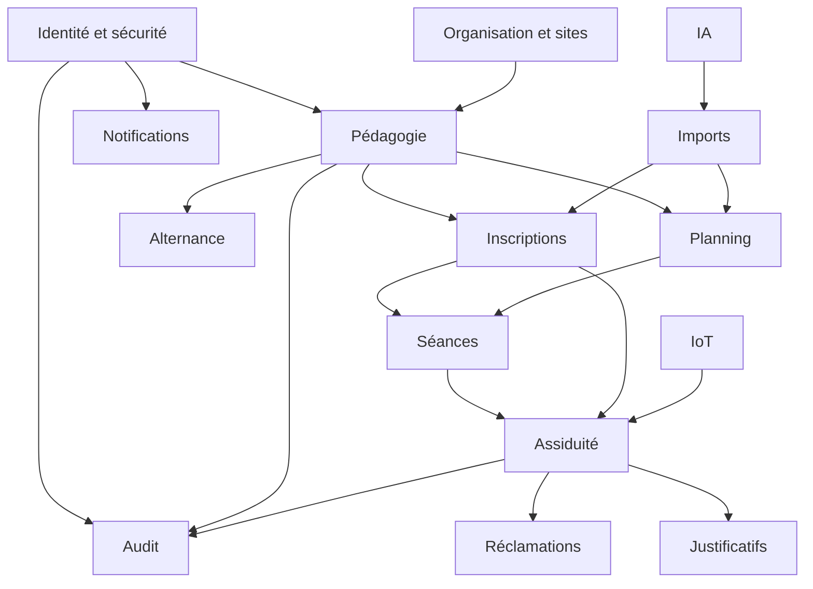
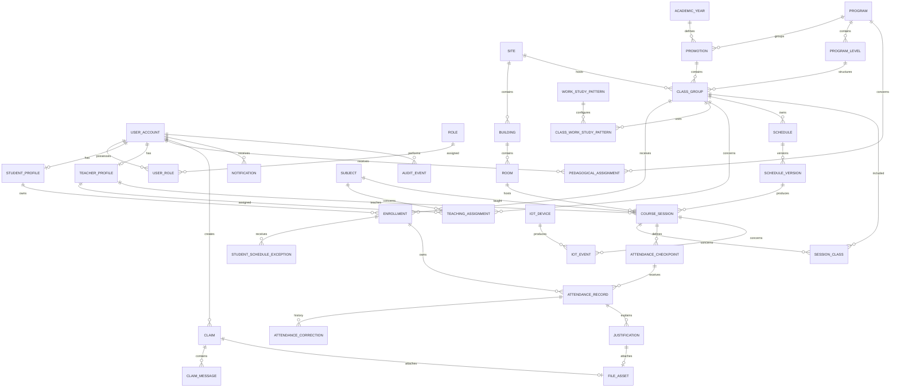
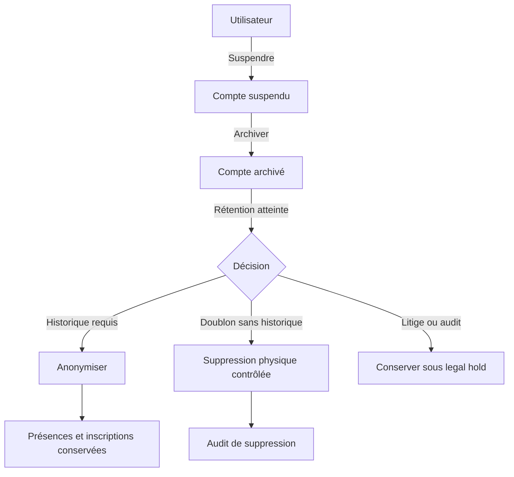
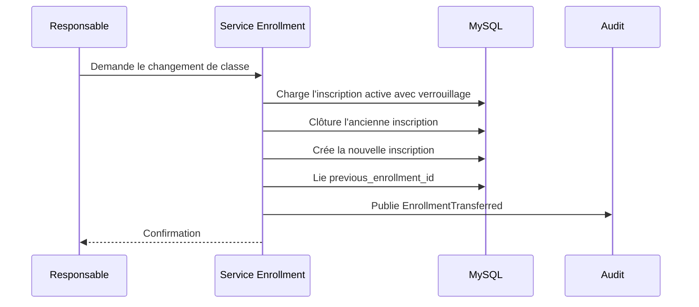
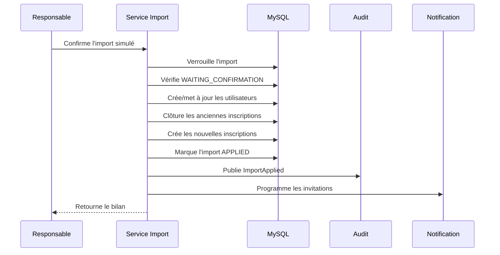

# Modèle de données — ESIC Connect

## Métadonnées

| Élément | Valeur |
|---|---|
| Projet | ESIC Connect |
| Document | Modèle conceptuel et logique de données |
| Porteur | Abubacar AFOLABI |
| Certification | RNCP 39394 — Expert en systèmes d’information et sécurité |
| Version | 1.0 |
| Date | 27 août 2026 |
| Statut | Modèle de référence à valider |
| SGBD cible | MySQL 8 |
| Cache et données temporaires | Redis 7 |
| Mapping objet-relationnel | Spring Data JPA / Hibernate |
| Migrations | Flyway |
| Package Java | `com.esic.connect` |

---

# 1. Objet du document

Ce document décrit le modèle de données d’**ESIC Connect**.

Il définit :

- les domaines de données ;
- les entités métier ;
- leurs attributs ;
- leurs relations ;
- les cardinalités ;
- les clés primaires ;
- les clés étrangères ;
- les contraintes d’unicité ;
- les règles d’intégrité ;
- les stratégies d’archivage ;
- les règles de suppression ;
- les historiques ;
- les index ;
- les conventions JPA ;
- les futures intégrations avec un système administratif centralisé.

Ce document complète :

- `docs/01-cadrage.md` ;
- `docs/02-cahier-des-charges.md` ;
- `docs/03-architecture.md`.

---

# 2. Principes directeurs

## 2.1 MySQL comme source de vérité

MySQL conserve toutes les données métier durables :

- utilisateurs ;
- formations ;
- classes ;
- inscriptions ;
- plannings ;
- séances ;
- présences ;
- justificatifs ;
- réclamations ;
- rapports ;
- audits ;
- équipements IoT.

Redis ne remplace jamais MySQL pour ces données.

## 2.2 Préservation de l’historique

Les données historiques ne doivent pas disparaître lorsqu’un élément
fonctionnel est désactivé.

Exemples :

- la suspension d’un apprenant ne supprime pas ses présences ;
- l’archivage d’une classe ne supprime pas ses séances ;
- la désactivation d’un formateur ne supprime pas ses cours passés ;
- l’archivage d’une formation ne supprime pas les anciennes promotions ;
- la suppression d’un rôle actif ne supprime pas les actions d’audit ;
- la suppression d’un fichier arrivé à échéance ne supprime pas les
  métadonnées indispensables à la traçabilité.

## 2.3 Absence de suppression en cascade sur le métier

Les tables métier utilisent par défaut :

```sql
ON DELETE RESTRICT
ON UPDATE RESTRICT
```

Dans MySQL/InnoDB, `RESTRICT` ou `NO ACTION` refuse la suppression du
parent lorsqu’une ligne enfant le référence. Cette stratégie protège
l’intégrité et évite les suppressions accidentelles d’un historique.
([dev.mysql.com](https://dev.mysql.com/doc/refman/8.4/en/create-table-foreign-keys.html?utm_source=openai))

Les relations `ON DELETE CASCADE` sont réservées à quelques données
strictement techniques ou temporaires, lorsque l’enfant ne possède
aucun sens sans son parent.

## 2.4 Suppression logique

Les entités importantes utilisent selon leur nature :

- `status` ;
- `active` ;
- `archived_at` ;
- `suspended_at` ;
- `deleted_at`.

Le terme `deleted_at` ne signifie pas qu’une suppression physique doit
être faite immédiatement. Il marque une suppression fonctionnelle.

## 2.5 Archivage plutôt que suppression

Les opérations courantes sont :

```text
ACTIVE → SUSPENDED → ARCHIVED
```

La suppression physique n’est utilisée que pour :

- un doublon confirmé ;
- une donnée temporaire expirée ;
- une donnée de test ;
- une donnée sans historique dépendant ;
- une purge réglementaire validée.

## 2.6 Anonymisation

Lorsque l’identité ne doit plus être conservée mais que les données
statistiques restent utiles :

- les identifiants directs sont supprimés ou remplacés ;
- les données d’assiduité agrégées peuvent être conservées ;
- l’opération est auditée ;
- l’anonymisation doit être irréversible dans le périmètre retenu.

## 2.7 Intégration future avec BERRA

ESIC Connect pourra être relié ultérieurement à **BERRA**, le système
centralisé de gestion administrative de l’ESIC.

Le modèle doit donc prévoir :

- un identifiant interne ESIC Connect ;
- un identifiant public technique ;
- un identifiant externe facultatif ;
- le système source ;
- la date de dernière synchronisation ;
- le statut de synchronisation.

ESIC Connect ne doit pas utiliser directement un identifiant BERRA
comme clé primaire.

---

# 3. Stratégie d’identification

## 3.1 Identifiant interne

Chaque table métier utilise une clé primaire interne :

```text
BIGINT UNSIGNED AUTO_INCREMENT
```

Avantages :

- index compacts ;
- jointures rapides ;
- stockage efficace ;
- bonnes performances MySQL ;
- simplicité pour les relations internes.

## 3.2 Identifiant public

Les entités exposées dans les API utilisent également un identifiant
public :

```text
public_id BINARY(16)
```

La valeur correspond à un UUID stocké sous forme binaire.

L’API expose une représentation textuelle UUID.

Avantages :

- identifiants difficiles à deviner ;
- indépendance entre API et clé interne ;
- meilleure préparation aux synchronisations ;
- meilleure sécurité contre l’énumération.

## 3.3 Identifiant externe

Les entités synchronisables peuvent comporter :

```text
external_source
external_id
external_synced_at
```

Exemples de `external_source` :

- `BERRA` ;
- `MICROSOFT_365` ;
- `MANUAL_IMPORT` ;
- `ESIC_CONNECT`.

## 3.4 Contrainte externe

Lorsque `external_id` est renseigné, l’unicité porte sur :

```text
(external_source, external_id)
```

Un identifiant externe ne doit pas être supposé unique entre plusieurs
systèmes sources.

## 3.5 Numéro étudiant

Pour le prototype :

- le numéro étudiant peut être importé ;
- il peut être généré localement s’il est absent ;
- il doit être unique lorsqu’il est attribué ;
- il ne doit pas être la clé primaire ;
- il pourra être remplacé ou rapproché de l’identifiant BERRA.

Format local proposé :

```text
ESIC-{ANNEE}-{SEQUENCE}
```

Exemple :

```text
ESIC-2026-000123
```

---

# 4. Colonnes techniques communes

## 4.1 Entité métier modifiable

Les entités métier importantes doivent comporter :

| Colonne | Type | Description |
|---|---|---|
| `id` | `BIGINT UNSIGNED` | Clé primaire interne |
| `public_id` | `BINARY(16)` | UUID public |
| `created_at` | `TIMESTAMP(6)` | Date de création en UTC |
| `created_by_id` | `BIGINT UNSIGNED NULL` | Auteur de la création |
| `updated_at` | `TIMESTAMP(6)` | Date de modification en UTC |
| `updated_by_id` | `BIGINT UNSIGNED NULL` | Auteur de la modification |
| `version` | `BIGINT UNSIGNED` | Verrouillage optimiste |

Spring Data JPA fournit des annotations pour enregistrer l’auteur et
les dates de création ou de modification, notamment `@CreatedBy`,
`@LastModifiedBy`, `@CreatedDate` et `@LastModifiedDate`.
([docs.spring.io](https://docs.spring.io/spring-data/jpa/reference/auditing.html?utm_source=openai))

## 4.2 Entité archivable

Les entités archivables ajoutent :

| Colonne | Type |
|---|---|
| `status` | `VARCHAR` ou `ENUM` contrôlé |
| `archived_at` | `TIMESTAMP(6) NULL` |
| `archived_by_id` | `BIGINT UNSIGNED NULL` |
| `archive_reason` | `VARCHAR(500) NULL` |

## 4.3 Fuseaux horaires

Les instants sont enregistrés en UTC :

```text
Instant
TIMESTAMP UTC
```

Les règles calendaires utilisent un identifiant IANA :

```text
Europe/Paris
Africa/Abidjan
America/New_York
```

Chaque site possède un champ :

```text
time_zone_id VARCHAR(64)
```

Chaque utilisateur peut éventuellement posséder un fuseau préféré.

Le fuseau par défaut du premier site est :

```text
Europe/Paris
```

Il ne doit pas être codé en dur dans toutes les règles métier.

---

# 5. Stratégie de suppression et d’intégrité

## 5.1 Matrice générale

| Type de donnée | Suppression fonctionnelle | Suppression physique | FK recommandée |
|---|---|---|---|
| Utilisateur | Suspension/archivage | Exceptionnelle | `RESTRICT` |
| Formation | Archivage | Exceptionnelle | `RESTRICT` |
| Classe | Archivage | Exceptionnelle | `RESTRICT` |
| Inscription | Clôture | Non en usage normal | `RESTRICT` |
| Planning | Archivage/versionnement | Non | `RESTRICT` |
| Séance | Annulation | Non | `RESTRICT` |
| Présence | Correction | Non | `RESTRICT` |
| Justificatif | Expiration/purge fichier | Oui selon rétention | `RESTRICT` |
| Réclamation | Clôture | Non | `RESTRICT` |
| Audit | Archivage/purge réglementée | Oui selon politique | Références faibles |
| Jeton temporaire | Expiration | Oui | Redis ou `CASCADE` limité |
| Ligne d’import temporaire | Expiration | Oui | `CASCADE` acceptable |
| Session d’authentification | Révocation | Oui | `CASCADE` acceptable |
| Credential WebAuthn | Révocation | Oui contrôlée | `RESTRICT` ou `CASCADE` limité |

## 5.2 Relations obligatoires

Une clé étrangère obligatoire utilise :

```sql
NOT NULL
ON DELETE RESTRICT
```

## 5.3 Relations facultatives

Une relation facultative peut utiliser :

```sql
NULL
ON DELETE SET NULL
```

uniquement si la relation n’est pas indispensable à l’histoire métier.

Exemple acceptable :

```text
notification.triggered_by_user_id
```

La suppression réglementaire de l’utilisateur peut laisser la
notification sans auteur direct.

## 5.4 Références historiques

Les références historiques utilisent généralement `RESTRICT`.

Si une anonymisation est requise, l’identité est pseudonymisée ou
anonymisée au niveau de l’utilisateur, au lieu de supprimer toutes les
lignes liées.

## 5.5 Données enfants purement techniques

`ON DELETE CASCADE` peut être utilisé uniquement pour :

- les paramètres d’un import temporaire ;
- les lignes d’un brouillon d’import supprimé avant confirmation ;
- les jetons d’une session technique ;
- les codes de récupération non utilisés ;
- les données temporaires sans valeur d’audit.

Cette décision doit être explicite dans chaque migration.

---

# 6. Règles JPA/Hibernate

## 6.1 Cascade

Ne pas utiliser globalement :

```java
cascade = CascadeType.ALL
```

`CascadeType.ALL` comprend notamment `REMOVE`. Une suppression du parent
peut donc être propagée aux enfants. ([javadoc.io](https://javadoc.io/static/jakarta.persistence/jakarta.persistence-api/4.0.0-M1/jakarta.persistence/jakarta/persistence/CascadeType.html?utm_source=openai))

## 6.2 Configuration recommandée

### Relation vers une entité de référence

```java
@ManyToOne(fetch = FetchType.LAZY, optional = false)
@JoinColumn(name = "class_group_id", nullable = false)
private ClassGroup classGroup;
```

Aucun `CascadeType.REMOVE`.

### Collection métier historique

```java
@OneToMany(mappedBy = "student", fetch = FetchType.LAZY)
private Set<Enrollment> enrollments = new HashSet<>();
```

Pas de :

```java
orphanRemoval = true
```

sur une collection historique.

## 6.3 `orphanRemoval`

Avec `orphanRemoval=true`, retirer un enfant de la collection peut
entraîner sa suppression. Cette option est donc interdite pour :

- inscriptions ;
- séances ;
- présences ;
- corrections ;
- justificatifs ;
- historiques.

La spécification Jakarta Persistence prévoit la propagation de la
suppression vers la cible lorsqu’une relation est configurée avec
`orphanRemoval=true`. ([jakarta.ee](https://jakarta.ee/specifications/persistence/4.0/jakarta-persistence-spec-4.0-m2?utm_source=openai))

## 6.4 Collections techniques

`orphanRemoval=true` peut être accepté pour une petite collection
technique sans valeur historique, après justification.

Exemple éventuel :

- paramètres temporaires d’un brouillon non confirmé.

## 6.5 Chargement

Les relations sont `LAZY` par défaut.

Éviter `EAGER` sur les collections afin de limiter :

- les requêtes volumineuses ;
- les chargements inutiles ;
- les problèmes N+1 ;
- la consommation mémoire.

## 6.6 Verrouillage optimiste

Les entités fortement modifiables comportent :

```java
@Version
private long version;
```

Entités concernées :

- utilisateur ;
- classe ;
- planning ;
- version de planning ;
- séance ;
- présence ;
- justificatif ;
- réclamation ;
- dispositif.

## 6.7 Égalité des entités

Ne pas baser `equals()` et `hashCode()` sur :

- les collections ;
- les relations ;
- les champs modifiables.

Utiliser une stratégie stable fondée sur l’identifiant public lorsqu’il
est attribué.

---

# 6bis. Schéma réellement en base (audit du 2 septembre 2026)

> **Ce document décrit un modèle cible.** Les sections §9 à §25
> ci-dessous contiennent des tables qui **n'existent pas** (`subject`,
> `teacher_profile`, `teaching_assignment`, `schedule*`, `file_asset`,
> `claim*`, `email_delivery`, `iot_*`, `webauthn_credential`,
> `mfa_totp_secret`, `trusted_device`, `daily_attendance_summary`,
> `provisional_attendee`, `session_cancellation_request`…) et des noms
> qui diffèrent du réel (`import_*` → `student_import_*` ;
> `schedule*` → `planning_*` ; `notification` existe mais avec une autre
> forme). Elles restent conservées comme **conception cible**.
>
> Le schéma réel est géré **uniquement par Flyway**, avec
> `spring.jpa.hibernate.ddl-auto = validate` : Hibernate ne génère jamais
> le schéma et **échoue au démarrage** si le mapping diverge. Aucune
> migration n'insère de donnée métier (seule `V2` amorce les 6 rôles de
> référence).

## 6bis.1 Migrations et tables réelles — `V1` → `V16` (41 tables)

| Migration | Tables créées | Domaine |
|---|---|---|
| `V1__create_identity_and_audit_tables` | `user_account`, `role`, `user_role`, `audit_event` | identité, audit |
| `V2__seed_reference_roles` | *(aucune)* — amorce les 6 rôles de référence | identité |
| `V3__create_account_invitation` | `account_invitation` | invitation / activation |
| `V4__create_organization_tables` | `site`, `building`, `room`, `site_network_range` | organisation |
| `V5__create_academic_tables` | `academic_year`, `program`, `program_level`, `promotion`, `class_group` | pédagogie |
| `V6__create_pedagogical_assignment` | `pedagogical_assignment` | périmètre du responsable pédagogique |
| `V7__create_student_profile_and_enrollment` | `student_profile`, `enrollment` | apprenants, inscriptions |
| `V8__create_alternation_tables` | `work_study_pattern`, `class_work_study_pattern`, `student_schedule_exception` | alternance |
| `V9__create_course_sessions_and_attendance` | `course_session`, `session_class`, `attendance_checkpoint`, `attendance_record` | séances, émargement |
| `V10__extend_attendance_management_and_reporting` | `attendance_correction`, `attendance_justification` | corrections, justificatifs |
| `V11__create_student_import_tables` | `student_import_job`, `student_import_job_issue`, `student_import_row`, `student_import_row_issue`, `student_number_sequence` | import CSV apprenants |
| `V12__create_planning_tables` **[G1-B]** | `planning_schedule`, `planning_version`, `planning_entry`, `planning_import_job`, `planning_import_job_issue`, `planning_import_row`, `planning_import_row_issue` | planning |
| `V13__link_course_session_to_planning` **[G1-B]** | *(aucune)* — colonnes **additives** sur `course_session` (dont `planning_slot_public_id`) | lien planning ↔ séance |
| `V14__create_session_lifecycle_tables` **[G1-C]** | `teacher_substitution` ; colonnes `cancellation_reason` / `cancelled_at` / `cancelled_by_id` + `CHECK` étendu sur `course_session` | cycle de vie des séances |
| `V15__create_notification_table` **[G1-D]** | `notification` | notifications persistantes |
| `V16__create_justification_attachment_table` **[G1-E]** | `justification_attachment` | pièces jointes (**métadonnées seules**) |

## 6bis.2 Identifiants et colonnes techniques réels

- **Double identité** : clé primaire interne `BIGINT AUTO_INCREMENT`
  (jamais exposée) + `public_id` **UUID** (stocké en `BINARY(16)`), **unique**, seul identifiant qui
  circule dans l'API, les DTO, les événements inter-modules et le front.
  Aucun DTO ni événement ne transporte de clé SQL.
- `shared.BaseEntity` fournit `created_at`, `updated_at` et `version`
  (**verrouillage optimiste** : une modification concurrente renvoie
  `409`, jamais `500`).
- Les entités archivables portent un statut / `archived_at` :
  l'**archivage remplace la suppression** sur le métier.
- Les clés étrangères vers `user_account` sont en `RESTRICT` : un compte
  référencé par un historique ne peut pas être supprimé.

## 6bis.3 Tables et contraintes structurantes livrées en G1

### `planning_*` (V12) — import, versions, créneaux
- `planning_import_job` : job d'import (`SIMULATED` → `PUBLISHED` /
  `CANCELLED` / `FAILED`), **empreinte SHA-256** du fichier ; le fichier
  lui-même n'est **jamais** écrit sur disque.
- `planning_version` : `version_number` incrémental par planning,
  statut `DRAFT` / `PUBLISHED` / `SUPERSEDED`. **Aucune suppression
  physique** de version (EF-PLAN-007).
- `planning_entry` : créneau publié, porteur d'un `slot_public_id`
  **déterministe** — identité **stable** d'un créneau d'une publication à
  l'autre (`DEC-G1-002`, corrigée à l'audit G1-B.1).
- `course_session.planning_slot_public_id` (V13, additif) : discriminant
  d'origine. Renseigné ⇒ séance issue d'un planning publié (RG-016) ;
  nul ⇒ séance exceptionnelle manuelle, `exception_reason` obligatoire.

### `course_session` / `teacher_substitution` (V9, V14)
- `status ∈ {PLANNED, OPEN, CLOSED, CANCELLED}` (`CHECK`), transitions
  strictes, pas de réouverture. `cancellation_reason` obligatoire à
  l'annulation.
- `teacher_substitution` : `original_teacher_user_id` **figé** (le
  formateur principal n'est jamais écrasé), remplaçant, période, motif,
  statut. **Une seule substitution `ACTIVE` applicable** à un instant
  donné (verrou de ligne sur la séance + contrôle de chevauchement).
- `session_class` : table d'association séance ↔ classes (une séance peut
  concerner plusieurs classes).

### `notification` (V15)
- `recipient_user_id` (FK `RESTRICT`), `type`, `title`, `body`
  **neutre** (pas de PII), `resource_type` / `resource_public_id`,
  `status ∈ {UNREAD, READ, ARCHIVED}`.
- `dedup_key CHAR(64) UNIQUE` = `SHA-256(type | resourcePublicId |
  recipientUserId | eventKey)` ⇒ **idempotence** : rejouer le listener
  ne crée pas de doublon.
- `CHECK ((status='UNREAD') = (read_at IS NULL))` ; index
  `(recipient, status, created_at)`.

### `justification_attachment` (V16)
- **Métadonnées uniquement — le contenu du fichier n'est jamais en
  base.** `storage_key` VARCHAR(180) **UNIQUE et opaque**, jamais dérivée
  du nom client ; `original_file_name` assaini ; `content_type`
  `CHECK IN {application/pdf, image/jpeg, image/png}` **re-dérivé des
  magic bytes**, jamais du `Content-Type` déclaré ; `size_bytes CHECK > 0` ;
  `sha256 CHAR(64)`.
- `status ∈ {PENDING_STORAGE, STORED, DELETED}` : la ligne
  `PENDING_STORAGE` est committée **avant** l'écriture du fichier
  (`DEC-G1-009`), ce qui rend tout état intermédiaire réconciliable.
- Colonne **générée** + `UNIQUE` ⇒ **une seule pièce active** par
  justificatif.

### `student_import_*` (V11)
- Chaîne `ON DELETE CASCADE` job → lignes → anomalies ; FK `RESTRICT`
  vers `user_account`.
- `student_number_sequence` : allocation **atomique** du numéro
  `ESIC-{annéeDébut}-{NNNNN}`.

### Contraintes métier notables ailleurs
- `enrollment` : **une seule inscription active** par apprenant et par
  année (contrainte SQL + isolation de la concurrence testée).
- `attendance_record` : **anti-double présence** par contrainte
  d'unicité — la concurrence produit `200` / `409`, jamais `500`.
- `attendance_correction` : historique **append-only**, motif
  obligatoire, jamais de mise à jour destructive.
- `audit_event` : **sans PII, sans jeton, sans adresse IP** (RG-086).

## 6bis.4 Données absentes du schéma réel

Aucune donnée biométrique, aucune adresse IP persistée dans l'audit
métier, aucun contenu binaire de fichier, aucun mot de passe ou jeton en
clair (mots de passe BCrypt ; jetons d'invitation et d'émargement stockés
sous forme d'**empreinte** ou dans Redis avec TTL).

---

# 7. Vue globale des domaines



---

# 8. Modèle conceptuel principal



---

# 9. Domaine organisationnel

## 9.1 Table `site`

Représente un site ou campus ESIC.

| Colonne | Type | Règle |
|---|---|---|
| `id` | BIGINT | PK |
| `public_id` | BINARY(16) | Unique |
| `code` | VARCHAR(50) | Unique |
| `name` | VARCHAR(150) | Obligatoire |
| `address_line1` | VARCHAR(255) | Facultatif |
| `address_line2` | VARCHAR(255) | Facultatif |
| `postal_code` | VARCHAR(20) | Facultatif |
| `city` | VARCHAR(100) | Facultatif |
| `country_code` | CHAR(2) | ISO 3166-1 |
| `time_zone_id` | VARCHAR(64) | Obligatoire |
| `status` | VARCHAR(30) | Actif/archivé |
| `created_at` | TIMESTAMP(6) | UTC |
| `updated_at` | TIMESTAMP(6) | UTC |
| `version` | BIGINT | Optimistic locking |

Le prototype crée un site fictif initial.

Le modèle reste compatible avec plusieurs sites.

## 9.2 Table `building`

| Colonne | Type |
|---|---|
| `id` | BIGINT |
| `public_id` | BINARY(16) |
| `site_id` | BIGINT FK |
| `code` | VARCHAR(50) |
| `name` | VARCHAR(150) |
| `status` | VARCHAR(30) |

Contrainte unique :

```text
(site_id, code)
```

Suppression du site :

```text
RESTRICT
```

## 9.3 Table `room`

| Colonne | Type |
|---|---|
| `id` | BIGINT |
| `public_id` | BINARY(16) |
| `building_id` | BIGINT FK NULL |
| `site_id` | BIGINT FK |
| `code` | VARCHAR(50) |
| `name` | VARCHAR(150) |
| `capacity` | INT UNSIGNED NULL |
| `floor_label` | VARCHAR(50) NULL |
| `status` | VARCHAR(30) |
| `static_qr_reference` | VARCHAR(255) NULL |
| `created_at` | TIMESTAMP(6) |
| `updated_at` | TIMESTAMP(6) |
| `version` | BIGINT |

Contrainte unique :

```text
(site_id, code)
```

Une salle archivée reste référencée par les anciennes séances.

## 9.4 Table `site_network_range`

Permet au super administrateur de définir les réseaux autorisés.

| Colonne | Type |
|---|---|
| `id` | BIGINT |
| `site_id` | BIGINT FK |
| `cidr` | VARCHAR(50) |
| `label` | VARCHAR(100) |
| `active` | BOOLEAN |
| `valid_from` | TIMESTAMP(6) NULL |
| `valid_until` | TIMESTAMP(6) NULL |
| `created_by_id` | BIGINT FK |
| `created_at` | TIMESTAMP(6) |

L’adresse IP de l’utilisateur n’est pas conservée dans cette table.

---

# 10. Domaine identité et accès

## 10.1 Table `user_account`

| Colonne | Type | Règle |
|---|---|---|
| `id` | BIGINT | PK |
| `public_id` | BINARY(16) | Unique |
| `external_source` | VARCHAR(50) NULL | BERRA, Microsoft, etc. |
| `external_id` | VARCHAR(191) NULL | Identifiant externe |
| `email` | VARCHAR(254) | Unique, normalisé |
| `password_hash` | VARCHAR(255) NULL | Aucun mot de passe en clair |
| `first_name` | VARCHAR(100) | Obligatoire |
| `last_name` | VARCHAR(100) | Obligatoire |
| `phone` | VARCHAR(30) NULL | Facultatif |
| `preferred_time_zone` | VARCHAR(64) NULL | Fuseau utilisateur |
| `status` | VARCHAR(30) | Statut du compte |
| `email_verified_at` | TIMESTAMP(6) NULL | Vérification |
| `last_login_at` | TIMESTAMP(6) NULL | Dernière connexion |
| `suspended_at` | TIMESTAMP(6) NULL | Suspension |
| `suspended_by_id` | BIGINT NULL | Auteur |
| `suspension_reason` | VARCHAR(500) NULL | Motif |
| `archived_at` | TIMESTAMP(6) NULL | Archivage |
| `external_synced_at` | TIMESTAMP(6) NULL | Synchronisation |
| `created_at` | TIMESTAMP(6) | UTC |
| `created_by_id` | BIGINT NULL | Auteur |
| `updated_at` | TIMESTAMP(6) | UTC |
| `updated_by_id` | BIGINT NULL | Auteur |
| `version` | BIGINT | Verrouillage |

Contraintes :

```text
UNIQUE(email)
UNIQUE(external_source, external_id) lorsque external_id est renseigné
```

L’adresse électronique est enregistrée sous une forme normalisée.

La casse originale peut être conservée séparément si nécessaire.

## 10.2 Table `role`

| Colonne | Type |
|---|---|
| `id` | SMALLINT |
| `code` | VARCHAR(50) |
| `name` | VARCHAR(100) |
| `description` | VARCHAR(500) |
| `system_role` | BOOLEAN |
| `active` | BOOLEAN |

Codes :

- `SUPER_ADMIN` ;
- `ADMIN` ;
- `SCHOOL_ADMINISTRATION` ;
- `PEDAGOGICAL_MANAGER` ;
- `TEACHER` ;
- `STUDENT`.

## 10.3 Table `user_role`

| Colonne | Type |
|---|---|
| `id` | BIGINT |
| `user_id` | BIGINT FK |
| `role_id` | SMALLINT FK |
| `valid_from` | TIMESTAMP(6) |
| `valid_until` | TIMESTAMP(6) NULL |
| `assigned_by_id` | BIGINT FK NULL |
| `assignment_reason` | VARCHAR(500) NULL |
| `active` | BOOLEAN |
| `created_at` | TIMESTAMP(6) |

Contrainte d’unicité active à contrôler :

```text
user_id + role_id + période
```

La table permet de conserver l’historique des rôles.

Un rôle n’est pas supprimé d’un utilisateur : son affectation est
clôturée.

## 10.4 Table `account_invitation`

| Colonne | Type |
|---|---|
| `id` | BIGINT |
| `user_id` | BIGINT FK |
| `token_hash` | VARCHAR(255) |
| `status` | VARCHAR(30) |
| `expires_at` | TIMESTAMP(6) |
| `used_at` | TIMESTAMP(6) NULL |
| `revoked_at` | TIMESTAMP(6) NULL |
| `created_at` | TIMESTAMP(6) |
| `created_by_id` | BIGINT NULL |

Le jeton brut n’est jamais stocké.

## 10.5 Table `trusted_device`

| Colonne | Type |
|---|---|
| `id` | BIGINT |
| `public_id` | BINARY(16) |
| `user_id` | BIGINT FK |
| `device_label` | VARCHAR(150) |
| `device_fingerprint_hash` | VARCHAR(255) NULL |
| `status` | VARCHAR(30) |
| `trusted_at` | TIMESTAMP(6) |
| `last_used_at` | TIMESTAMP(6) NULL |
| `revoked_at` | TIMESTAMP(6) NULL |
| `version` | BIGINT |

Aucune donnée biométrique brute n’est conservée.

## 10.6 Table `webauthn_credential`

| Colonne | Type |
|---|---|
| `id` | BIGINT |
| `public_id` | BINARY(16) |
| `user_id` | BIGINT FK |
| `credential_id` | VARBINARY(1024) |
| `public_key` | BLOB |
| `signature_count` | BIGINT UNSIGNED |
| `transports` | VARCHAR(255) NULL |
| `device_type` | VARCHAR(50) NULL |
| `backed_up` | BOOLEAN |
| `status` | VARCHAR(30) |
| `created_at` | TIMESTAMP(6) |
| `last_used_at` | TIMESTAMP(6) NULL |
| `revoked_at` | TIMESTAMP(6) NULL |

La suppression d’un compte est normalement interdite par `RESTRICT`.

Lors d’une anonymisation complète validée, les credentials peuvent être
révoqués puis supprimés séparément.

## 10.7 Table `mfa_totp_secret`

| Colonne | Type |
|---|---|
| `id` | BIGINT |
| `user_id` | BIGINT FK |
| `encrypted_secret` | VARBINARY(1024) |
| `status` | VARCHAR(30) |
| `confirmed_at` | TIMESTAMP(6) NULL |
| `revoked_at` | TIMESTAMP(6) NULL |
| `created_at` | TIMESTAMP(6) |

Le secret TOTP doit être chiffré, jamais haché uniquement, car le serveur
doit pouvoir l’utiliser pour vérifier les codes.

## 10.8 Table `recovery_code`

Donnée technique pouvant être supprimée après utilisation.

| Colonne | Type |
|---|---|
| `id` | BIGINT |
| `user_id` | BIGINT FK |
| `code_hash` | VARCHAR(255) |
| `used_at` | TIMESTAMP(6) NULL |
| `created_at` | TIMESTAMP(6) |

Une suppression physique contrôlée est autorisée après révocation.

## 10.9 Table `authentication_session`

Cette table est facultative si les sessions sont intégralement gérées
dans Redis.

Elle peut conserver :

- identifiant de session ;
- utilisateur ;
- date de création ;
- date d’expiration ;
- date de révocation ;
- appareil de confiance ;
- version de sécurité.

Aucun access token brut ne doit être conservé.

---

# 11. Profils utilisateurs

## 11.1 Table `student_profile`

| Colonne | Type |
|---|---|
| `id` | BIGINT |
| `public_id` | BINARY(16) |
| `user_id` | BIGINT FK UNIQUE |
| `student_number` | VARCHAR(50) UNIQUE |
| `birth_date` | DATE NULL |
| `work_study` | BOOLEAN |
| `company_name` | VARCHAR(191) NULL |
| `status` | VARCHAR(30) |
| `created_at` | TIMESTAMP(6) |
| `updated_at` | TIMESTAMP(6) |
| `version` | BIGINT |

L’entreprise est conservée sous forme de texte dans le prototype.

Une table `company` pourra être ajoutée lors d’une future intégration
avec BERRA.

## 11.2 Table `teacher_profile`

| Colonne | Type |
|---|---|
| `id` | BIGINT |
| `public_id` | BINARY(16) |
| `user_id` | BIGINT FK UNIQUE |
| `teacher_type` | VARCHAR(30) |
| `organization_name` | VARCHAR(191) NULL |
| `intervention_start_date` | DATE NULL |
| `intervention_end_date` | DATE NULL |
| `status` | VARCHAR(30) |
| `created_at` | TIMESTAMP(6) |
| `updated_at` | TIMESTAMP(6) |
| `version` | BIGINT |

Valeurs de `teacher_type` :

- `INTERNAL` ;
- `EXTERNAL`.

---

# 12. Domaine pédagogique

## 12.1 Table `academic_year`

| Colonne | Type |
|---|---|
| `id` | BIGINT |
| `public_id` | BINARY(16) |
| `code` | VARCHAR(30) |
| `name` | VARCHAR(100) |
| `start_date` | DATE |
| `end_date` | DATE |
| `status` | VARCHAR(30) |
| `created_at` | TIMESTAMP(6) |
| `updated_at` | TIMESTAMP(6) |
| `version` | BIGINT |

La période est configurable et peut être dérivée du planning.

Contrainte :

```text
end_date > start_date
```

## 12.2 Table `program`

Représente une formation.

| Colonne | Type |
|---|---|
| `id` | BIGINT |
| `public_id` | BINARY(16) |
| `external_source` | VARCHAR(50) NULL |
| `external_id` | VARCHAR(191) NULL |
| `code` | VARCHAR(50) |
| `name` | VARCHAR(191) |
| `program_type` | VARCHAR(50) |
| `description` | TEXT NULL |
| `status` | VARCHAR(30) |
| `created_at` | TIMESTAMP(6) |
| `updated_at` | TIMESTAMP(6) |
| `version` | BIGINT |

Exemples de type :

- `BTS` ;
- `BACHELOR` ;
- `MASTER` ;
- `OTHER`.

Le code est généré ou saisi pour le prototype.

## 12.3 Table `program_level`

| Colonne | Type |
|---|---|
| `id` | BIGINT |
| `program_id` | BIGINT FK |
| `code` | VARCHAR(50) |
| `name` | VARCHAR(100) |
| `sequence_number` | SMALLINT |
| `status` | VARCHAR(30) |

Exemples :

- BTS 1 ;
- BTS 2 ;
- Bachelor 3 ;
- Master 1 ;
- Master 2.

Contrainte unique :

```text
(program_id, code)
```

## 12.4 Table `promotion`

| Colonne | Type |
|---|---|
| `id` | BIGINT |
| `public_id` | BINARY(16) |
| `program_id` | BIGINT FK |
| `academic_year_id` | BIGINT FK |
| `code` | VARCHAR(80) |
| `name` | VARCHAR(191) |
| `status` | VARCHAR(30) |
| `created_at` | TIMESTAMP(6) |
| `updated_at` | TIMESTAMP(6) |
| `version` | BIGINT |

Contrainte unique :

```text
(program_id, academic_year_id, code)
```

## 12.5 Table `class_group`

| Colonne | Type |
|---|---|
| `id` | BIGINT |
| `public_id` | BINARY(16) |
| `external_source` | VARCHAR(50) NULL |
| `external_id` | VARCHAR(191) NULL |
| `promotion_id` | BIGINT FK |
| `program_level_id` | BIGINT FK |
| `site_id` | BIGINT FK |
| `code` | VARCHAR(80) |
| `name` | VARCHAR(191) |
| `capacity` | INT UNSIGNED NULL |
| `status` | VARCHAR(30) |
| `created_at` | TIMESTAMP(6) |
| `updated_at` | TIMESTAMP(6) |
| `archived_at` | TIMESTAMP(6) NULL |
| `version` | BIGINT |

Unicité :

```text
(promotion_id, code)
```

Une classe archivée reste référencée par les anciennes inscriptions et
séances.

## 12.6 Table `subject`

Représente une matière.

| Colonne | Type |
|---|---|
| `id` | BIGINT |
| `public_id` | BINARY(16) |
| `external_source` | VARCHAR(50) NULL |
| `external_id` | VARCHAR(191) NULL |
| `code` | VARCHAR(80) |
| `name` | VARCHAR(191) |
| `description` | TEXT NULL |
| `status` | VARCHAR(30) |
| `created_at` | TIMESTAMP(6) |
| `updated_at` | TIMESTAMP(6) |
| `version` | BIGINT |

Aucun code officiel n’étant imposé au prototype, le code peut être
généré ou renseigné.

Exemple :

```text
SUB-CYBERSECURITE
```

## 12.7 Table `pedagogical_assignment`

Permet d’affecter un responsable principal ou un délégué à une
formation.

| Colonne | Type |
|---|---|
| `id` | BIGINT |
| `program_id` | BIGINT FK |
| `user_id` | BIGINT FK |
| `assignment_type` | VARCHAR(30) |
| `valid_from` | DATE |
| `valid_until` | DATE NULL |
| `delegated_by_id` | BIGINT NULL |
| `reason` | VARCHAR(500) NULL |
| `status` | VARCHAR(30) |
| `created_at` | TIMESTAMP(6) |
| `version` | BIGINT |

Valeurs :

- `PRIMARY_MANAGER` ;
- `DELEGATE`.

Règle métier :

- un seul `PRIMARY_MANAGER` actif par formation ;
- plusieurs délégations temporaires possibles ;
- les périodes de délégation ne donnent accès qu’au périmètre défini.

MySQL ne permet pas simplement un index partiel standard sur
`assignment_type = PRIMARY_MANAGER AND status = ACTIVE`.

La règle doit être garantie par :

- le service métier ;
- une transaction ;
- un verrouillage ;
- un test d’intégration ;
- éventuellement une colonne générée dédiée.

---

# 13. Inscriptions et historique des classes

## 13.1 Table `enrollment`

Cette table est centrale pour conserver l’historique.

| Colonne | Type |
|---|---|
| `id` | BIGINT |
| `public_id` | BINARY(16) |
| `student_profile_id` | BIGINT FK |
| `class_group_id` | BIGINT FK |
| `academic_year_id` | BIGINT FK |
| `start_date` | DATE |
| `end_date` | DATE NULL |
| `status` | VARCHAR(30) |
| `enrollment_source` | VARCHAR(50) |
| `change_reason` | VARCHAR(500) NULL |
| `previous_enrollment_id` | BIGINT FK NULL |
| `created_at` | TIMESTAMP(6) |
| `created_by_id` | BIGINT NULL |
| `updated_at` | TIMESTAMP(6) |
| `version` | BIGINT |

Statuts :

- `PENDING` ;
- `ACTIVE` ;
- `COMPLETED` ;
- `TRANSFERRED` ;
- `WITHDRAWN` ;
- `SUSPENDED` ;
- `ARCHIVED`.

## 13.2 Changement de classe

Lorsqu’un apprenant change de classe :

1. l’inscription actuelle est chargée avec verrouillage ;
2. son `end_date` est renseigné ;
3. son statut devient `TRANSFERRED` ou `COMPLETED` ;
4. une nouvelle inscription est créée ;
5. `previous_enrollment_id` référence l’ancienne inscription ;
6. l’opération est auditée.

Aucune ancienne présence n’est déplacée.

## 13.3 Unicité d’une inscription active

Règle :

```text
Un apprenant possède au maximum une inscription principale active
pour une même période.
```

Cette règle doit être protégée par :

- transaction ;
- verrouillage ;
- service métier ;
- test concurrent ;
- contrainte technique lorsque possible.

## 13.4 Suppression

Une inscription n’est pas supprimée.

Elle est clôturée.

La clé étrangère vers `student_profile` et `class_group` utilise
`RESTRICT`.

---

# 14. Alternance

## 14.1 Table `work_study_pattern`

| Colonne | Type |
|---|---|
| `id` | BIGINT |
| `public_id` | BINARY(16) |
| `code` | VARCHAR(80) |
| `name` | VARCHAR(191) |
| `pattern_type` | VARCHAR(50) |
| `cycle_length_weeks` | SMALLINT NULL |
| `configuration_json` | JSON |
| `status` | VARCHAR(30) |
| `created_at` | TIMESTAMP(6) |
| `updated_at` | TIMESTAMP(6) |
| `version` | BIGINT |

Types :

- `THREE_DAYS_SCHOOL_TWO_DAYS_COMPANY` ;
- `ONE_WEEK_SCHOOL_OUT_OF_FOUR` ;
- `TWO_WEEKS_SCHOOL_OUT_OF_FOUR` ;
- `CUSTOM`.

Exemple de configuration JSON :

```json
{
  "cycleStartDate": "2026-09-01",
  "schoolWeeks": [1],
  "companyWeeks": [2, 3, 4],
  "schoolDays": ["MONDAY", "TUESDAY", "WEDNESDAY"]
}
```

## 14.2 Table `class_work_study_pattern`

| Colonne | Type |
|---|---|
| `id` | BIGINT |
| `class_group_id` | BIGINT FK |
| `work_study_pattern_id` | BIGINT FK |
| `valid_from` | DATE |
| `valid_until` | DATE NULL |
| `created_by_id` | BIGINT |
| `created_at` | TIMESTAMP(6) |
| `version` | BIGINT |

Une classe peut changer de rythme au fil du temps.

L’ancienne affectation est clôturée, pas supprimée.

## 14.3 Table `student_schedule_exception`

| Colonne | Type |
|---|---|
| `id` | BIGINT |
| `enrollment_id` | BIGINT FK |
| `exception_type` | VARCHAR(50) |
| `start_at` | TIMESTAMP(6) |
| `end_at` | TIMESTAMP(6) |
| `time_zone_id` | VARCHAR(64) |
| `reason` | VARCHAR(500) |
| `status` | VARCHAR(30) |
| `created_by_id` | BIGINT |
| `created_at` | TIMESTAMP(6) |
| `version` | BIGINT |

Exemples :

- autorisation de distance ;
- présence exceptionnelle à l’école ;
- période en entreprise ;
- indisponibilité validée.

---

# 15. Affectation des formateurs

## 15.1 Table `teaching_assignment`

Permet de définir un formateur pour une matière et une classe sur une
période.

| Colonne | Type |
|---|---|
| `id` | BIGINT |
| `teacher_profile_id` | BIGINT FK |
| `subject_id` | BIGINT FK |
| `class_group_id` | BIGINT FK |
| `valid_from` | DATE |
| `valid_until` | DATE NULL |
| `status` | VARCHAR(30) |
| `assigned_by_id` | BIGINT |
| `created_at` | TIMESTAMP(6) |
| `version` | BIGINT |

Une matière n’a pas un formateur global unique.

Le même cours peut être enseigné par des personnes différentes selon :

- la classe ;
- la période ;
- la séance.

## 15.2 Relation avec les séances

La séance conserve son propre `teacher_profile_id`.

Cela permet de conserver l’identité du formateur réellement affecté
même si l’affectation générale change ensuite.

---

# 16. Imports

## 16.1 Table `import_job`

Table générique pour les imports.

| Colonne | Type |
|---|---|
| `id` | BIGINT |
| `public_id` | BINARY(16) |
| `import_type` | VARCHAR(50) |
| `status` | VARCHAR(30) |
| `original_file_name` | VARCHAR(255) |
| `stored_file_id` | BIGINT FK NULL |
| `requested_by_id` | BIGINT FK |
| `scope_program_id` | BIGINT FK NULL |
| `scope_class_group_id` | BIGINT FK NULL |
| `total_rows` | INT |
| `valid_rows` | INT |
| `warning_rows` | INT |
| `error_rows` | INT |
| `created_rows` | INT |
| `updated_rows` | INT |
| `started_at` | TIMESTAMP(6) NULL |
| `completed_at` | TIMESTAMP(6) NULL |
| `confirmed_at` | TIMESTAMP(6) NULL |
| `confirmed_by_id` | BIGINT NULL |
| `expires_at` | TIMESTAMP(6) NULL |
| `created_at` | TIMESTAMP(6) |
| `version` | BIGINT |

Types :

- `STUDENT_IMPORT` ;
- `SCHEDULE_IMPORT`.

Statuts :

- `UPLOADED` ;
- `ANALYZING` ;
- `SIMULATED` ;
- `WAITING_CONFIRMATION` ;
- `CONFIRMED` ;
- `APPLIED` ;
- `FAILED` ;
- `CANCELLED` ;
- `EXPIRED`.

## 16.2 Table `import_sheet`

| Colonne | Type |
|---|---|
| `id` | BIGINT |
| `import_job_id` | BIGINT FK |
| `sheet_index` | INT |
| `sheet_name` | VARCHAR(191) |
| `target_class_group_id` | BIGINT FK NULL |
| `mapping_json` | JSON NULL |
| `status` | VARCHAR(30) |
| `created_at` | TIMESTAMP(6) |

## 16.3 Table `import_row`

| Colonne | Type |
|---|---|
| `id` | BIGINT |
| `import_sheet_id` | BIGINT FK |
| `row_number` | INT |
| `raw_data_json` | JSON |
| `normalized_data_json` | JSON NULL |
| `status` | VARCHAR(30) |
| `action_type` | VARCHAR(50) NULL |
| `target_entity_type` | VARCHAR(50) NULL |
| `target_entity_public_id` | BINARY(16) NULL |
| `confidence_score` | DECIMAL(5,4) NULL |
| `created_at` | TIMESTAMP(6) |

Ces lignes sont temporaires tant que l’import n’est pas confirmé.

Une purge peut les supprimer après expiration, sous réserve de conserver
un résumé de l’import.

## 16.4 Table `import_row_issue`

| Colonne | Type |
|---|---|
| `id` | BIGINT |
| `import_row_id` | BIGINT FK |
| `severity` | VARCHAR(20) |
| `column_name` | VARCHAR(191) NULL |
| `received_value` | TEXT NULL |
| `error_code` | VARCHAR(100) |
| `message` | VARCHAR(1000) |
| `suggested_value` | TEXT NULL |

`ON DELETE CASCADE` est acceptable entre :

```text
import_job → import_sheet → import_row → import_row_issue
```

uniquement avant confirmation ou lors de la purge des données
temporaires.

Les données métier créées par l’import ne sont jamais supprimées avec
l’import.

---

# 17. Planning

## 17.1 Table `schedule`

| Colonne | Type |
|---|---|
| `id` | BIGINT |
| `public_id` | BINARY(16) |
| `class_group_id` | BIGINT FK |
| `academic_year_id` | BIGINT FK |
| `name` | VARCHAR(191) |
| `status` | VARCHAR(30) |
| `current_version_id` | BIGINT FK NULL |
| `created_by_id` | BIGINT |
| `created_at` | TIMESTAMP(6) |
| `updated_at` | TIMESTAMP(6) |
| `archived_at` | TIMESTAMP(6) NULL |
| `version` | BIGINT |

Statuts :

- `DRAFT` ;
- `READY_TO_PUBLISH` ;
- `PUBLISHED` ;
- `ARCHIVED`.

## 17.2 Table `schedule_version`

| Colonne | Type |
|---|---|
| `id` | BIGINT |
| `public_id` | BINARY(16) |
| `schedule_id` | BIGINT FK |
| `version_number` | INT |
| `status` | VARCHAR(30) |
| `source_import_job_id` | BIGINT FK NULL |
| `change_summary` | VARCHAR(1000) NULL |
| `created_by_id` | BIGINT |
| `created_at` | TIMESTAMP(6) |
| `published_by_id` | BIGINT NULL |
| `published_at` | TIMESTAMP(6) NULL |
| `replaced_version_id` | BIGINT FK NULL |
| `version` | BIGINT |

Contrainte unique :

```text
(schedule_id, version_number)
```

Les versions ne sont pas supprimées.

Le système en affiche au minimum trois, mais peut conserver davantage
selon la politique de rétention.

## 17.3 Éviter la relation circulaire technique

La relation :

```text
schedule.current_version_id → schedule_version.id
schedule_version.schedule_id → schedule.id
```

crée un cycle de clés étrangères.

Deux options sont possibles :

### Option retenue

Conserver :

```text
schedule_version.schedule_id
```

et stocker `current_version_number` dans `schedule`, ou retrouver la
version courante par statut et index.

Cela réduit les difficultés d’insertion et de migration.

## 17.4 Table `schedule_slot`

Représente une plage dans une version de planning avant ou
indépendamment de la création d’une séance.

| Colonne | Type |
|---|---|
| `id` | BIGINT |
| `public_id` | BINARY(16) |
| `schedule_version_id` | BIGINT FK |
| `subject_id` | BIGINT FK |
| `teacher_profile_id` | BIGINT FK NULL |
| `room_id` | BIGINT FK NULL |
| `session_date` | DATE |
| `start_local_time` | TIME |
| `end_local_time` | TIME |
| `time_zone_id` | VARCHAR(64) |
| `attendance_mode` | VARCHAR(30) |
| `remote_link` | VARCHAR(2048) NULL |
| `notes` | TEXT NULL |
| `status` | VARCHAR(30) |
| `source_import_row_id` | BIGINT FK NULL |
| `created_at` | TIMESTAMP(6) |
| `version` | BIGINT |

Une version de planning publiée génère ou met à jour les séances.

---

# 18. Séances

## 18.1 Table `course_session`

| Colonne | Type |
|---|---|
| `id` | BIGINT |
| `public_id` | BINARY(16) |
| `schedule_slot_id` | BIGINT FK NULL |
| `subject_id` | BIGINT FK |
| `primary_teacher_id` | BIGINT FK |
| `substitute_teacher_id` | BIGINT FK NULL |
| `room_id` | BIGINT FK NULL |
| `site_id` | BIGINT FK |
| `start_at` | TIMESTAMP(6) |
| `end_at` | TIMESTAMP(6) |
| `time_zone_id` | VARCHAR(64) |
| `attendance_mode` | VARCHAR(30) |
| `remote_link` | VARCHAR(2048) NULL |
| `status` | VARCHAR(30) |
| `exceptional` | BOOLEAN |
| `exception_reason` | VARCHAR(500) NULL |
| `opened_at` | TIMESTAMP(6) NULL |
| `opened_by_id` | BIGINT NULL |
| `closed_at` | TIMESTAMP(6) NULL |
| `closed_by_id` | BIGINT NULL |
| `cancelled_at` | TIMESTAMP(6) NULL |
| `cancelled_by_id` | BIGINT NULL |
| `cancellation_reason` | VARCHAR(500) NULL |
| `created_at` | TIMESTAMP(6) |
| `updated_at` | TIMESTAMP(6) |
| `version` | BIGINT |

Statuts :

- `PLANNED` ;
- `OPEN` ;
- `CLOSED` ;
- `CANCELLED` ;
- `POSTPONED`.

## 18.2 Table `session_class`

Une séance peut concerner plusieurs classes.

| Colonne | Type |
|---|---|
| `id` | BIGINT |
| `course_session_id` | BIGINT FK |
| `class_group_id` | BIGINT FK |
| `created_at` | TIMESTAMP(6) |

Contrainte unique :

```text
(course_session_id, class_group_id)
```

Aucune suppression en cascade depuis la classe.

## 18.3 Table `teacher_substitution`

| Colonne | Type |
|---|---|
| `id` | BIGINT |
| `course_session_id` | BIGINT FK |
| `original_teacher_id` | BIGINT FK |
| `substitute_teacher_id` | BIGINT FK |
| `requested_by_id` | BIGINT FK |
| `approved_by_id` | BIGINT FK NULL |
| `reason` | VARCHAR(500) |
| `status` | VARCHAR(30) |
| `requested_at` | TIMESTAMP(6) |
| `approved_at` | TIMESTAMP(6) NULL |
| `version` | BIGINT |

## 18.4 Table `session_cancellation_request`

| Colonne | Type |
|---|---|
| `id` | BIGINT |
| `course_session_id` | BIGINT FK |
| `requested_by_id` | BIGINT FK |
| `decided_by_id` | BIGINT FK NULL |
| `reason` | VARCHAR(500) |
| `status` | VARCHAR(30) |
| `requested_at` | TIMESTAMP(6) |
| `decided_at` | TIMESTAMP(6) NULL |
| `decision_comment` | VARCHAR(500) NULL |
| `version` | BIGINT |

---

# 19. Points de contrôle et émargements

> **Mise en œuvre (migrations V9 puis V10).** V9 crée
> `attendance_checkpoint` (un point de contrôle par séance) et
> `attendance_record` (`source` ∈ {`DYNAMIC_QR`, `SHORT_CODE`}). **V10**
> (branche `feature/attendance-management-and-reporting`) généralise à
> **plusieurs points de contrôle** par séance
> (`checkpoint_type` ∈ {`START`, `END`, `CUSTOM`}, `display_order` unique
> par séance, `status` ∈ {`PLANNED`, `OPEN`, `CLOSED`, `CANCELLED`},
> `required`), enrichit `attendance_record` (`status` ∈ {`PRESENT`,
> `LATE`, `ABSENT`, `EXCUSED_ABSENCE`, `CANCELLED`} — `PARTIAL` /
> `TO_CONFIRM` reportés ; `EXCUSED_ABSENCE` ≡ `EXCUSED` ; `source` +
> {`MANUAL`, `CORRECTION`} ; `late_minutes`, `comment`, acteurs de saisie
> / correction), ajoute `attendance_correction` (§19.4, append-only) et
> **`attendance_justification`** — justificatif **métier sans fichier**
> (catégorie, référence externe, commentaire ; cycle `PENDING` →
> `ACCEPTED` / `REJECTED` ; un seul justificatif actif par absence via une
> colonne générée). La table matérialisée `daily_attendance_summary`
> (§19.5) n'est pas créée : le calcul des demi-journées est fait à la
> volée. Détails et écarts : `docs/reports/ATTENDANCE_MANAGEMENT_DESIGN.md`.
>
> **V16** (bloc G1-E) ajoute **`justification_attachment`** : la
> **pièce jointe** d'un justificatif — **métadonnées uniquement**
> (`original_file_name` assaini, `storage_key` opaque unique jamais
> dérivée du nom client, `content_type` re-dérivé des magic bytes ∈
> {`application/pdf`, `image/jpeg`, `image/png`}, `size_bytes`, `sha256`,
> `status` ∈ {`PENDING_STORAGE`, `STORED`, `DELETED`}). Le **contenu**
> n'est **jamais** en base : il est stocké hors webroot par le port
> `com.esic.connect.attendance.JustificationFileStorage` (adaptateur
> local `LocalFilesystemJustificationFileStorage` : clé dispersée
> `aa/bb/<uuid>`, écriture temporaire + déplacement atomique, taille
> appliquée pendant le flux, SHA-256 calculé pendant l'écriture,
> anti-traversal). Un seul fichier actif (non `DELETED`) par justificatif
> via la colonne générée `active_attachment_key`. FK `RESTRICT` vers
> `attendance_justification` et `user_account`. Séquence base ↔ fichier
> avec compensation (DEC-G1-009) — voir `docs/reports/G1_ARCHITECTURE_DECISIONS.md`.
> Endpoints de dépôt / téléchargement et écran d'upload : checkpoints
> G1-E suivants.

## 19.1 Table `attendance_checkpoint`

| Colonne | Type |
|---|---|
| `id` | BIGINT |
| `public_id` | BINARY(16) |
| `course_session_id` | BIGINT FK |
| `checkpoint_type` | VARCHAR(50) |
| `scheduled_at` | TIMESTAMP(6) |
| `opens_at` | TIMESTAMP(6) |
| `closes_at` | TIMESTAMP(6) |
| `status` | VARCHAR(30) |
| `dynamic_qr_enabled` | BOOLEAN |
| `static_room_qr_enabled` | BOOLEAN |
| `created_at` | TIMESTAMP(6) |
| `version` | BIGINT |

Types :

- `MORNING_ARRIVAL` ;
- `MORNING_BREAK_RETURN` ;
- `AFTERNOON_ARRIVAL` ;
- `AFTERNOON_BREAK_RETURN`.

## 19.2 Table `attendance_record`

| Colonne | Type |
|---|---|
| `id` | BIGINT |
| `public_id` | BINARY(16) |
| `checkpoint_id` | BIGINT FK |
| `enrollment_id` | BIGINT FK |
| `status` | VARCHAR(30) |
| `validation_channel` | VARCHAR(50) |
| `recorded_at` | TIMESTAMP(6) |
| `recorded_by_id` | BIGINT FK NULL |
| `student_confirmed` | BOOLEAN |
| `webauthn_verified` | BOOLEAN |
| `late_minutes` | INT UNSIGNED |
| `manual_reason` | VARCHAR(500) NULL |
| `anomaly_level` | VARCHAR(20) NULL |
| `created_at` | TIMESTAMP(6) |
| `updated_at` | TIMESTAMP(6) |
| `version` | BIGINT |

Contrainte unique essentielle :

```text
(checkpoint_id, enrollment_id)
```

Cette contrainte empêche une double présence au même point de contrôle.

Statuts :

- `PRESENT` ;
- `LATE` ;
- `PARTIAL` ;
- `TO_CONFIRM` ;
- `ABSENT` ;
- `EXCUSED`.

## 19.3 Pourquoi référencer `enrollment`

La présence référence l’inscription et non uniquement l’utilisateur.

Cela permet de conserver :

- la classe à laquelle l’apprenant appartenait ;
- l’année scolaire ;
- la promotion ;
- son contexte historique.

Un changement de classe futur ne modifie donc pas les anciennes
présences.

## 19.4 Table `attendance_correction`

| Colonne | Type |
|---|---|
| `id` | BIGINT |
| `attendance_record_id` | BIGINT FK |
| `previous_status` | VARCHAR(30) |
| `new_status` | VARCHAR(30) |
| `reason` | VARCHAR(1000) |
| `corrected_by_id` | BIGINT FK |
| `corrected_at` | TIMESTAMP(6) |
| `source` | VARCHAR(50) |
| `version_before` | BIGINT |
| `version_after` | BIGINT |

Une correction est ajoutée.

Elle ne remplace jamais les anciennes corrections.

## 19.5 Table `daily_attendance_summary`

Cette table est facultative.

Elle peut matérialiser le calcul journalier pour améliorer les rapports.

| Colonne | Type |
|---|---|
| `id` | BIGINT |
| `enrollment_id` | BIGINT FK |
| `attendance_date` | DATE |
| `morning_status` | VARCHAR(30) |
| `afternoon_status` | VARCHAR(30) |
| `day_status` | VARCHAR(30) |
| `calculated_at` | TIMESTAMP(6) |
| `calculation_version` | VARCHAR(30) |
| `version` | BIGINT |

Contrainte unique :

```text
(enrollment_id, attendance_date)
```

Les données sources restent les `attendance_record`.

Le résumé peut être recalculé.

---

# 20. Apprenants provisoires

## 20.1 Table `provisional_attendee`

| Colonne | Type |
|---|---|
| `id` | BIGINT |
| `public_id` | BINARY(16) |
| `course_session_id` | BIGINT FK |
| `first_name` | VARCHAR(100) |
| `last_name` | VARCHAR(100) |
| `email` | VARCHAR(254) NULL |
| `status` | VARCHAR(30) |
| `added_by_id` | BIGINT FK |
| `added_at` | TIMESTAMP(6) |
| `matched_student_profile_id` | BIGINT FK NULL |
| `regularized_by_id` | BIGINT NULL |
| `regularized_at` | TIMESTAMP(6) NULL |
| `notes` | VARCHAR(1000) NULL |
| `version` | BIGINT |

Statuts :

- `PENDING_REGISTRATION` ;
- `MATCHED` ;
- `REJECTED` ;
- `ARCHIVED`.

Cette table évite de créer immédiatement un faux compte officiel.

---

# 21. Justificatifs et fichiers

## 21.1 Table `file_asset`

| Colonne | Type |
|---|---|
| `id` | BIGINT |
| `public_id` | BINARY(16) |
| `storage_provider` | VARCHAR(30) |
| `storage_key` | VARCHAR(500) |
| `original_file_name` | VARCHAR(255) |
| `generated_file_name` | VARCHAR(255) |
| `content_type` | VARCHAR(100) |
| `size_bytes` | BIGINT UNSIGNED |
| `sha256` | CHAR(64) |
| `antivirus_status` | VARCHAR(30) |
| `uploaded_by_id` | BIGINT FK |
| `uploaded_at` | TIMESTAMP(6) |
| `retention_until` | DATE NULL |
| `purged_at` | TIMESTAMP(6) NULL |
| `status` | VARCHAR(30) |
| `version` | BIGINT |

Le fichier physique peut être purgé sans supprimer nécessairement la
ligne de métadonnées.

## 21.2 Table `justification`

Une seule pièce jointe fusionnée est autorisée par justificatif.

| Colonne | Type |
|---|---|
| `id` | BIGINT |
| `public_id` | BINARY(16) |
| `enrollment_id` | BIGINT FK |
| `attendance_record_id` | BIGINT FK NULL |
| `period_start_at` | TIMESTAMP(6) |
| `period_end_at` | TIMESTAMP(6) |
| `time_zone_id` | VARCHAR(64) |
| `file_asset_id` | BIGINT FK UNIQUE |
| `submitted_by_id` | BIGINT FK |
| `status` | VARCHAR(30) |
| `reason_category` | VARCHAR(50) NULL |
| `student_comment` | TEXT NULL |
| `decision_comment` | TEXT NULL |
| `decided_by_id` | BIGINT FK NULL |
| `submitted_at` | TIMESTAMP(6) |
| `decided_at` | TIMESTAMP(6) NULL |
| `retention_until` | DATE |
| `version` | BIGINT |

Formats :

- PDF prioritaire ;
- JPEG/PNG acceptés si autorisés par le cahier des charges ;
- taille maximale 5 Mo.

Le besoin fonctionnel recommande aux apprenants de fusionner leurs
preuves dans un seul PDF.

## 21.3 Suppression

La suppression d’un justificatif ne supprime jamais une présence.

Après expiration :

- le fichier physique peut être purgé ;
- `file_asset.purged_at` est renseigné ;
- la décision et les métadonnées minimales restent disponibles selon la
  politique retenue.

---

# 22. Réclamations

## 22.1 Table `claim`

| Colonne | Type |
|---|---|
| `id` | BIGINT |
| `public_id` | BINARY(16) |
| `created_by_id` | BIGINT FK |
| `enrollment_id` | BIGINT FK NULL |
| `course_session_id` | BIGINT FK NULL |
| `attendance_record_id` | BIGINT FK NULL |
| `period_start_at` | TIMESTAMP(6) NULL |
| `period_end_at` | TIMESTAMP(6) NULL |
| `category` | VARCHAR(50) |
| `subject` | VARCHAR(191) |
| `status` | VARCHAR(30) |
| `priority` | VARCHAR(20) |
| `assigned_role` | VARCHAR(50) |
| `assigned_user_id` | BIGINT FK NULL |
| `created_at` | TIMESTAMP(6) |
| `updated_at` | TIMESTAMP(6) |
| `closed_at` | TIMESTAMP(6) NULL |
| `version` | BIGINT |

Une réclamation peut porter sur :

- une séance ;
- une présence ;
- une période ;
- une question administrative.

## 22.2 Table `claim_message`

| Colonne | Type |
|---|---|
| `id` | BIGINT |
| `claim_id` | BIGINT FK |
| `author_id` | BIGINT FK |
| `author_role` | VARCHAR(50) |
| `message` | TEXT |
| `file_asset_id` | BIGINT FK NULL |
| `created_at` | TIMESTAMP(6) |
| `edited_at` | TIMESTAMP(6) NULL |

Les messages ne sont pas supprimés lors de la clôture.

## 22.3 Table `claim_transition`

| Colonne | Type |
|---|---|
| `id` | BIGINT |
| `claim_id` | BIGINT FK |
| `previous_status` | VARCHAR(30) |
| `new_status` | VARCHAR(30) |
| `from_role` | VARCHAR(50) NULL |
| `to_role` | VARCHAR(50) NULL |
| `performed_by_id` | BIGINT FK |
| `reason` | VARCHAR(1000) NULL |
| `performed_at` | TIMESTAMP(6) |

Cette table conserve :

- les transferts ;
- les clôtures ;
- les réouvertures ;
- les changements de statut.

---

# 23. Notifications et emails

## 23.1 Table `notification`

| Colonne | Type |
|---|---|
| `id` | BIGINT |
| `public_id` | BINARY(16) |
| `recipient_user_id` | BIGINT FK |
| `type` | VARCHAR(50) |
| `title` | VARCHAR(191) |
| `message` | VARCHAR(2000) |
| `resource_type` | VARCHAR(50) NULL |
| `resource_public_id` | BINARY(16) NULL |
| `priority` | VARCHAR(20) |
| `read_at` | TIMESTAMP(6) NULL |
| `created_at` | TIMESTAMP(6) |
| `expires_at` | TIMESTAMP(6) NULL |

## 23.2 Table `email_delivery`

| Colonne | Type |
|---|---|
| `id` | BIGINT |
| `public_id` | BINARY(16) |
| `recipient_email` | VARCHAR(254) |
| `recipient_user_id` | BIGINT FK NULL |
| `template_code` | VARCHAR(100) |
| `business_reference_type` | VARCHAR(50) NULL |
| `business_reference_public_id` | BINARY(16) NULL |
| `processing_status` | VARCHAR(30) |
| `delivery_status` | VARCHAR(30) |
| `attempt_count` | INT |
| `last_error_code` | VARCHAR(100) NULL |
| `last_error_message` | VARCHAR(1000) NULL |
| `next_attempt_at` | TIMESTAMP(6) NULL |
| `provider_message_id` | VARCHAR(191) NULL |
| `created_at` | TIMESTAMP(6) |
| `sent_at` | TIMESTAMP(6) NULL |
| `delivered_at` | TIMESTAMP(6) NULL |
| `version` | BIGINT |

La table distingue :

- le traitement interne ;
- la délivrabilité externe.

---

# 24. Audit

## 24.1 Table `audit_event`

L’audit doit rester lisible même si l’entité ou l’utilisateur est
anonymisé.

| Colonne | Type |
|---|---|
| `id` | BIGINT |
| `public_id` | BINARY(16) |
| `occurred_at` | TIMESTAMP(6) |
| `actor_user_id` | BIGINT FK NULL |
| `actor_public_id_snapshot` | BINARY(16) NULL |
| `actor_display_snapshot` | VARCHAR(191) NULL |
| `actor_role` | VARCHAR(50) NULL |
| `action` | VARCHAR(100) |
| `category` | VARCHAR(50) |
| `resource_type` | VARCHAR(100) |
| `resource_public_id` | BINARY(16) NULL |
| `result` | VARCHAR(30) |
| `reason` | VARCHAR(1000) NULL |
| `old_values_json` | JSON NULL |
| `new_values_json` | JSON NULL |
| `correlation_id` | BINARY(16) NULL |
| `metadata_json` | JSON NULL |

## 24.2 Relation à l’utilisateur

`actor_user_id` peut être nullable avec :

```text
ON DELETE SET NULL
```

Cette exception est acceptable parce que l’audit conserve des valeurs
figées :

- identifiant public ;
- affichage ;
- rôle.

Cependant, la suppression physique d’un utilisateur reste rare.

## 24.3 Données interdites

Ne jamais inclure :

- mot de passe ;
- jeton brut ;
- secret ;
- clé privée ;
- contenu complet d’un justificatif ;
- donnée biométrique ;
- adresse IP dans l’audit métier.

---

# 25. IoT

## 25.1 Table `iot_device`

| Colonne | Type |
|---|---|
| `id` | BIGINT |
| `public_id` | BINARY(16) |
| `device_code` | VARCHAR(100) |
| `device_type` | VARCHAR(50) |
| `site_id` | BIGINT FK |
| `room_id` | BIGINT FK NULL |
| `status` | VARCHAR(30) |
| `credential_version` | INT |
| `last_seen_at` | TIMESTAMP(6) NULL |
| `last_sequence` | BIGINT UNSIGNED |
| `firmware_version` | VARCHAR(100) NULL |
| `registered_by_id` | BIGINT FK |
| `registered_at` | TIMESTAMP(6) |
| `revoked_at` | TIMESTAMP(6) NULL |
| `version` | BIGINT |

Le secret du dispositif n’est pas stocké en clair.

## 25.2 Table `iot_event`

| Colonne | Type |
|---|---|
| `id` | BIGINT |
| `public_id` | BINARY(16) |
| `event_id` | BINARY(16) |
| `device_id` | BIGINT FK |
| `course_session_id` | BIGINT FK NULL |
| `event_type` | VARCHAR(50) |
| `sequence_number` | BIGINT UNSIGNED |
| `occurred_at` | TIMESTAMP(6) |
| `received_at` | TIMESTAMP(6) |
| `subject_reference_hash` | VARCHAR(255) NULL |
| `payload_json` | JSON |
| `validation_status` | VARCHAR(30) |
| `rejection_reason` | VARCHAR(500) NULL |
| `processed_at` | TIMESTAMP(6) NULL |

Contraintes :

```text
UNIQUE(event_id)
UNIQUE(device_id, sequence_number)
```

Ces contraintes protègent contre le rejeu et les doublons.

## 25.3 Table `iot_device_heartbeat`

Cette table est facultative.

Pour éviter un volume excessif, les heartbeats peuvent :

- être conservés dans une table dédiée avec rétention courte ;
- être agrégés ;
- ou être envoyés dans une solution de métriques.

Ils ne doivent pas encombrer la table métier des événements.

---

# 26. Intelligence artificielle et anomalies

## 26.1 Table `ai_analysis`

| Colonne | Type |
|---|---|
| `id` | BIGINT |
| `public_id` | BINARY(16) |
| `analysis_type` | VARCHAR(50) |
| `model_name` | VARCHAR(100) |
| `model_version` | VARCHAR(100) |
| `input_reference_type` | VARCHAR(50) |
| `input_reference_public_id` | BINARY(16) NULL |
| `confidence_score` | DECIMAL(5,4) NULL |
| `result_json` | JSON |
| `status` | VARCHAR(30) |
| `created_at` | TIMESTAMP(6) |
| `reviewed_by_id` | BIGINT FK NULL |
| `reviewed_at` | TIMESTAMP(6) NULL |
| `human_decision` | VARCHAR(30) NULL |
| `human_comment` | VARCHAR(1000) NULL |

Types :

- `IMPORT_MAPPING` ;
- `IMPORT_NORMALIZATION` ;
- `ATTENDANCE_ANOMALY` ;
- `IOT_ANOMALY`.

## 26.2 Table `anomaly_alert`

| Colonne | Type |
|---|---|
| `id` | BIGINT |
| `public_id` | BINARY(16) |
| `analysis_id` | BIGINT FK |
| `attendance_record_id` | BIGINT FK NULL |
| `iot_event_id` | BIGINT FK NULL |
| `level` | VARCHAR(20) |
| `status` | VARCHAR(30) |
| `reasons_json` | JSON |
| `assigned_to_id` | BIGINT FK NULL |
| `resolved_by_id` | BIGINT FK NULL |
| `resolved_at` | TIMESTAMP(6) NULL |
| `resolution_comment` | VARCHAR(1000) NULL |
| `created_at` | TIMESTAMP(6) |
| `version` | BIGINT |

Une alerte ne modifie pas automatiquement la présence.

---

# 27. Index

## 27.1 Principes

Créer un index pour :

- les clés étrangères fréquemment interrogées ;
- les champs de recherche ;
- les contraintes d’unicité ;
- les plages de dates ;
- les filtres de rapport.

Éviter :

- les index redondants ;
- les index sur chaque colonne ;
- les index larges sans requête réelle ;
- les index inutiles sur des valeurs à faible cardinalité seules.

## 27.2 Index prioritaires

### Utilisateurs

```text
UNIQUE user_account(email)
UNIQUE user_account(public_id)
INDEX user_account(status)
INDEX user_account(external_source, external_id)
```

### Inscriptions

```text
INDEX enrollment(student_profile_id, status)
INDEX enrollment(class_group_id, status)
INDEX enrollment(academic_year_id, status)
INDEX enrollment(start_date, end_date)
```

### Séances

```text
INDEX course_session(start_at, status)
INDEX course_session(primary_teacher_id, start_at)
INDEX course_session(room_id, start_at, end_at)
INDEX session_class(class_group_id, course_session_id)
```

### Présences

```text
UNIQUE attendance_record(checkpoint_id, enrollment_id)
INDEX attendance_record(enrollment_id, recorded_at)
INDEX attendance_record(status, recorded_at)
INDEX attendance_checkpoint(course_session_id, checkpoint_type)
```

### Rapports

```text
INDEX daily_attendance_summary(enrollment_id, attendance_date)
INDEX daily_attendance_summary(attendance_date, day_status)
```

### Imports

```text
INDEX import_job(import_type, status, created_at)
INDEX import_row(import_sheet_id, status)
```

### Audit

```text
INDEX audit_event(occurred_at)
INDEX audit_event(actor_user_id, occurred_at)
INDEX audit_event(resource_type, resource_public_id)
INDEX audit_event(correlation_id)
```

### IoT

```text
UNIQUE iot_event(event_id)
UNIQUE iot_event(device_id, sequence_number)
INDEX iot_event(course_session_id, occurred_at)
```

---

# 28. Contraintes métier en base

## 28.1 Contraintes simples

À imposer directement :

- email unique ;
- numéro étudiant unique ;
- `end_date >= start_date` ;
- `end_at > start_at` ;
- taille de fichier positive ;
- score entre 0 et 1 ;
- séquence IoT positive ;
- unicité présence ;
- unicité version planning ;
- unicité classe dans promotion.

## 28.2 Contraintes complexes

À gérer dans le service métier et les tests :

- responsable principal unique actif ;
- une inscription principale active ;
- absence de chevauchement d’affectation ;
- absence de conflit de salle ;
- absence de conflit de formateur ;
- autorisation de distance ;
- respect du rythme d’alternance ;
- fenêtre du QR ;
- quatre contrôles cohérents.

## 28.3 Pourquoi ne pas tout placer en trigger

Les triggers MySQL ne doivent pas contenir la logique métier principale.

Raisons :

- logique difficile à tester ;
- couplage à MySQL ;
- maintenance plus complexe ;
- visibilité réduite dans le code ;
- comportement implicite.

Les contraintes critiques simples restent en base.

Les règles métier complexes restent dans Spring Boot.

---

# 29. Transactions et concurrence

## 29.1 Import confirmé

La confirmation d’un import doit utiliser une transaction.

Si une erreur bloquante survient :

- aucune donnée partielle ne doit être appliquée ;
- l’import passe en échec ;
- le rapport d’erreur est conservé.

Pour de grands volumes futurs, un traitement par lots avec reprise pourra
être ajouté.

## 29.2 Émargement

La validation d’une présence doit :

1. vérifier le jeton Redis ;
2. vérifier la séance ;
3. vérifier l’inscription ;
4. tenter l’insertion ;
5. s’appuyer sur la contrainte unique ;
6. retourner un résultat idempotent.

Deux validations simultanées ne doivent pas créer deux présences.

## 29.3 Changement de classe

Le changement de classe doit verrouiller ou protéger l’inscription active
afin d’éviter deux inscriptions actives concurrentes.

## 29.4 Modification d’un planning

`@Version` évite qu’un responsable écrase les changements d’un autre
utilisateur.

## 29.5 Suppression physique

Toute suppression physique doit :

- vérifier les dépendances ;
- s’exécuter dans une transaction ;
- produire un audit ;
- demander une confirmation ;
- être limitée à un rôle autorisé.

---

# 30. Historisation

## 30.1 Ce qui doit être historisé

- changements de classe ;
- affectations pédagogiques ;
- rôles ;
- versions de planning ;
- corrections de présence ;
- décisions de justificatifs ;
- transitions de réclamation ;
- remplacements ;
- annulations ;
- statuts de compte ;
- synchronisations externes.

## 30.2 Approche

Utiliser des tables métier dédiées plutôt qu’un historique générique
pour les informations importantes.

Exemples :

- `enrollment` ;
- `schedule_version` ;
- `attendance_correction` ;
- `claim_transition` ;
- `teacher_substitution`.

`audit_event` complète l’historique, mais ne remplace pas le modèle
métier.

---

# 31. Intégration future avec BERRA

## 31.1 Principe

BERRA pourra devenir le système maître pour :

- identité des apprenants ;
- numéro étudiant ;
- état administratif ;
- formation ;
- inscription ;
- classe.

ESIC Connect pourra rester maître pour :

- planning opérationnel ;
- séances ;
- QR ;
- présences ;
- réclamations ;
- dispositifs ;
- alertes.

## 31.2 Table `external_mapping`

Une table générique peut être ajoutée si plusieurs systèmes doivent être
synchronisés.

| Colonne | Type |
|---|---|
| `id` | BIGINT |
| `entity_type` | VARCHAR(100) |
| `entity_public_id` | BINARY(16) |
| `external_system` | VARCHAR(50) |
| `external_id` | VARCHAR(191) |
| `last_synced_at` | TIMESTAMP(6) NULL |
| `sync_status` | VARCHAR(30) |
| `last_error` | VARCHAR(1000) NULL |
| `version` | BIGINT |

Contrainte :

```text
UNIQUE(external_system, entity_type, external_id)
```

## 31.3 Synchronisation

La synchronisation doit être :

- idempotente ;
- traçable ;
- résistante aux doublons ;
- capable de gérer les conflits ;
- fondée sur les identifiants externes ;
- sans remplacement des clés internes.

## 31.4 Priorité des données

La propriété de chaque champ devra être définie.

Exemple :

| Donnée | Système maître futur |
|---|---|
| Nom | BERRA |
| Prénom | BERRA |
| Numéro étudiant | BERRA |
| Classe administrative | BERRA |
| Planning | ESIC Connect |
| Présence | ESIC Connect |
| Justificatif | ESIC Connect ou administration |
| Compte Microsoft | Microsoft 365 |

---

# 32. Anonymisation et conservation statistique

## 32.1 Objectif

Après la durée de conservation nominative, ESIC peut conserver des
statistiques anonymes si elles ne permettent plus d’identifier une
personne.

## 32.2 Agrégats possibles

- taux mensuel par formation ;
- taux par classe ;
- répartition des retards ;
- taux de justificatifs ;
- performance des imports ;
- incidents techniques ;
- statistiques IoT.

## 32.3 Table `anonymous_attendance_stat`

| Colonne | Type |
|---|---|
| `id` | BIGINT |
| `period_type` | VARCHAR(30) |
| `period_start` | DATE |
| `period_end` | DATE |
| `program_type` | VARCHAR(50) |
| `level_code` | VARCHAR(50) NULL |
| `attendance_mode` | VARCHAR(30) NULL |
| `expected_half_days` | BIGINT |
| `present_half_days` | BIGINT |
| `late_count` | BIGINT |
| `excused_count` | BIGINT |
| `created_at` | TIMESTAMP(6) |

Ne pas conserver :

- email ;
- nom ;
- numéro étudiant ;
- identifiant de compte ;
- classe de très faible effectif permettant une réidentification.

---

# 33. Purge

## 33.1 Catégories

### Données temporaires

- jetons ;
- brouillons expirés ;
- lignes d’import expirées ;
- sessions révoquées ;
- codes de récupération.

### Fichiers

- justificatifs après rétention ;
- pièces jointes après rétention.

### Données historiques

- selon la politique validée ;
- après archivage ;
- éventuellement anonymisées.

## 33.2 Processus de purge

```text
Détection
→ Simulation
→ Rapport
→ Validation
→ Purge/anonymisation
→ Vérification
→ Audit
```

La purge doit elle-même être simulable avant application.

## 33.3 Conservation légale

Une donnée concernée par :

- une réclamation ouverte ;
- un litige ;
- un audit ;
- une obligation spécifique ;

ne doit pas être purgée automatiquement.

Un indicateur `legal_hold` pourra être ajouté aux ressources
concernées.

---

# 34. Nommage SQL

## 34.1 Conventions

- noms en anglais ;
- `snake_case` ;
- noms de tables au singulier ;
- clés primaires `id` ;
- clés étrangères `{entity}_id` ;
- horodatages terminés par `_at` ;
- dates terminées par `_date` ;
- booléens explicites.

## 34.2 Exemples

```text
user_account
class_group
course_session
attendance_record
created_at
archived_at
student_profile_id
```

## 34.3 Mots réservés

Éviter :

- `user` ;
- `class` ;
- `session` ;
- `role` si conflit selon l’outil ;
- `order` ;
- `group`.

D’où les noms :

- `user_account` ;
- `class_group` ;
- `course_session`.

---

# 35. Types MySQL

## 35.1 Chaînes

- email : `VARCHAR(254)` ;
- nom : `VARCHAR(100)` ;
- code : `VARCHAR(50 à 80)` ;
- URL : `VARCHAR(2048)` ;
- texte long : `TEXT`.

## 35.2 Dates

- instant : `TIMESTAMP(6)` UTC ;
- date civile : `DATE` ;
- heure locale structurante : `TIME` ;
- fuseau : `VARCHAR(64)`.

## 35.3 JSON

Utiliser `JSON` pour :

- configuration d’alternance ;
- données brutes d’import ;
- résultats IA ;
- métadonnées variables.

Ne pas utiliser JSON pour remplacer les relations principales.

## 35.4 Enumérations

Deux options :

1. `VARCHAR` validé par l’application ;
2. table de référence pour les valeurs administrables.

Pour le prototype, utiliser des chaînes contrôlées et des contraintes
`CHECK` lorsque cela apporte une valeur réelle.

Éviter l’`ENUM` MySQL pour les valeurs susceptibles d’évoluer souvent,
car il rend les migrations plus lourdes.

---

# 36. Exemple de classe de base JPA

```java
@MappedSuperclass
@EntityListeners(AuditingEntityListener.class)
public abstract class AuditedEntity {

    @Id
    @GeneratedValue(strategy = GenerationType.IDENTITY)
    private Long id;

    @Column(name = "public_id", nullable = false, unique = true, updatable = false)
    private UUID publicId;

    @CreatedDate
    @Column(name = "created_at", nullable = false, updatable = false)
    private Instant createdAt;

    @LastModifiedDate
    @Column(name = "updated_at", nullable = false)
    private Instant updatedAt;

    @CreatedBy
    @ManyToOne(fetch = FetchType.LAZY)
    @JoinColumn(name = "created_by_id")
    private UserAccount createdBy;

    @LastModifiedBy
    @ManyToOne(fetch = FetchType.LAZY)
    @JoinColumn(name = "updated_by_id")
    private UserAccount updatedBy;

    @Version
    @Column(name = "version", nullable = false)
    private long version;
}
```

## 36.1 Attention sur les auteurs

Toutes les tables n’ont pas besoin de relations JPA directes vers
`UserAccount` dans leur classe de base.

Pour éviter un couplage excessif, une variante peut stocker :

```java
private Long createdById;
private Long updatedById;
```

La décision finale doit respecter les frontières des modules Spring
Modulith.

---

# 37. Exemple d’entité historique

```java
@Entity
@Table(
    name = "enrollment",
    indexes = {
        @Index(name = "idx_enrollment_student_status",
               columnList = "student_profile_id,status"),
        @Index(name = "idx_enrollment_class_status",
               columnList = "class_group_id,status")
    }
)
public class Enrollment {

    @Id
    @GeneratedValue(strategy = GenerationType.IDENTITY)
    private Long id;

    @Column(name = "public_id", nullable = false, unique = true, updatable = false)
    private UUID publicId;

    @ManyToOne(fetch = FetchType.LAZY, optional = false)
    @JoinColumn(name = "student_profile_id", nullable = false)
    private StudentProfile student;

    @ManyToOne(fetch = FetchType.LAZY, optional = false)
    @JoinColumn(name = "class_group_id", nullable = false)
    private ClassGroup classGroup;

    @Column(name = "start_date", nullable = false)
    private LocalDate startDate;

    @Column(name = "end_date")
    private LocalDate endDate;

    @Enumerated(EnumType.STRING)
    @Column(name = "status", nullable = false)
    private EnrollmentStatus status;

    @Version
    private long version;
}
```

Aucun `CascadeType.REMOVE`.

Aucun `orphanRemoval=true`.

---

# 38. Exemples de contraintes Flyway

```sql
CREATE TABLE attendance_record (
    id BIGINT UNSIGNED NOT NULL AUTO_INCREMENT,
    public_id BINARY(16) NOT NULL,
    checkpoint_id BIGINT UNSIGNED NOT NULL,
    enrollment_id BIGINT UNSIGNED NOT NULL,
    status VARCHAR(30) NOT NULL,
    validation_channel VARCHAR(50) NOT NULL,
    recorded_at TIMESTAMP(6) NOT NULL,
    recorded_by_id BIGINT UNSIGNED NULL,
    webauthn_verified BOOLEAN NOT NULL DEFAULT FALSE,
    late_minutes INT UNSIGNED NOT NULL DEFAULT 0,
    version BIGINT UNSIGNED NOT NULL DEFAULT 0,

    CONSTRAINT pk_attendance_record
        PRIMARY KEY (id),

    CONSTRAINT uk_attendance_record_public_id
        UNIQUE (public_id),

    CONSTRAINT uk_attendance_checkpoint_enrollment
        UNIQUE (checkpoint_id, enrollment_id),

    CONSTRAINT fk_attendance_checkpoint
        FOREIGN KEY (checkpoint_id)
        REFERENCES attendance_checkpoint(id)
        ON DELETE RESTRICT
        ON UPDATE RESTRICT,

    CONSTRAINT fk_attendance_enrollment
        FOREIGN KEY (enrollment_id)
        REFERENCES enrollment(id)
        ON DELETE RESTRICT
        ON UPDATE RESTRICT,

    CONSTRAINT fk_attendance_recorded_by
        FOREIGN KEY (recorded_by_id)
        REFERENCES user_account(id)
        ON DELETE SET NULL
        ON UPDATE RESTRICT
);
```

---

# 39. Diagramme des suppressions



---

# 40. Diagramme de changement de classe



---

# 41. Diagramme de confirmation d’import



---

# 42. Scalabilité

## 42.1 Scalabilité verticale initiale

Le monolithe peut d’abord évoluer par :

- augmentation de la mémoire ;
- augmentation du CPU ;
- optimisation des requêtes ;
- ajout d’index ;
- utilisation du cache ;
- traitements asynchrones.

## 42.2 Scalabilité horizontale

Le modèle est compatible avec plusieurs instances Spring Boot si :

- les sessions sont centralisées dans Redis ;
- les fichiers sont déplacés vers un stockage partagé ;
- les tâches planifiées sont coordonnées ;
- les événements sont idempotents ;
- les verrous ne restent pas uniquement en mémoire.

## 42.3 Partitionnement futur

Les tables volumineuses susceptibles d’évoluer sont :

- `attendance_record` ;
- `audit_event` ;
- `iot_event` ;
- `notification` ;
- `email_delivery`.

Avant tout partitionnement, mesurer réellement le volume.

Une stratégie future peut archiver par année scolaire.

## 42.4 Lecture des rapports

Les rapports lourds peuvent utiliser :

- résumés journaliers ;
- agrégats ;
- vues SQL ;
- tables matérialisées applicatives ;
- exports asynchrones.

---

# 43. Tables prioritaires du MVP

Le MVP doit commencer par les tables suivantes :

1. `user_account` ;
2. `role` ;
3. `user_role` ;
4. `student_profile` ;
5. `teacher_profile` ;
6. `site` ;
7. `academic_year` ;
8. `program` ;
9. `program_level` ;
10. `promotion` ;
11. `class_group` ;
12. `pedagogical_assignment` ;
13. `enrollment` ;
14. `work_study_pattern` ;
15. `class_work_study_pattern` ;
16. `subject` ;
17. `import_job` ;
18. `import_sheet` ;
19. `import_row` ;
20. `import_row_issue` ;
21. `schedule` ;
22. `schedule_version` ;
23. `schedule_slot` ;
24. `course_session` ;
25. `session_class` ;
26. `attendance_checkpoint` ;
27. `attendance_record` ;
28. `attendance_correction` ;
29. `audit_event`.

Tables secondaires :

- invitations ;
- WebAuthn ;
- MFA ;
- justificatifs ;
- réclamations ;
- notifications ;
- IoT ;
- IA.

---

# 44. Ordre proposé des migrations Flyway

```text
V001__create_identity_tables.sql
V002__create_organization_tables.sql
V003__create_academic_tables.sql
V004__create_profile_and_enrollment_tables.sql
V005__create_alternation_tables.sql
V006__create_import_tables.sql
V007__create_schedule_tables.sql
V008__create_course_session_tables.sql
V009__create_attendance_tables.sql
V010__create_audit_tables.sql
V011__create_security_tables.sql
V012__create_justification_and_claim_tables.sql
V013__create_notification_tables.sql
V014__create_iot_tables.sql
V015__create_ai_tables.sql
V016__create_indexes.sql
V017__insert_reference_data.sql
V018__insert_demo_data.sql
```

Les données de démonstration doivent être séparées des structures.

Pour un déploiement de production, `V018` ne doit pas charger des comptes
de démonstration.

---

# 45. Données de référence initiales

## 45.1 Rôles

```text
SUPER_ADMIN
ADMIN
SCHOOL_ADMINISTRATION
PEDAGOGICAL_MANAGER
TEACHER
STUDENT
```

## 45.2 Types de formation

```text
BTS
BACHELOR
MASTER
OTHER
```

## 45.3 Modes

```text
PRESENTIAL
REMOTE
HYBRID
```

## 45.4 Points de contrôle

```text
MORNING_ARRIVAL
MORNING_BREAK_RETURN
AFTERNOON_ARRIVAL
AFTERNOON_BREAK_RETURN
```

## 45.5 Canaux de validation

```text
ROOM_STATIC_QR
TEACHER_DYNAMIC_QR
REMOTE_QR
REMOTE_CODE
TEACHER_MANUAL
PEDAGOGICAL_MANUAL
IOT_TERMINAL
```

---

# 46. Tests du modèle de données

## 46.1 Intégrité référentielle

Tester que :

- une classe avec des inscriptions ne peut pas être supprimée ;
- un apprenant avec des présences ne peut pas être supprimé ;
- une séance avec des présences ne peut pas être supprimée ;
- un planning publié ne peut pas être supprimé ;
- une matière utilisée ne peut pas être supprimée ;
- un formateur historique ne peut pas être supprimé.

## 46.2 Unicité

Tester :

- email unique ;
- numéro étudiant unique ;
- présence unique par checkpoint ;
- version de planning unique ;
- événement IoT unique ;
- code de salle unique par site.

## 46.3 Historique

Tester :

- changement de classe ;
- modification de planning ;
- correction de présence ;
- remplacement ;
- réouverture de réclamation ;
- archivage d’un compte.

## 46.4 Concurrence

Tester :

- deux imports confirmés simultanément ;
- deux validations d’une même présence ;
- deux changements de classe simultanés ;
- deux publications de planning ;
- deux responsables principaux actifs.

## 46.5 Suppression

Tester explicitement qu’aucune suppression parent ne provoque la
suppression involontaire de données métier.

---

# 47. Décisions principales à présenter au jury

## Pourquoi ne pas supprimer un apprenant ?

Parce que l’identité est liée à :

- ses inscriptions ;
- ses présences ;
- ses justificatifs ;
- ses réclamations ;
- ses audits.

Le compte est suspendu ou archivé afin de préserver les preuves.

## Pourquoi référencer l’inscription dans la présence ?

Parce que l’inscription conserve le contexte historique de la classe et
de l’année scolaire.

## Pourquoi éviter `CascadeType.ALL` ?

Parce qu’il comprend la suppression en cascade et peut effacer des
données liées lorsqu’un parent est supprimé.

## Pourquoi utiliser `RESTRICT` ?

Pour empêcher une suppression qui casserait l’historique.

## Pourquoi avoir un identifiant interne et un UUID public ?

- l’identifiant interne optimise MySQL ;
- l’UUID public protège l’API ;
- l’identifiant externe prépare BERRA.

## Pourquoi utiliser l’archivage ?

L’archivage conserve la preuve tout en empêchant l’utilisation
opérationnelle de la ressource.

## Pourquoi stocker les instants en UTC ?

Pour supporter plusieurs sites et fuseaux horaires sans ambiguïté.

## Pourquoi séparer le fichier et ses métadonnées ?

Pour permettre :

- une sécurité adaptée ;
- un changement de stockage ;
- une purge du fichier ;
- la conservation d’une preuve minimale.

---

# 48. Résumé des règles anti-perte

1. Pas de `ON DELETE CASCADE` sur les données métier.
2. Pas de `CascadeType.REMOVE` sur les relations historiques.
3. Pas d’`orphanRemoval=true` sur les collections métier.
4. Archivage au lieu de suppression.
5. Historique par tables dédiées.
6. Présence liée à l’inscription historique.
7. Versionnement du planning.
8. Correction ajoutée, jamais écrasée.
9. Audit séparé du métier.
10. Suppression physique exceptionnelle.
11. Purge simulée avant application.
12. Anonymisation lorsque l’identité n’est plus nécessaire.
13. Clés étrangères avec `RESTRICT` par défaut.
14. `SET NULL` uniquement pour une référence facultative.
15. Contraintes uniques pour éviter les doublons.
16. `@Version` pour éviter les écrasements concurrents.
17. Flyway pour toutes les modifications du schéma.
18. Sauvegarde avant les purges importantes.

---

# 49. Conclusion

Le modèle de données d’ESIC Connect est conçu autour de quatre priorités :

1. préserver l’historique ;
2. empêcher les doublons ;
3. protéger l’intégrité référentielle ;
4. préparer l’intégration future avec BERRA.

La stratégie ne cherche pas à faciliter les suppressions physiques.

Elle cherche à rendre les opérations sûres.

Lorsqu’une suppression est refusée par une clé étrangère, cela signifie
généralement qu’une donnée historique dépend encore du parent.

La solution professionnelle consiste alors à :

- archiver le parent ;
- clôturer la relation ;
- anonymiser si nécessaire ;
- ou utiliser une procédure explicite de purge.

Cette stratégie évite qu’une simple suppression d’utilisateur, de classe
ou de planning provoque la disparition involontaire des présences et des
preuves associées.
