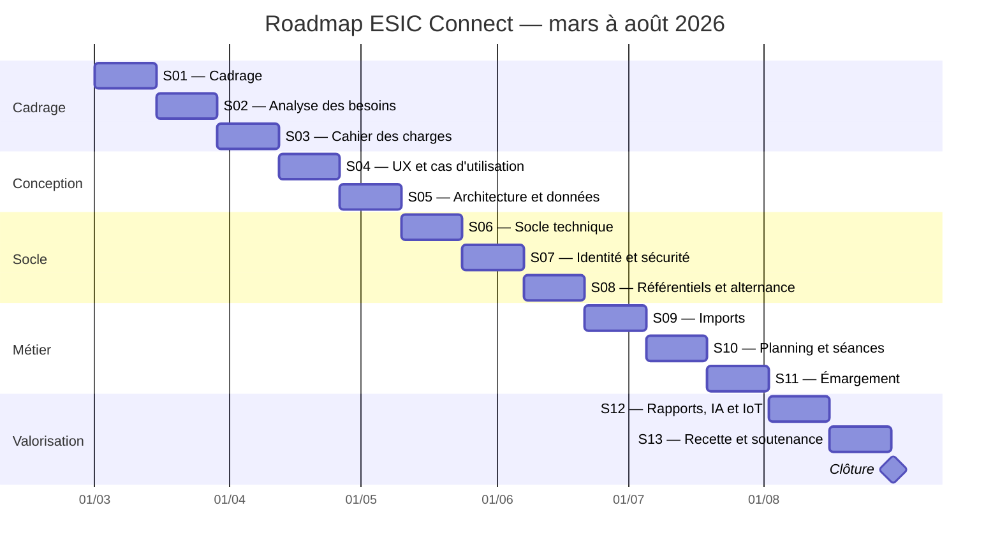

# Roadmap sur six mois — ESIC Connect

## Métadonnées

| Élément | Valeur |
|---|---|
| Période | 1er mars au 31 août 2026 |
| Nombre de sprints | 13 |
| Durée d’un sprint | Deux semaines |
| Méthode | Scrum adapté et Kanban |
| Product Owner | Monsieur BANKA |
| Scrum Master | Monsieur INOUSSA Chaabane |
| Architecte-développeur | Abubacar AFOLABI |
| Version | 1.0 |
| Date du document | 28 août 2026 |

---

# 1. Positionnement

Cette roadmap présente la **trajectoire de référence** du projet sur six
mois.

Elle décrit :

- l’ordre logique des travaux ;
- les objectifs des sprints ;
- les livrables attendus ;
- les dépendances ;
- les points de contrôle ;
- les compétences RNCP mobilisées.

Elle ne doit pas être interprétée comme la preuve que tous les travaux
ont été réellement exécutés aux dates indiquées.

Les preuves réelles sont déterminées par :

- le dépôt Git ;
- les commits ;
- les tests ;
- les captures ;
- les comptes rendus vérifiables ;
- les démonstrations.

---

# 2. Cadence Scrum

Chaque sprint dure deux semaines.

## Début de sprint

- Sprint Planning ;
- choix de l’objectif ;
- sélection des stories ;
- vérification de la capacité ;
- identification des risques.

## Pendant le sprint

- Daily Scrum court ;
- mise à jour du Kanban ;
- développement ;
- tests ;
- documentation ;
- traitement des obstacles.

## Fin de sprint

- Sprint Review ;
- vérification du résultat ;
- mise à jour du Product Backlog ;
- Sprint Retrospective ;
- définition d’une amélioration pour le sprint suivant.

---

# 3. Roadmap globale



---

# 4. S01 — Cadrage

## Période

```text
1er au 14 mars 2026
```

## Objectif du sprint

Comprendre la situation initiale, définir la problématique et identifier
les parties prenantes.

## Éléments prévus

- analyse de l’existant ;
- problématique ;
- objectifs ;
- acteurs ;
- première définition du périmètre ;
- première liste des risques ;
- organisation documentaire ;
- création du dépôt.

## Livrables attendus

- note de cadrage initiale ;
- carte des parties prenantes ;
- vision produit ;
- registre initial des risques ;
- arborescence documentaire.

## Incrément attendu

Un projet cadré et compréhensible par les parties prenantes.

## Blocs RNCP

- BC01.

---

# 5. S02 — Analyse des besoins

## Période

```text
15 au 28 mars 2026
```

## Objectif du sprint

Transformer les problèmes observés en besoins structurés.

## Éléments prévus

- entretiens ;
- besoins par rôle ;
- fonctionnement des plannings ;
- importation des apprenants ;
- règles d’assiduité ;
- cours présentiels, hybrides et distanciels ;
- alternance ;
- rapports ;
- sécurité ;
- IoT et IA.

## Livrables attendus

- expression des besoins ;
- comptes rendus vérifiables si disponibles ;
- premières user stories ;
- premières règles métier ;
- premières priorités.

## Incrément attendu

Un ensemble de besoins suffisamment précis pour préparer le cahier des
charges.

## Blocs RNCP

- BC01 ;
- BC02 ;
- BC03 ;
- BC04.

---

# 6. S03 — Cahier des charges et risques

## Période

```text
29 mars au 11 avril 2026
```

## Objectif du sprint

Formaliser les exigences fonctionnelles, techniques et sécuritaires.

## Éléments prévus

- exigences ;
- règles de gestion ;
- priorités MoSCoW ;
- critères d’acceptation ;
- exigences non fonctionnelles ;
- risques ;
- RGPD ;
- périmètre du MVP ;
- architecture cible initiale.

## Livrables attendus

- cahier des charges ;
- registre des risques ;
- plan qualité initial ;
- matrice exigences/blocs RNCP.

## Incrément attendu

Un cahier des charges validable et exploitable par l’équipe technique.

## Blocs RNCP

- BC01 ;
- BC02 ;
- BC03 ;
- BC04.

---

# 7. S04 — UX et cas d’utilisation

## Période

```text
12 au 25 avril 2026
```

## Objectif du sprint

Définir les interactions entre les utilisateurs et la plateforme.

## Éléments prévus

- personas ;
- parcours ;
- cas d’utilisation ;
- maquettes ;
- navigation ;
- accessibilité ;
- scénarios d’erreur ;
- structure de la présentation.

## Diagrammes

- cas d’utilisation global ;
- responsable pédagogique ;
- formateur ;
- apprenant ;
- administration ;
- activités d’import ;
- activités d’émargement.

## Livrables attendus

- dossier UX ;
- diagrammes ;
- maquettes ;
- parcours prioritaires.

## Incrément attendu

Une représentation claire de l’expérience utilisateur avant le
développement.

## Blocs RNCP

- BC01 ;
- BC02.

---

# 8. S05 — Architecture et modèle de données

## Période

```text
26 avril au 9 mai 2026
```

## Objectif du sprint

Définir une architecture sécurisée, modulaire et évolutive.

## Éléments prévus

- architecture trois tiers ;
- monolithe modulaire ;
- Spring Modulith ;
- MySQL ;
- Redis ;
- FastAPI ;
- MQTT ;
- SSE ;
- environnements ;
- modèle conceptuel ;
- modèle logique ;
- stratégie de suppression ;
- sauvegarde ;
- architecture AWS cible.

## Livrables attendus

- `docs/03-architecture.md` ;
- `docs/04-modele-donnees.md` ;
- diagramme de composants ;
- diagramme de déploiement ;
- diagramme de données ;
- ADR principaux.

## Incrément attendu

Une architecture suffisamment précise pour lancer l’implémentation.

## Blocs RNCP

- BC02 ;
- BC03 ;
- BC04.

---

# 9. S06 — Socle technique

## Période

```text
10 au 23 mai 2026
```

## Objectif du sprint

Créer un environnement local reproductible et les fondations
applicatives.

## Éléments prévus

- Docker Compose ;
- MySQL ;
- Redis ;
- Mailpit ;
- Mosquitto ;
- Spring Boot ;
- Angular ;
- FastAPI ;
- profils ;
- Flyway ;
- OpenAPI ;
- Actuator ;
- tests de démarrage.

## Livrables attendus

- applications initialisées ;
- conteneurs ;
- health checks ;
- migrations initiales ;
- documentation de lancement.

## Incrément attendu

Une plateforme vide, mais démarrable et observable.

## Blocs RNCP

- BC02 ;
- BC03 ;
- BC04.

---

# 10. S07 — Identité, rôles et sécurité

## Période

```text
24 mai au 6 juin 2026
```

## Objectif du sprint

Sécuriser les accès et appliquer les rôles.

## Éléments prévus

- utilisateurs ;
- rôles multiples ;
- connexion ;
- cookies sécurisés ;
- périmètres ;
- invitation ;
- récupération ;
- audit ;
- tests `401` et `403`.

## Livrables attendus

- authentification fonctionnelle ;
- comptes de démonstration ;
- matrice des droits ;
- tests d’autorisation ;
- écran de connexion.

## Incrément attendu

Des utilisateurs capables d’accéder uniquement à leurs fonctionnalités.

## Blocs RNCP

- BC02 ;
- BC03.

---

# 11. S08 — Référentiels et alternance

## Période

```text
7 au 20 juin 2026
```

## Objectif du sprint

Structurer les formations et les rythmes pédagogiques.

## Éléments prévus

- sites ;
- formations ;
- niveaux ;
- promotions ;
- classes ;
- matières ;
- inscriptions historiques ;
- responsables ;
- délégations ;
- trois rythmes d’alternance ;
- exceptions.

## Livrables attendus

- référentiels ;
- interfaces de gestion ;
- tests des changements de classe ;
- tests des rythmes.

## Incrément attendu

Une organisation pédagogique utilisable par les imports et les
plannings.

## Blocs RNCP

- BC02 ;
- BC03.

---

# 12. S09 — Importation des apprenants et plannings

## Période

```text
21 juin au 4 juillet 2026
```

## Objectif du sprint

Automatiser l’intégration des données pédagogiques.

## Éléments prévus

- import CSV apprenants ;
- simulation ;
- détection des doublons ;
- confirmation ;
- historique ;
- import CSV planning ;
- prévisualisation ;
- erreurs ;
- Excel multifeuille si possible.

## Livrables attendus

- API d’import ;
- écrans d’import ;
- fichiers exemples ;
- rapports d’import ;
- tests.

## Incrément attendu

Un responsable peut intégrer une classe et un planning sans ressaisie
individuelle.

## Blocs RNCP

- BC02 ;
- BC03.

---

# 13. S10 — Planning et séances

## Période

```text
5 au 18 juillet 2026
```

## Objectif du sprint

Transformer les plannings en séances opérationnelles.

## Éléments prévus

- brouillons ;
- publication ;
- versions ;
- conflits ;
- séances ;
- salles ;
- formateurs ;
- remplacements ;
- annulations ;
- liens distanciels ;
- notifications de modification.

## Livrables attendus

- calendrier ;
- séances publiées ;
- versionnement ;
- workflow de remplacement ;
- workflow d’annulation.

## Incrément attendu

Les utilisateurs consultent un planning publié et les formateurs
retrouvent leurs séances.

## Blocs RNCP

- BC02 ;
- BC03.

---

# 14. S11 — Émargement et assiduité

## Période

```text
19 juillet au 1er août 2026
```

## Objectif du sprint

Enregistrer les présences de façon fiable et calculer l’assiduité.

## Éléments prévus

- ouverture ;
- clôture ;
- QR dynamique ;
- QR fixe ;
- Redis ;
- quatre contrôles ;
- retards ;
- présence manuelle ;
- WebAuthn ;
- SSE ;
- demi-journées ;
- apprenant provisoire.

## Livrables attendus

- parcours d’émargement ;
- écran du formateur ;
- écran de l’apprenant ;
- tests d’expiration ;
- tests de concurrence ;
- calcul d’assiduité.

## Incrément attendu

Un parcours complet allant de l’ouverture d’une séance à la
visualisation de la présence.

## Blocs RNCP

- BC02 ;
- BC03 ;
- BC04.

---

# 15. S12 — Rapports, IA, IoT et supervision

## Période

```text
2 au 15 août 2026
```

## Objectif du sprint

Valoriser les données et démontrer les technologies avancées.

## Éléments prévus

- tableaux de bord ;
- rapports ;
- CSV ;
- Excel ;
- justificatifs ;
- réclamations ;
- notifications ;
- mapping intelligent ;
- score de confiance ;
- Raspberry Pi ;
- MQTT ;
- heartbeat ;
- événement sécurisé ;
- supervision.

## Livrables attendus

- tableaux de bord ;
- rapports ;
- service IA ;
- démonstration MQTT ;
- journaux ;
- métriques.

## Incrément attendu

Une solution capable de restituer les résultats et de démontrer l’IA et
l’IoT.

## Blocs RNCP

- BC02 ;
- BC03 ;
- BC04.

---

# 16. S13 — Recette, documentation et soutenance

## Période

```text
16 au 29 août 2026
```

## Objectif du sprint

Stabiliser, démontrer et documenter le projet.

## Éléments prévus

- tests finaux ;
- recette ;
- sécurité ;
- performance ;
- sauvegarde ;
- restauration ;
- staging ;
- rapport ;
- présentation ;
- matrice RNCP ;
- vidéo ;
- questions du jury ;
- bilan.

## Livrables attendus

- version candidate ;
- rapport final ;
- présentation ;
- vidéo ;
- cahier de recette ;
- guide de démonstration ;
- bilan des limites.

## Incrément attendu

Un prototype cohérent, documenté et soutenable.

## Blocs RNCP

- BC01 ;
- BC02 ;
- BC03 ;
- BC04.

---

# 17. Clôture

## Période

```text
30 et 31 août 2026
```

## Activités

- archivage ;
- export des documents ;
- vérification des sauvegardes ;
- gel de la version ;
- création d’un tag Git ;
- bilan ;
- dernières corrections non structurelles.

---

# 18. Jalons

| Jalon | Date cible | Résultat |
|---|---|---|
| J1 — Cadrage terminé | 14 mars 2026 | Vision et périmètre |
| J2 — Besoins consolidés | 28 mars 2026 | Besoins par acteur |
| J3 — Cahier des charges | 11 avril 2026 | Exigences définies |
| J4 — UX et cas d’utilisation | 25 avril 2026 | Parcours validables |
| J5 — Architecture validable | 9 mai 2026 | Architecture et données |
| J6 — Socle opérationnel | 23 mai 2026 | Services démarrables |
| J7 — Accès sécurisés | 6 juin 2026 | Authentification et rôles |
| J8 — Référentiels prêts | 20 juin 2026 | Formations et classes |
| J9 — Imports démontrables | 4 juillet 2026 | Apprenants et planning |
| J10 — Planning opérationnel | 18 juillet 2026 | Séances disponibles |
| J11 — Émargement complet | 1er août 2026 | Présence enregistrée |
| J12 — IA et IoT démontrés | 15 août 2026 | Technologies avancées |
| J13 — Version de soutenance | 29 août 2026 | Projet soutenable |

---

# 19. Risques de planification

| Risque | Conséquence | Réponse |
|---|---|---|
| Sous-estimation des imports | Décalage planning | Imposer le CSV avant Excel |
| WebAuthn complexe | Retard sécurité | Prévoir un prototype séparé |
| Trop de fonctionnalités | MVP incomplet | Respecter MoSCoW |
| IoT matériel indisponible | Bloc 4 insuffisant | Simulateur MQTT |
| Staging indisponible | Démonstration impossible | Démo locale et vidéo |
| Documentation tardive | Rapport incohérent | Mise à jour continue |
| Intégration IA incertaine | Bloc IA faible | Règles et score explicable |
| Données réelles indisponibles | Tests limités | Données synthétiques |

---

# 20. Gestion dans GitHub Projects

Créer trois vues :

## Vue 1 — Backlog

Disposition :

```text
Table
```

Groupement :

```text
Epic
```

## Vue 2 — Kanban

Disposition :

```text
Board
```

Colonnes :

```text
Backlog
Prêt
En cours
En revue
En test
Terminé
```

## Vue 3 — Roadmap

Disposition :

```text
Roadmap
```

Positionnement :

- itération ;
- date de début ;
- date cible.

Les itérations de GitHub Projects permettent de regrouper les éléments
dans des périodes répétitives et de les visualiser dans une roadmap.

---

# 21. Limites du travail en cours

| Colonne | Limite |
|---|---:|
| En cours | 2 |
| En revue | 2 |
| En test | 2 |

Objectif :

- réduire la dispersion ;
- terminer avant de commencer ;
- identifier rapidement les blocages.

---

# 22. Indicateurs de suivi

- nombre de stories terminées ;
- story points terminés ;
- stories reportées ;
- anomalies ouvertes ;
- couverture des tests ;
- risques critiques ;
- respect de l’objectif du sprint ;
- taux de couverture RNCP ;
- fonctionnalités démontrées ;
- dette technique restante.

---

# 23. Transparence

La roadmap est une planification de référence.

Elle ne doit pas être transformée en faux historique.

Le rapport doit distinguer :

- ce qui était planifié ;
- ce qui a été réellement réalisé ;
- ce qui a été consolidé tardivement ;
- ce qui a été simulé ;
- ce qui reste une architecture cible.
