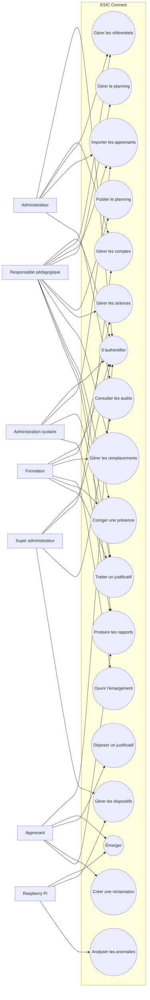

# Diagramme de cas d’utilisation global

## Objectif

Présenter les principales interactions entre les acteurs et ESIC Connect.

## Acteurs

| Acteur | Responsabilité |
|---|---|
| Super administrateur | Administration technique et sécurité |
| Administrateur | Administration fonctionnelle globale |
| Administration scolaire | Gestion administrative et rapports |
| Responsable pédagogique | Pilotage d’un périmètre de formation |
| Formateur | Gestion opérationnelle de ses séances |
| Apprenant | Planning, émargement et suivi personnel |
| Raspberry Pi | Borne IoT d’émargement et télémétrie |

## Règles importantes

- Un utilisateur peut cumuler plusieurs rôles.
- Le responsable pédagogique reste limité à son périmètre.
- Le formateur ne publie pas le planning.
- L’apprenant accède uniquement à ses données.
- La Raspberry Pi ne crée jamais directement une présence définitive :
  Spring Boot valide toujours l’événement.