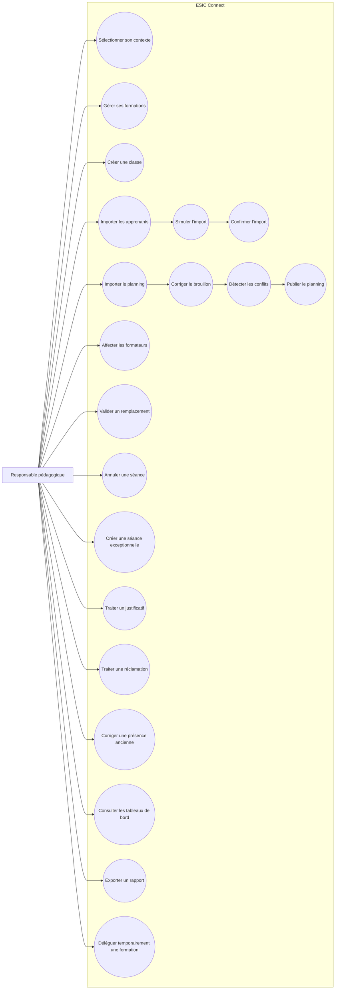

# Cas d’utilisation — Responsable pédagogique

## Préconditions générales

- Le compte est actif.
- L’utilisateur possède le rôle `PEDAGOGICAL_MANAGER`.
- Il est affecté à la formation concernée.
- Une authentification renforcée peut être demandée pour une action
  sensible.

## Postconditions importantes

- Les imports confirmés sont audités.
- Les séances proviennent d’un planning publié.
- Les anciennes inscriptions sont conservées.
- Les changements publiés peuvent générer des notifications.
- Toute correction ancienne exige un motif.