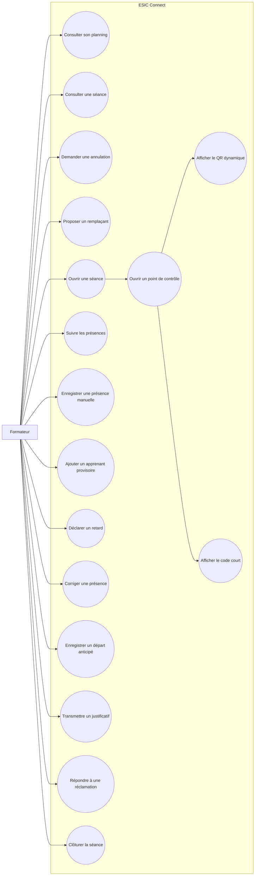

# Cas d’utilisation — Formateur

## Restrictions

- Le formateur ne publie pas le planning.
- Il ne valide pas lui-même son remplacement.
- Il ne supprime pas une présence.
- Une correction exige un motif.
- Une correction ancienne peut nécessiter un responsable pédagogique.
- L’ajout d’un nouvel apprenant crée une entrée provisoire, pas une
  inscription officielle.