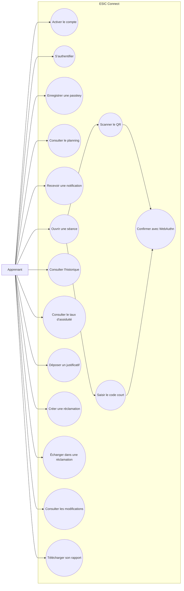

# Cas d’utilisation — Apprenant

## Restrictions

- L’apprenant ne consulte que ses propres données.
- Il ne modifie pas directement une présence.
- Le téléchargement du rapport peut être désactivé par le responsable.
- Un justificatif accepté produit `EXCUSED`, pas `PRESENT`.
- Une alternative est disponible si le smartphone ou WebAuthn est
  indisponible.