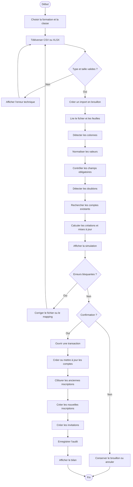

# Diagramme d’activité — Importation des apprenants

## Cas d’échec

- colonne obligatoire absente ;
- email invalide ;
- classe inconnue ;
- formation hors périmètre ;
- doublon dans le fichier ;
- conflit avec un compte existant ;
- classe cible identique ;
- import déjà confirmé ;
- erreur transactionnelle.

## Règle d’intégrité

La simulation ne modifie pas les données métier définitives.