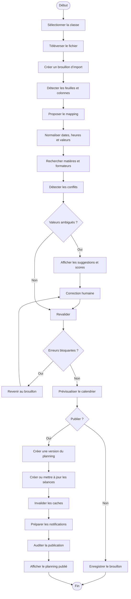

# Diagramme d’activité — Importation du planning

## Conflits contrôlés

- formateur affecté à deux séances ;
- salle utilisée simultanément ;
- classe affectée à deux séances ;
- horaire invalide ;
- formateur inconnu ;
- salle inactive ;
- incohérence avec l’alternance ;
- lien distant manquant si nécessaire.

## Position de l’IA

L’IA fournit une suggestion. Le responsable pédagogique reste le seul
décideur de la publication.