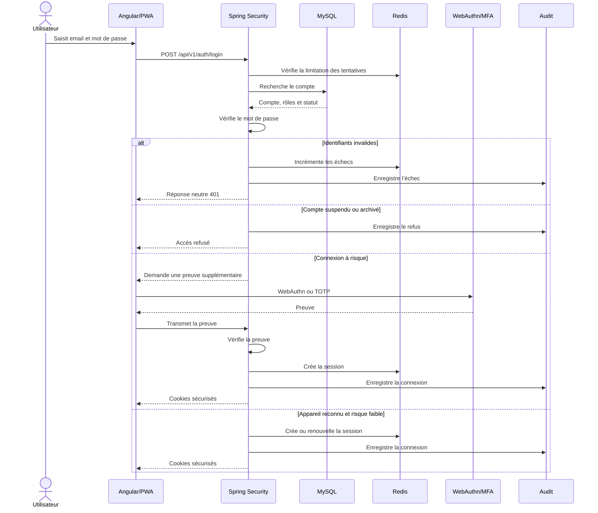

# Diagramme de séquence — Authentification adaptative

## Décisions

- Cookie `HttpOnly`.
- Cookie `Secure` sous HTTPS.
- Jeton sensible absent de `localStorage`.
- MFA renforcé selon le rôle ou le risque.
- Réponse de connexion neutre.
- Audit des succès et échecs.