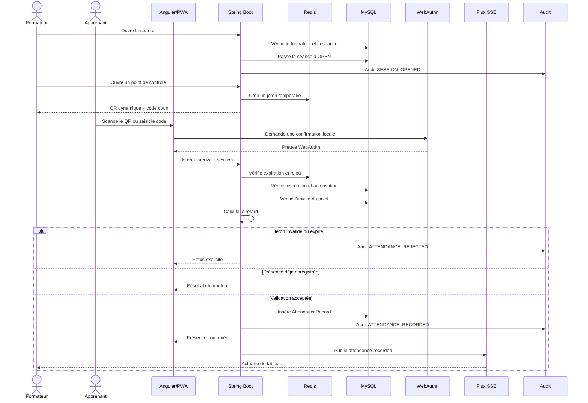

# Diagramme de séquence — Émargement dynamique

## Contrôles

- séance ouverte ;
- utilisateur authentifié ;
- inscription active ;
- point de contrôle actif ;
- jeton Redis valide ;
- unicité ;
- autorisation de distanciel ;
- WebAuthn lorsqu’il est disponible ou requis.