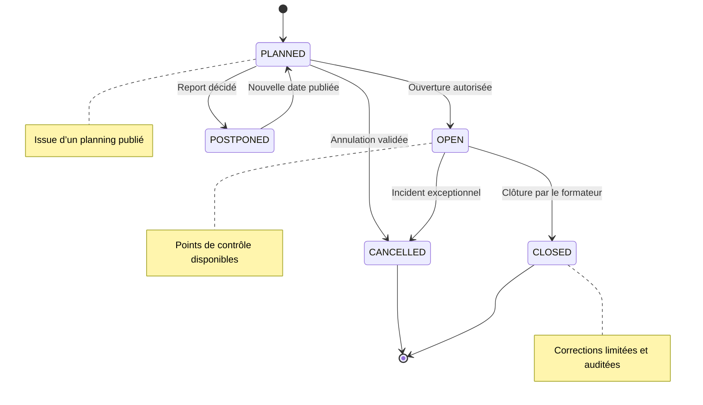

# Diagramme d’états — Séance

## Transitions autorisées

| État initial | État cible | Acteur |
|---|---|---|
| `PLANNED` | `OPEN` | Formateur affecté ou remplaçant |
| `PLANNED` | `CANCELLED` | Responsable pédagogique |
| `PLANNED` | `POSTPONED` | Responsable pédagogique |
| `OPEN` | `CLOSED` | Formateur |
| `POSTPONED` | `PLANNED` | Responsable pédagogique |

Toute transition doit être auditée.