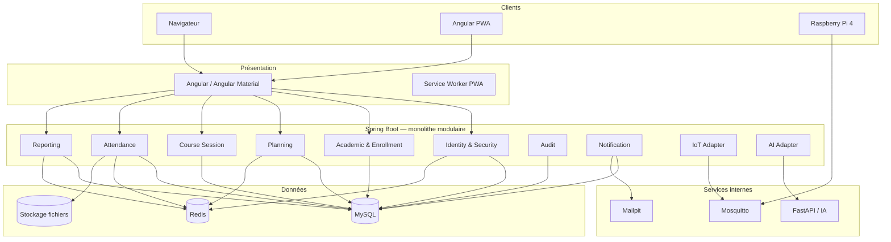

# Diagramme de composants

## Principe

Spring Boot reste :

- l’autorité de sécurité ;
- l’autorité métier ;
- le point d’entrée du navigateur ;
- le validateur des événements IA et IoT.

FastAPI et MQTT ne sont pas directement exposés au navigateur.