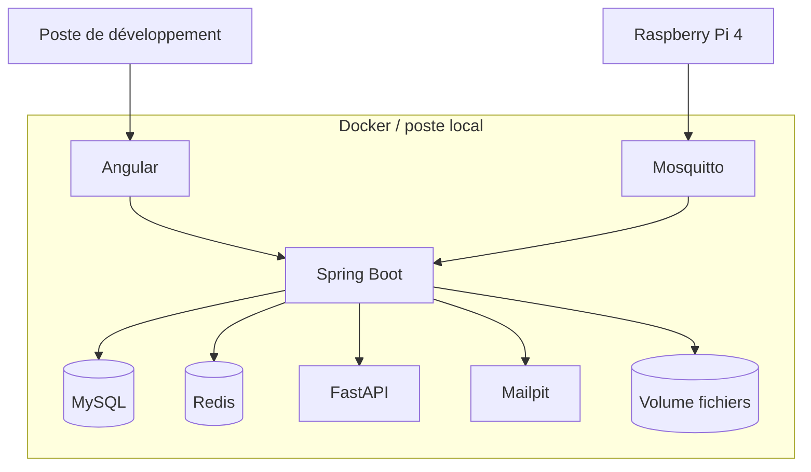
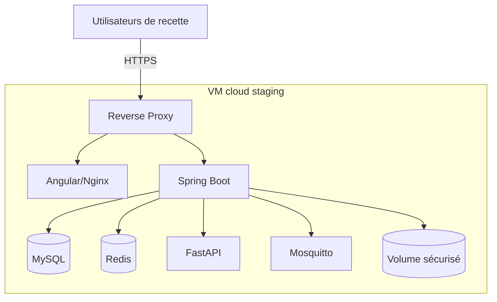
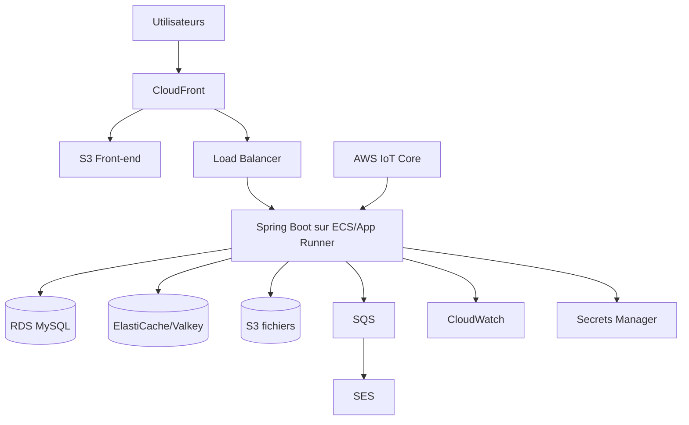

# Diagrammes de déploiement

## Déploiement local



## Déploiement staging



## Production AWS cible



## Environnements

```text
local → test → staging → production
```

- Local : développement.
- Test : tests automatisés.
- Staging : recette et démonstration.
- Production : exploitation réelle.