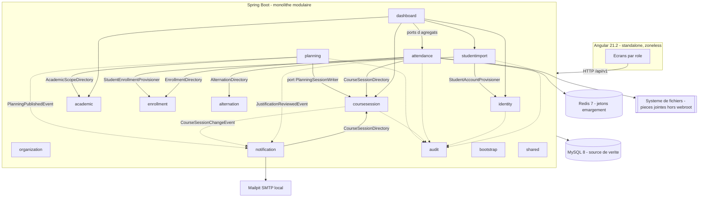
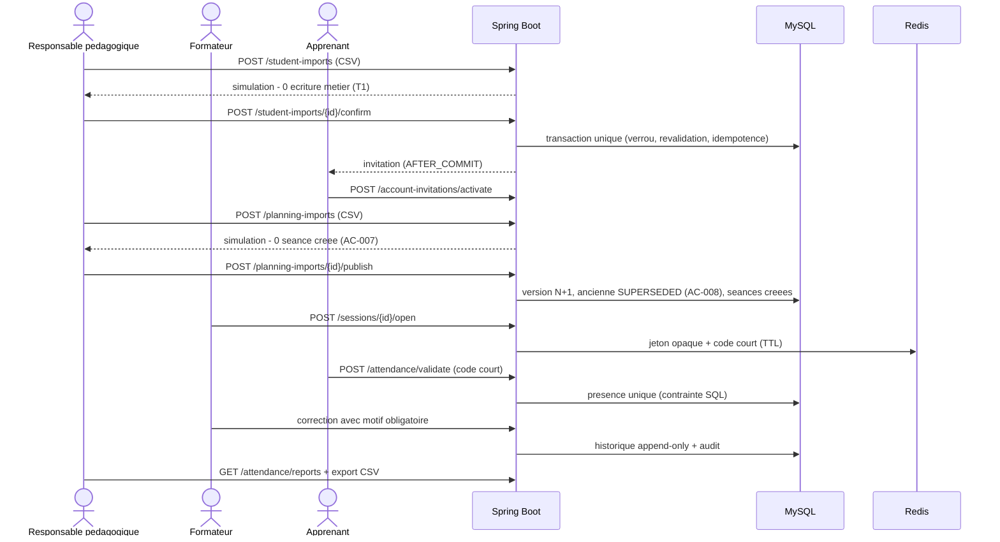
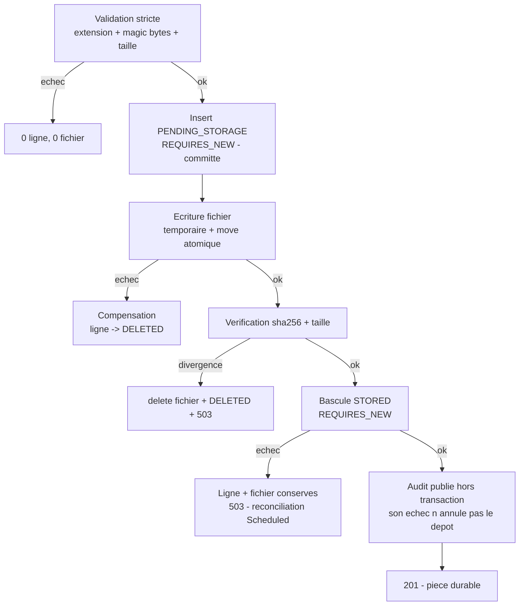

# Source technique consolidée — Mémoire de soutenance ESIC Connect

> **Ce document n'est pas le mémoire.** C'est une **source technique
> consolidée et vérifiable**, destinée à être fournie à un rédacteur (ou
> à un projet Claude) pour écrire le mémoire de soutenance RNCP 39394.
>
> **Règles de lecture** — chaque bloc technique donne :
> **Réalisation** (ce qui est fait) · **Preuves** (chemins exacts, tests,
> migrations, décisions, commits) · **Limites** (ce qui n'est pas fait) ·
> **À valoriser** (l'angle de soutenance).
>
> **Aucune affirmation de ce document n'est décorative** : elle est
> vérifiable dans le dépôt. Ce qui n'est pas prouvé est écrit comme non
> prouvé.
>
> **Point de vérité** : audit du **2 septembre 2026**, HEAD
> `d3450e6` (documentation alignée par `ae8c258`). Le code et les tests
> font foi ; en cas de divergence avec un document, c'est le code qui a
> raison.

---

## 1. Fiche d'identité du projet

| Élément | Valeur |
|---|---|
| Nom | **ESIC Connect** |
| Nature | Preuve de concept (prototype) d'une plateforme web de planification pédagogique, d'émargement et de suivi de l'assiduité |
| Établissement | ESIC (formations BTS / Bachelor / Mastère, commerce et informatique) |
| Porteur | Abubacar AFOLABI |
| Certification | **RNCP 39394 — Expert en systèmes d'information et sécurité** (blocs BC01 à BC04) |
| Stack | Java 21 · Spring Boot 3.5 · **Spring Modulith 1.4** · MySQL 8 · Redis 7 · Angular 21.2 (standalone, zoneless, signaux) · Angular Material · Flyway · Docker Compose · Mailpit |
| Architecture | **Monolithe modulaire** — 14 modules à frontières vérifiées automatiquement |
| Taille du schéma | **16 migrations Flyway** (V1 → V16), **41 tables** métier |
| Surface d'API | **30 contrôleurs REST** sous `/api/v1` |
| Tests | **811** tests back (96 classes) + **600** tests front (71 fichiers), **0 échec** |
| Environnement | **Local uniquement**, conteneurisé. **Aucun déploiement** |
| Statut global | **`IMPLEMENTED_NOT_MANUALLY_DEMONSTRATED / PARTIAL`** |
| Branche / HEAD | `docs/g1-manual-demonstration` — `d3450e6` (= `main`) |

**Vocabulaire de statut employé dans tout le dossier** (à reprendre tel
quel dans le mémoire) :

| Statut | Signification |
|---|---|
| `IMPLEMENTED_AND_TESTED` | code livré **et** couvert par des tests automatisés passants |
| `IMPLEMENTED_NOT_MANUALLY_DEMONSTRATED` | livré et testé, **jamais** manipulé manuellement de bout en bout |
| `PARTIAL` | une partie seulement de l'exigence est livrée |
| `NOT_IMPLEMENTED` | aucun code ; limite explicitement assumée |
| `HORS_PÉRIMÈTRE_ASSUMÉ` | exclusion décidée et documentée |

> **Ce vocabulaire est en soi un élément de soutenance** : il rend
> impossible de confondre « le code existe » et « ça marche devant un
> jury ».

---

## 2. Contexte métier

**Réalisation**

L'ESIC dispense des formations en alternance (BTS, Bachelor, Mastère).
L'observation de l'existant montre un système d'information **éclaté** :

- le **planning** est construit par le responsable pédagogique puis
  partagé sur un canal **Microsoft Teams** ; il n'existe pas d'outil
  central qui le publie et en génère les séances ;
- les réunions Teams des cours à distance sont créées **à la main** par
  le formateur ou le responsable, hors de tout planning ;
- l'**émargement** repose sur des feuilles papier, des fichiers Excel ou
  des supports construits au cas par cas ;
- le contrôle des absences et des justificatifs se fait par
  **sollicitation** du formateur, du responsable pédagogique, des
  conseillers ou de l'administration ;
- les taux d'assiduité et les attestations sont **calculés
  manuellement**.

Conséquences directes : ressaisies, doublons, perte de feuilles,
impossibilité de vérifier une présence a posteriori, absence de piste
d'audit homogène, délais de production des rapports, difficulté à gérer
remplacements et comptes non activés.

Une spécificité structurante : en **alternance**, une journée passée en
entreprise **n'est pas une absence**. Un système qui ignore le rythme
produit mécaniquement de faux absentéistes.

**Preuves**

- `docs/01-cadrage.md` §2 (contexte), §3 (problématique)
- `docs/02-cahier-des-charges.md` §2.2 (contexte actuel), §2.3 (15
  problèmes identifiés), §8 (rythmes d'alternance)

**Limites**

Le contexte est décrit à partir d'une **observation** du fonctionnement,
**sans étude terrain formalisée**, sans entretiens tracés ni volumétrie
mesurée. À présenter comme tel.

**À valoriser**

La distinction absence / journée entreprise est le **premier arbitrage
métier du projet** : elle a une conséquence technique directe (module
`alternation`, contexte `SCHOOL` / `COMPANY` / `UNKNOWN` consommé par le
calcul d'assiduité). C'est un bon exemple de « besoin métier → règle de
gestion → modèle de données → test ».

---

## 3. Problématique

> Comment concevoir une plateforme centralisée, performante, accessible
> et sécurisée permettant aux responsables pédagogiques d'importer les
> apprenants et les plannings, aux formateurs d'utiliser les séances
> programmées, aux apprenants d'émarger de manière fiable et à
> l'administration de suivre l'assiduité, tout en garantissant la
> traçabilité, la protection des données et la continuité des activités
> pédagogiques ?

**Sous-problèmes techniques réellement traités**, chacun avec une
réponse implémentée :

| Sous-problème | Réponse implémentée |
|---|---|
| Comment importer des données hétérogènes sans corrompre la base ? | **simulation systématique sans écriture métier**, puis confirmation transactionnelle unique |
| Comment garantir qu'une présence n'est ni rejouable ni falsifiable ? | jeton **opaque** à TTL court en Redis + contrainte SQL d'unicité + audit |
| Comment republier un planning sans détruire les séances déjà tenues ? | **identité de créneau stable** + versionnement + supersession, jamais de suppression |
| Comment garder des modules étanches dans un monolithe ? | Spring Modulith + **ports publics** + événements, frontières **testées** |
| Comment rester cohérent entre une base et un système de fichiers ? | séquence **compensée** avec état `PENDING_STORAGE` + réconciliation |
| Comment ne pas mentir sur ce qui est livré ? | vocabulaire de statuts + matrices d'exigences + reclassements à la baisse |

**À valoriser**

Le mémoire gagne à être structuré autour de ces **six sous-problèmes**
plutôt qu'autour d'une liste de fonctionnalités : chacun a une réponse
technique nommée, une preuve et une limite.

---

## 4. Objectifs initiaux

**Objectif général** : prototype web responsive couvrant le cycle
« importation des apprenants et des plannings → émargement → rapports
d'assiduité », en trois jours de réalisation annoncés.

**Objectifs fonctionnels** : 38 objectifs numérotés
(`docs/01-cadrage.md` §5.2), consolidés en **62 exigences `EF-*`**,
**59 règles de gestion `RG-*`** et **20 critères d'acceptation `AC-*`**
(`docs/02-cahier-des-charges.md` §43, §44, §45), priorisés
`MUST` / `SHOULD` / `COULD` / `FUTURE` (§56).

**Objectifs techniques** : Java 21 + Spring Boot, Angular + Material,
MySQL source de vérité, Redis pour le temporaire, Python/FastAPI pour
l'IA, MQTT pour l'IoT, Docker Compose en local, API REST documentée,
migrations, tests automatisés.

**Objectifs de sécurité** : hachage robuste, RBAC + cumul de rôles +
périmètre, MFA sur comptes sensibles, anti-bot, limitation de tentatives,
**aucune donnée personnelle dans les QR codes**, jetons temporaires non
prédictibles, anti-rejeu, journalisation, **aucune donnée biométrique
stockée**, données strictement fictives.

**Preuves** : `docs/01-cadrage.md` §5 ; `docs/02-cahier-des-charges.md`
§3, §43-§45, §56.

**Limites**

L'écart entre l'ambition initiale (IA, IoT, WebAuthn, MFA, PWA, AWS) et
le livré est **important et assumé** — il est traité au §7 et au §34.

**À valoriser**

Ne pas cacher l'écart : le **décrire comme un exercice de priorisation**.
Le cahier des charges a été écrit comme une cible d'architecte ; la
livraison a été arbitrée par la valeur et le risque.

---

## 5. Périmètre retenu

**Parcours prioritaire** (fil conducteur du projet, `CLAUDE.md`) :

```text
Import apprenants → Import planning → Publication → Création des séances
→ Ouverture par le formateur → Émargement → Rapport
```

**Deux mouvements de périmètre, tous deux datés et documentés** — c'est
un point de pilotage à valoriser :

1. **Réduction assumée (F2, 31 août 2026)** : le domaine **planning**
   est déclaré **`HORS_PÉRIMÈTRE_ASSUMÉ`**. `EF-PLAN-001..007`,
   `EF-SES-001`, `RG-016`, `AC-007`, `AC-008` sont explicitement
   **non livrés**, et le dépôt écrit noir sur blanc que le parcours
   prioritaire est **incomplet**.
   *Preuve* : `docs/01-cadrage.md` §23.5, `docs/02-cahier-des-charges.md`
   §4.5.1, `docs/reports/PROJECT_FINAL_AUDIT.md` §7.4.
2. **Levée (lot G1, 1er septembre 2026)** : le module `planning` est
   réellement implémenté, testé et fusionné (PR #40). Les exigences
   ci-dessus passent `IMPLEMENTED_AND_TESTED`.
   *Preuve* : `docs/reports/G1_FINAL_REPORT.md` §2 ;
   `G1_REQUIREMENTS_TRACEABILITY.md` §3, §3bis.

**À valoriser**

Cette séquence **réduction → livraison** est plus démonstrative qu'une
livraison directe : elle montre une capacité à **arrêter** un périmètre
sous contrainte, à le documenter sans le maquiller, puis à le **reprendre
proprement** quand les conditions le permettent.

---

## 6. Périmètre réellement livré

**Réalisation** — parcours de bout en bout, rejoué automatiquement :

```text
Administration et référentiels (site / salle, année, formation, classe)
  → Import CSV contrôlé des apprenants (simulation → confirmation)
  → Activation d'un compte apprenant par invitation
  → Import CSV du planning → simulation (0 séance créée)
  → Publication versionnée → génération des séances
  → Ouverture de la séance par le formateur
  → Émargement (jeton opaque + code court, Redis)
  → Suivi et correction motivée / auditée des présences
  → Rapport d'assiduité (demi-journées) + export CSV
  → Justificatif avec pièce jointe → acceptation / refus
  → Notifications métier
  → Tableaux de bord selon le rôle
```

**Preuves**

- Recette : `backend/src/test/java/com/esic/connect/recette/PriorityPathRecetteIntegrationTests.java`
  (`@SpringBootTest(RANDOM_PORT)` + `TestRestTemplate`, appels HTTP réels)
- Vue de synthèse : `docs/CURRENT-STATE.md`
- Matrice d'exigences : `docs/reports/G1_REQUIREMENTS_TRACEABILITY.md`
- Commit de fusion : `d3450e6` — `feat(g1): livrer la montée en gamme
  fonctionnelle du Groupe 1 (#40)`

**Limites — à énoncer sans détour**

- **Aucun test e2e navigateur** (`NOT_IMPLEMENTED`).
- **Aucune démonstration manuelle consignée** (`NOT_PERFORMED`) : aucune
  capture d'écran, aucune trace d'une session UI.
- La recette est une **recette d'intégration API**, pas un e2e : elle ne
  pilote aucun navigateur et ne rend aucun composant Angular.

**À valoriser**

La chaîne est **continue** : un **seul** apprenant, créé par l'import
CSV, activé via l'API publique d'activation (jeton capté par un mailer de
test), est **le même** qui émarge, dépose un justificatif et sa pièce
jointe. Ce point avait été corrigé en fin de lot : la version précédente
créait un apprenant parallèle, ce qui rendait la chaîne **discontinue
tout en paraissant complète** (réserve G, `G1_FINAL_REPORT.md` §3.1).

---

## 7. Exigences implémentées, partielles et écartées

### 7.1 Vue par domaine

| Domaine | Exigences | Statut |
|---|---|---|
| Authentification, rôles, contexte | `EF-AUTH-001..003`, `EF-USER-002/003` | `IMPLEMENTED_AND_TESTED` |
| Référentiels académiques et organisationnels | `EF-ACA-001..006`, `EF-ROOM-001` | `IMPLEMENTED_AND_TESTED` (API) ; écrans d'écriture `academic` **absents** |
| Import apprenants | `EF-IMP-001`, `EF-IMP-002` | `IMPLEMENTED_AND_TESTED` |
| Planning | `EF-PLAN-001, 002, 004, 005, 007`, `RG-016`, `RG-030/031`, `AC-007`, `AC-008` | `IMPLEMENTED_AND_TESTED` |
| Séances | `EF-SES-001..005` | `IMPLEMENTED_AND_TESTED` |
| Émargement et assiduité | `EF-ATT-001, 002, 004, 006` | `IMPLEMENTED_AND_TESTED` |
| Justificatifs | `EF-JUS-001`, `EF-JUS-002`, `RG-071/072`, `AC-014` | `IMPLEMENTED_AND_TESTED` (fonctionnel) |
| Rapports | `EF-REP-001..003` | `IMPLEMENTED_AND_TESTED` |
| Audit | `EF-AUD-001` | `IMPLEMENTED_AND_TESTED` |
| Notifications | `EF-NOTIF-001` | `IMPLEMENTED_AND_TESTED` |

### 7.2 `PARTIAL` — à ne jamais présenter comme complet

| Exigence | Ce qui manque exactement |
|---|---|
| `EF-ATT-003` (4 points de contrôle) | N points génériques (`START`/`END`/`CUSTOM`) livrés ; les **4 types nommés** (`MORNING_ARRIVAL`…) et le calcul journée / demi-journée strict du cahier **ne sont pas modélisés** |
| `EF-ATT-005` (retards) | **seuil unique** `PT10M` ; les paliers 15 / 30 min et la validation manuelle au-delà de 30 min ne sont pas implémentés |
| `EF-PLAN-003` (correction de lignes) | pas d'édition ligne à ligne ; contournement = **annulation + réimport** (`DEC-G1-003`) |
| `EF-PLAN-007`, `RG-032..035` | versions conservées, mais conflit **salle** contre les séances déjà publiées non détecté ; pas de retour à une version antérieure |
| `EF-NOTIF-002`, `RG-033` | audience **formateurs uniquement** ; apprenants et responsables pédagogiques **non notifiés** ; livraison « au mieux » **sans reprise** |
| Tableaux de bord (CDC §25) | cartes manager (justificatifs périmétrés, alternance `UNKNOWN`, planning actif, conflits) et « audit récent » administration **non exposées** |
| `EF-USER-001` | pas d'endpoint `POST /users` créant un compte `PENDING_ACTIVATION` |
| Rapports officiels (CDC §24.5) | pas de mise en page, pas de PDF, pas d'export Excel (`EF-REP-004`) |
| Anti-brute-force (CDC §26.4) | **rate-limiting `NOT_IMPLEMENTED`** ; atténuations : refus uniforme + BCrypt |

### 7.3 `HORS_PÉRIMÈTRE_ASSUMÉ` — décidé, documenté, jamais présenté comme livré

`EF-PLAN-006` (planning plein calendrier) · `EF-ROOM-002` +
`EF-ATT-008` (QR fixe de salle et contrôle réseau — le référentiel
`site_network_range` **existe mais n'est pas consommé**) · scan caméra ·
`EF-AUTH-005` (mot de passe oublié) · `EF-AUTH-006/007` (WebAuthn /
passkeys) · `EF-AUTH-008` (MFA TOTP) · anti-bot Turnstile ·
`EF-CLAIM-001/002` (réclamations) · départ anticipé ·
`EF-IMP-003/004` (Excel, multifeuille) · `EF-AI-001..003` (IA) ·
`EF-IOT-001/002` (MQTT, Raspberry Pi) · PWA installable / offline / push
· `/auth/logout` et révocation de session · déploiement cloud, HTTPS,
haute disponibilité, sauvegarde outillée · **e2e navigateur**.

**Preuves** : `docs/CURRENT-STATE.md` ;
`docs/reports/G1_REQUIREMENTS_TRACEABILITY.md` §1bis et §10 ;
`docs/reports/PROJECT_FINAL_AUDIT.md` §0.3 et §7.4.

**À valoriser**

Le tableau §7.2 est **le meilleur matériau de soutenance du dossier** :
chaque ligne dit précisément *ce qui manque*, pas « en cours ». Un jury
teste presque toujours la capacité à qualifier son propre incomplet.

---

## 8. Utilisateurs et responsabilités

**Six rôles** (table `role`, amorcée par `V2`), cumulables :

| Rôle | Peut réellement, dans le produit livré |
|---|---|
| `SUPER_ADMIN` | administration technique, comptes, plages réseau CIDR, référentiel organisationnel |
| `ADMIN` | comptes et rôles, référentiels, imports, planning, séances |
| `SCHOOL_ADMINISTRATION` | consultation, suspension / réactivation, suivi d'assiduité, rapports, justificatifs |
| `PEDAGOGICAL_MANAGER` | **dans son périmètre** : import apprenants, import et **publication** du planning, séances, annulation, remplaçants, justificatifs, rapports |
| `TEACHER` | ses séances **et celles où il est remplaçant actif** : ouvrir, afficher QR / code court, suivre et corriger les présences, clôturer |
| `STUDENT` | activer son compte, émarger, consulter son assiduité, déposer un justificatif **avec pièce jointe** |

**Trois règles d'autorisation réellement implémentées**

1. **Refus par défaut** : `@EnableMethodSecurity` + `@PreAuthorize` sur
   toutes les routes non publiques.
2. **Le périmètre est décidé côté serveur** : `AcademicScopeGuard` /
   `AcademicScopeDirectory`. Le front ne fait que **masquer** ; il ne
   décide jamais.
3. **Le cumul de rôles n'élargit jamais le périmètre** : un responsable
   également formateur gère ses formations et enseigne ses séances, mais
   **ne voit pas** les formations d'un autre responsable (`AC-002`,
   `AC-003`).

**Preuves**

- `backend/src/main/java/com/esic/connect/academic/AcademicScopeDirectory.java`,
  `academic/internal/AcademicScopeGuard.java`
- `backend/src/main/java/com/esic/connect/coursesession/internal/CourseSessionAccessGuard.java`
- Tests : `academic/AcademicScopeDirectoryTests`,
  `academic/PedagogicalScopeIntegrationTests`, et une classe
  `*SecurityTests` par module (matrice `401` / `403` / `200`)

**Limites** — pas de MFA, pas de WebAuthn, pas de révocation de session
(JWT stateless assumé), pas d'écran d'émission d'invitation.

**À valoriser**

Le **contexte de rôle multi-rôles** : le front propose un sélecteur, le
serveur **vérifie** que le rôle demandé figure dans le JWT et refuse
sinon (`403 DASHBOARD_CONTEXT_NOT_HELD`). Ce n'est **pas** une
préférence d'affichage : c'est une décision serveur. Ce point avait été
détecté comme une **divergence UI ↔ serveur** en fin de lot (le serveur
ignorait le contexte et appliquait une priorité fixe) — corriger cette
divergence est une bonne anecdote technique.

---

## 9. Parcours métier de bout en bout

| # | Acteur | Action | Garantie technique |
|---|---|---|---|
| 1 | `ADMIN` / `SUPER_ADMIN` | créer site, bâtiment, salle, année, formation, niveau, promotion, classe | archivage plutôt que suppression ; `public_id` UUID |
| 2 | `PEDAGOGICAL_MANAGER` | importer le CSV apprenants | **simulation sans aucune écriture métier** (invariant T1) |
| 3 | idem | confirmer | **une seule transaction** : verrou `FOR UPDATE`, re-validation, idempotence, rollback total (T3), e-mail **après commit** (T4), audit **après commit** (T5) |
| 4 | Apprenant | activer son compte | jeton `SecureRandom`, **empreinte SHA-256 seule** stockée, TTL, **usage unique** |
| 5 | `PEDAGOGICAL_MANAGER` | importer le planning CSV | simulation : anomalies + conflits, **0 séance créée** (`AC-007`) |
| 6 | idem | publier | transaction **tout ou rien**, version N/N+1, ancienne `SUPERSEDED` (`AC-008`), séances créées via **port public** |
| 7 | `TEACHER` | ouvrir la séance | cycle strict `PLANNED → OPEN → CLOSED`, **pas de réouverture** |
| 8 | Serveur | générer le jeton | jeton **opaque** + code court en Redis, TTL 30 s, rotation ; **le QR ne contient aucune donnée personnelle** |
| 9 | `STUDENT` | émarger | inscription vérifiée à la **date civile de la séance** ; anti-doublon par contrainte SQL ; `PRESENT` / `LATE` |
| 10 | `TEACHER` | corriger une présence | **motif obligatoire**, historique append-only, verrou optimiste → `409` |
| 11 | `STUDENT` | déposer un justificatif + pièce jointe | validation par **magic bytes**, stockage hors webroot, séquence compensée |
| 12 | `PEDAGOGICAL_MANAGER` | accepter | `ABSENT → EXCUSED_ABSENCE` (`AC-014`) ; **notification du propriétaire après commit** |
| 13 | Tous | consulter rapports / tableau de bord | périmètre serveur ; apprenant strictement cloisonné (`AC-017`) |

**Preuve unique couvrant tout le parcours** :
`recette/PriorityPathRecetteIntegrationTests#theEndToEndPriorityPathAndG1ExtensionsReplaySuccessfully`.

---

## 10. Architecture générale

**Réalisation**

```text
Navigateur / Angular 21.2 (standalone, zoneless, signaux)
        │  HTTP  (ng serve proxifie /api en local)
        ▼
Spring Boot 3.5 — monolithe modulaire (Spring Modulith 1.4)
   │            │             │              │
   ▼            ▼             ▼              ▼
MySQL 8      Redis 7      Mailpit       Système de fichiers
(source      (jetons      (SMTP local)  (pièces jointes,
 de vérité)   d'émarge-                  hors webroot)
              ment SEULS)

Mosquitto (MQTT) : démarré par compose.yaml, AUCUN code ne s'y connecte.
```

**Preuves** : `compose.yaml` ; `docs/03-architecture.md` §7 et §24bis ;
`backend/src/main/resources/application.yml`.

**Limites — le tableau « cible vs réel »**

| Sujet | Réel | Documenté comme cible |
|---|---|---|
| Exécution | local uniquement | staging, AWS (`docs/03` §24, §25) |
| HTTPS / TLS | **aucun** | §26 |
| Redis | **jetons d'émargement uniquement** | cache planning, rate-limiting, droits calculés |
| Stockage fichiers | système de fichiers **local** | S3 |
| Messagerie | Mailpit, envoi asynchrone, échec seulement journalisé | SES + file + DLQ |
| IoT | broker démarré, **aucun code** | AWS IoT Core |
| Supervision | `/actuator/health` seul | métriques, logs JSON |
| Sauvegarde / HA | **aucune, jamais testée** | §28, §29 |

**À valoriser**

Le choix du **monolithe modulaire** contre les microservices, argumenté :
réduction du temps d'implémentation, de la complexité opérationnelle et
des problèmes de communication interservices — **sans renoncer aux
frontières**, puisque celles-ci sont vérifiées par un test. C'est la
justification la plus solide de l'architecture.

---

## 11. Architecture modulaire

**Réalisation** — **14 modules** sous `com.esic.connect` :

`identity` · `organization` · `academic` · `enrollment` · `alternation` ·
`planning` · `coursesession` · `attendance` · `studentimport` ·
`notification` · `dashboard` · `audit` · `bootstrap` · `shared`

**Trois règles structurantes, réellement tenues**

1. Chaque module a un package `internal` **inaccessible** aux autres.
2. Les échanges passent par des **ports publics** (interfaces + records
   d'UUID publics) — **jamais** une entité JPA ni un repository partagé.
3. Les effets transverses passent par des **événements**.

**Ports publics principaux** (fichiers réels, hors `internal`) :

| Port | Fournisseur → consommateur | Objet |
|---|---|---|
| `coursesession/PlanningSessionWriter.java` | `coursesession` → `planning` | créer / réutiliser / superséder des séances à la publication |
| `coursesession/CourseSessionDirectory.java` | → `planning`, `notification`, `dashboard` | fenêtres de séances, destinataires, séances à venir |
| `academic/AcademicScopeDirectory.java`, `academic/ClassGroupDirectory.java` | → `planning`, `dashboard`, `studentimport` | périmètre pédagogique, résolution de classes **par lot** |
| `enrollment/StudentEnrollmentProvisioner.java`, `enrollment/EnrollmentDirectory.java` | → `studentimport`, `attendance` | inscription à l'import, inscription active |
| `identity/StudentAccountProvisioner.java`, `identity/TeacherDirectory.java`, `identity/UserDirectory.java`, `identity/CurrentUserResolver.java` | → plusieurs | provisionnement, résolution d'utilisateurs |
| `attendance/JustificationFileStorage.java` | port **sortant** | stockage du contenu hors base |
| `alternation/AlternationDirectory.java` | → `attendance`, `planning` | contexte `SCHOOL` / `COMPANY` / `UNKNOWN` |
| `attendance/AttendanceDashboardDirectory.java`, `studentimport/StudentImportDashboardDirectory.java`, `identity/AccountStatsDirectory.java`, `organization/SiteDirectory.java` | → `dashboard` | agrégats bornés |

**Événements publics** : `planning/PlanningPublishedEvent.java`,
`coursesession/CourseSessionChangeEvent.java`,
`coursesession/AttendanceCheckpointChangeEvent.java`,
`attendance/AttendanceChangeEvent.java`,
`attendance/JustificationReviewedEvent.java`, plus les événements de
cycle de vie de chaque module vers `audit`.

**Preuves**

- 14 fichiers `package-info.java` sous `backend/src/main/java/com/esic/connect/*/`
- **Test** : `backend/src/test/java/com/esic/connect/ModularityTests.java` — **vert**
- Décision : `docs/reports/G1_ARCHITECTURE_DECISIONS.md`, `DEC-G1-001`
- Documentation : `docs/03-architecture.md` §7

**Limites**

`claim`, `reporting`, `ai`, `iot` restent une **architecture cible sans
code**. `justification` n'est pas un module autonome (fusionné dans
`attendance`). Le décompte « 13 modules » qui traînait dans le journal du
lot était **faux d'une unité** — corrigé.

**À valoriser**

**Démonstration en direct possible** : ouvrir `ModularityTests`,
introduire volontairement un import vers un package `internal` d'un autre
module, relancer, montrer l'échec. Cela prouve que la modularité est une
**contrainte outillée**, pas une intention de documentation.

---

## 12. Stack technique et justification des choix

| Choix | Justification retenue | Conséquence assumée |
|---|---|---|
| **Monolithe modulaire** (Spring Modulith) plutôt que microservices | délai court, une seule unité de déploiement, pas de communication réseau interservices à sécuriser — **sans renoncer aux frontières**, vérifiées par test | pas de scalabilité indépendante par domaine |
| **MySQL** comme source de vérité unique | relationnel adapté aux contraintes d'intégrité fortes (unicité d'inscription, anti-doublon de présence) ; `CHECK` et clés étrangères font partie de la logique métier | pas de flexibilité documentaire |
| **Flyway** seul maître du schéma + `ddl-auto: validate` | le schéma est un artefact **versionné et rejouable** ; Hibernate ne peut jamais le modifier et **échoue au démarrage** si le mapping diverge | toute évolution passe par une migration |
| **Redis** limité aux jetons d'émargement | on n'utilise Redis que là où sa sémantique (TTL, expiration automatique) est **exactement** le besoin | pas de cache applicatif — l'objectif « < 100 ms » n'est pas atteint partout |
| **Angular standalone / zoneless / signaux** | absence de `zone.js`, rendu piloté par signaux ; budget de bundle tenu (**484,52 kB** < 500 kB) | version récente, moins de ressources communautaires |
| **JWT en mémoire seule** (ni `localStorage`, ni `sessionStorage`) | supprime la classe d'exfiltration par XSS de stockage persistant ; conforme à `RG-085` | **session perdue au rechargement** — comportement voulu et documenté |
| **Mailpit** en local | permet de démontrer réellement l'invitation et l'activation sans prestataire externe ni données réelles | délivrabilité externe **non testée** |
| **Docker Compose** | infrastructure reproductible en une commande | aucun déploiement réel |

**Preuves** : `backend/pom.xml`, `frontend/package.json`,
`compose.yaml`, `backend/src/main/resources/application.yml`,
`docs/03-architecture.md`.

**À valoriser**

Le point le plus défendable : **`ddl-auto: validate`**. Il rend
impossible la dérive silencieuse entre code et base — une divergence
n'est pas un bug de production, c'est un **refus de démarrage**.

---

## 13. Modèle de données et migrations

**Réalisation** — **16 migrations**, **41 tables**, toutes **additives**.

| Migration | Contenu | Bloc |
|---|---|---|
| `V1` | `user_account`, `role`, `user_role`, `audit_event` | socle |
| `V2` | amorce des **6 rôles** de référence (seule migration insérant des données) | socle |
| `V3` | `account_invitation` | socle |
| `V4` | `site`, `building`, `room`, `site_network_range` | organisation |
| `V5` | `academic_year`, `program`, `program_level`, `promotion`, `class_group` | pédagogie |
| `V6` | `pedagogical_assignment` | périmètre |
| `V7` | `student_profile`, `enrollment` | inscriptions |
| `V8` | `work_study_pattern`, `class_work_study_pattern`, `student_schedule_exception` | alternance |
| `V9` | `course_session`, `session_class`, `attendance_checkpoint`, `attendance_record` | séances |
| `V10` | `attendance_correction`, `attendance_justification` | assiduité |
| `V11` | `student_import_job` (+3 filles), `student_number_sequence` | import |
| `V12` | `planning_schedule`, `planning_version`, `planning_entry`, `planning_import_job` (+3 filles) | **G1-B** |
| `V13` | colonnes **additives** sur `course_session` (dont `planning_slot_public_id`) | **G1-B** |
| `V14` | `teacher_substitution` + colonnes d'annulation sur `course_session` | **G1-C** |
| `V15` | `notification` | **G1-D** |
| `V16` | `justification_attachment` | **G1-E** |

**Choix de modélisation à expliquer au jury**

1. **Double identité** : clé interne `BIGINT` jamais exposée + `public_id`
   UUID (`BINARY(16)`) unique, **seul** identifiant circulant dans l'API,
   les DTO, les événements et le front. Conséquence directe : les IDOR
   par incrément sont structurellement impossibles.
2. **Archivage plutôt que suppression** ; clés étrangères en `RESTRICT`
   vers `user_account` : un compte porteur d'historique **ne peut pas**
   être supprimé.
3. **Verrouillage optimiste** (`version` dans `shared/BaseEntity.java`) :
   une modification concurrente produit `409`, **jamais** `500`.
4. **Les contraintes SQL portent la règle métier** : unicité de
   l'inscription active, anti-doublon de présence, une seule pièce jointe
   active (colonne **générée** + `UNIQUE`), `dedup_key` unique des
   notifications, `CHECK` de statuts.
5. **Aucun contenu binaire en base** : le contenu des fichiers vit sur le
   système de fichiers ; la base ne porte que les métadonnées.

**Preuves** : `backend/src/main/resources/db/migration/` ;
`docs/04-modele-donnees.md` §6bis (schéma **réel**) ;
`docs/reports/G1_ARCHITECTURE_DECISIONS.md`, `DEC-G1-012`.

**Limites**

- `docs/04-modele-donnees.md` §9 à §25 décrit un **modèle cible** dont
  plusieurs tables n'existent pas (`subject`, `teaching_assignment`,
  `schedule*`, `claim*`, `file_asset`, `iot_*`, `webauthn_credential`…).
  Le §6bis dit lequel est réel — **le mémoire doit citer le §6bis**.
- V12 et V13 ont été corrigées **en place avant tout push**. Conséquence
  documentée : une base ayant appliqué l'ancienne forme **ne se répare
  pas** par `flyway repair` (qui ne touche que l'historique, pas le
  schéma) — recréation ou migration corrective explicite.

**À valoriser**

Le **rejeu complet `V1 → V16` sur une base vierge suivi de
`ddl-auto=validate`** est une preuve exécutable en direct, et une réponse
directe à « comment gérez-vous les évolutions de schéma ? ».

---

## 14. Sécurité et contrôle d'accès

**Réalisation**

| Mécanisme | Détail implémenté |
|---|---|
| Mots de passe | **BCrypt** ; jamais en clair, jamais journalisés |
| Authentification | **JWT HS256 stateless** — signature, `exp` et `iss` vérifiés ; `401` **nu** (aucun détail) |
| Non-énumération | réponse **strictement uniforme** pour email inconnu / mot de passe faux / compte inactif |
| Secret de signature | **obligatoire, sans valeur par défaut** ; démarrage **refusé** si absent ou < 32 octets |
| Autorisation | `@EnableMethodSecurity` + `@PreAuthorize` sur **toutes** les routes non publiques ; **refus par défaut** |
| Périmètre | décidé **côté serveur** (`AcademicScopeGuard`) ; le front ne fait que masquer |
| Cumul de rôles | n'élargit **jamais** le périmètre (`AC-002`, `AC-003`) |
| Contexte de rôle | `?context=` **vérifié** contre les autorités du JWT ⇒ `403 DASHBOARD_CONTEXT_NOT_HELD`, **aucune élévation possible** |
| Stockage du jeton | **mémoire seule** côté front — ni `localStorage` ni `sessionStorage` (asserté par test) |
| CORS | **restrictif**, piloté par `APP_ALLOWED_ORIGINS`, **jamais `*`**, `allowCredentials=false` |
| En-têtes | **CSP** (`script-src 'self'`, ni `unsafe-inline` ni `unsafe-eval` sur les scripts), `Referrer-Policy: no-referrer`, `nosniff`, `X-Frame-Options: DENY`, anti-cache |
| Invitations | jeton `SecureRandom`, **seule l'empreinte SHA-256 est stockée**, TTL, **usage unique** |
| Émargement | jeton **opaque** à TTL court, rotation, **anti-rejeu**, purge à la fermeture |
| Chaîne d'approvisionnement | Dependabot (Maven, npm, Actions) ; `dependency-review-action` **bloquante** ≥ `high` ; `npm audit --audit-level=high` en CI ; workflows `permissions: contents: read`, sans secret, sans `pull_request_target` |

**Preuves**

- `backend/src/main/java/com/esic/connect/shared/security/` (dont `SecurityConfig`)
- Tests : `shared/security/HttpSecurityHeadersIntegrationTests`,
  `identity/AuthenticationSecurityTests`, et une classe `*SecurityTests`
  par module
- `.github/workflows/` ; `docs/07-securite-rgpd.md` §8

**Limites — à énoncer explicitement**

- **Pas de HTTPS** dans le prototype ⇒ HSTS non effectif.
- **Rate-limiting `NOT_IMPLEMENTED`** sur `/auth/login` (`R-G1-36`).
- Pas de MFA, pas de WebAuthn, pas d'anti-bot, pas de mot de passe
  oublié, **pas de révocation de session** (JWT stateless assumé).
- `style-src 'unsafe-inline'` et `img-src data:` tolérés **pour Swagger
  UI** — écart identifié, borné et documenté.
- **Aucun scanner de sécurité n'a été passé** (pas de test d'injection /
  XSS / CSRF automatisé) : l'exposition est réduite **par
  construction**, pas prouvée par outillage.

**À valoriser**

Trois points se défendent particulièrement bien :
(1) le back-end **refuse de démarrer** sans secret valide ;
(2) le contexte de rôle est **vérifié serveur** — une UI compromise ne
peut pas obtenir un tableau de bord non détenu ;
(3) la **non-énumération de comptes** : la réponse d'échec est identique
quelle qu'en soit la cause.

---

## 15. Protection des données et RGPD

**Réalisation**

- **Données strictement fictives** : domaine réservé `example.test`,
  téléphones `06000000xx`. Aucune donnée réelle n'a été utilisée.
- **Aucun secret versionné** : `.env` ignoré par Git ; `.env.example` ne
  contient que des placeholders, avec `JWT_SECRET=` et
  `ESIC_DEMO_PASSWORD=` **délibérément vides**.
- **Audit sans PII** : `audit_event` ne contient **ni** donnée
  personnelle, **ni** jeton, **ni adresse IP** (`RG-086`).
- **Corps de notification neutre** : construit à partir d'informations
  déjà publiques ; le motif d'annulation, nominatif, est **exclu**.
- **Aucune donnée biométrique** : WebAuthn n'est pas implémenté, donc
  rien de biométrique n'est même reçu (`RG-081`, `AC-018`).
- **Aucune donnée personnelle dans le QR code** : il n'encode qu'un jeton
  opaque (`RG-080`).
- **Minimisation dans les DTO** : aucun identifiant SQL, aucune adresse
  e-mail superflue exposée.
- **Purge réellement implémentée** : jobs d'import apprenants
  (`StudentImportPurgeService`) et jobs d'import de planning
  (`PlanningPurgeService`) ; jetons Redis par **TTL**. Les fichiers CSV
  importés **ne sont jamais écrits sur disque** (empreinte SHA-256
  seule).

**Preuves** : `docs/07-securite-rgpd.md` §9, §14 ;
`bootstrap/DemoDataInitializer.java` ; `.env.example` ;
`studentimport/internal/StudentImportPurgeService.java` ;
`planning/internal/PlanningPurgeService.java`.

**Limites — formulation à reprendre telle quelle**

> **La conformité RGPD n'est pas revendiquée.** Le projet applique des
> principes de protection des données ; il ne prétend pas être conforme.

Ce qui manque concrètement :

- **aucune politique de rétention outillée** pour l'audit, les présences,
  les notifications, les pièces jointes `DELETED`, ni les invitations
  `PENDING` échues — les durées cibles (5 ans, 12 mois) sont
  **documentaires** ;
- pas de procédure outillée pour les droits d'accès, rectification,
  effacement, export ;
- pas d'analyse d'impact (AIPD) ;
- pas de chiffrement au repos applicatif du répertoire de stockage.

**À valoriser**

Le **choix de conception** qui protège le mieux : ne jamais persister ce
dont on n'a pas besoin — pas d'IP dans l'audit, pas de fichier CSV sur
disque, pas de biométrie, pas de contenu de fichier en base, pas de
donnée personnelle dans le QR. La minimisation est **structurelle**, pas
déclarative.

---

## 16. Import des apprenants

**Réalisation** — module `studentimport`, migration `V11`, 6 endpoints
`/api/v1/student-imports`.

*Lecture sécurisée du fichier* : extension `.csv` exigée ; rejet des
signatures **ZIP**, **OLE2**, **PDF** et de tout octet nul ; UTF-8
strict ; parseur **RFC 4180 maison** ; séparateur `,` / `;` auto-détecté ;
plafond **2 MiB** → `413 IMP_FILE_TOO_LARGE` ; **le fichier n'est jamais
écrit sur disque** — seule son empreinte SHA-256 est conservée.

*Phase 1 — simulation* : lecture, normalisation, validation, détection
des doublons intra-fichier et des comptes existants, calcul des actions
prévues, anomalies avec **ligne, colonne, valeur, motif, gravité**.
**Aucune écriture métier** (invariant **T1**).

*Phase 2 — confirmation* : **une seule transaction** — verrou
`SELECT … FOR UPDATE` sur le job, **re-validation complète**, idempotence
(`APPLIED` ⇒ `200 alreadyApplied`), **rollback total** sur toute
exception (**T3**), e-mails d'invitation seulement `AFTER_COMMIT`
(**T4**), audit `AFTER_COMMIT` + `REQUIRES_NEW` — donc **aucune trace si
rollback** (**T5**), allocation **atomique** du numéro
`ESIC-{annéeDébut}-{NNNNN}`.

**Preuves**

- Code : `backend/src/main/java/com/esic/connect/studentimport/internal/`
  (`CsvFileGuard`, `CsvParser`, `StudentImportService`,
  `StudentNumberAllocator`, `StudentImportPurgeService`)
- Migration : `V11__create_student_import_tables.sql`
- Tests : `StudentImportSimulationIntegrationTests`,
  `StudentImportConfirmationIntegrationTests`,
  `StudentImportConfirmationRollbackTests`,
  `StudentImportAuditIntegrationTests`, `StudentImportRecetteTests`,
  `CsvFileGuardTests`, `CsvParserTests`, `StudentNumberAllocatorTests`
- Front : `frontend/src/app/features/students/import/**` (`/students/import`)
- Données : `docs/demo-data/apprenants-demo.csv` (résultats **réellement
  observés** dans `docs/demo-data/README.md`)
- Commits : `31acb09` (schéma V11), `9c5affa` (CP2 → CP10)

**Limites** — CSV uniquement (**pas d'Excel ni multifeuille**) ; **aucune
assistance IA** au mapping de colonnes ; pas de correction ligne à ligne
dans l'écran.

**À valoriser**

Le **triptyque simulation / confirmation / idempotence** est le motif de
conception le plus réutilisé du projet : on le retrouve **à l'identique**
sur l'import de planning. Montrer que le même invariant (T1 : « simuler
n'écrit rien ») est **testé deux fois, dans deux modules**, démontre une
architecture pensée par principes plutôt que par cas particuliers.

---

## 17. Planning et publication versionnée

**Réalisation** — module `planning`, migrations `V12` et `V13`.

*Simulation* : CSV borné, jamais écrit sur disque ; résolution des
références (année, classe, formateur, salle) ; détection des conflits
**formateur / classe / salle** et hors plage horaire **intra-fichier**,
**plus** conflits formateur / classe contre les séances **déjà
publiées** ; **aucune séance créée** (`AC-007`).

*Publication* : transaction **tout ou rien** — verrou `FOR UPDATE`,
re-validation, création de la version **N+1**, passage de l'ancienne en
`SUPERSEDED` (`AC-008`), création / réutilisation / supersession des
séances via le **port public** `coursesession.PlanningSessionWriter`.
Une ligne en **erreur** rend le job non publiable (`RG-034`).

*Identité de créneau* : `planning_entry.slot_public_id`, **déterministe
et stable d'une version à l'autre**, reporté dans
`course_session.planning_slot_public_id`. C'est ce qui permet de
republier sans détruire : le même créneau est **reconnu**, pas recréé.

*Concurrence* : deux publications simultanées ⇒ le perdant renvoie
`alreadyPublished = true` — **strictement idempotent**, jamais `FAILED`.

*Supersession* : une séance supersédée devient **inactive partout**
(liste, résolution d'émargement, ouverture, jeton, rapports) via une
garde centralisée `CourseSession.isOperational()` ; seul l'historique de
planning la montre.

**Preuves**

- Code : `planning/internal/` — `PlanningCsvGuard`, `PlanningCsvParser`,
  `PlanningSimulationService`, `PlanningReferenceResolver`,
  `PlanningPublicationService`, `PlanningPublicationOrchestrator`,
  `PlanningPublicationFailureRecorder`, `PlanningVersionService`,
  `PlanningSlotIds`, `PlanningPurgeService`
- Port : `coursesession/PlanningSessionWriter.java`
- Événement : `planning/PlanningPublishedEvent.java`
- Migrations : `V12__create_planning_tables.sql`,
  `V13__link_course_session_to_planning.sql`
- Tests : `planning/PlanningImportIntegrationTests`,
  `PlanningPublicationIntegrationTests`,
  `PlanningSlotIdentityIntegrationTests`,
  `internal/PlanningPublicationFailureIntegrationTests`,
  `internal/PlanningCsvParserTests`
- Décisions : `DEC-G1-001` (frontière), `DEC-G1-002` (identité de
  créneau), `DEC-G1-003` (simulation / idempotence), `DEC-G1-004`
  (devenir des séances), `DEC-G1-005` (conflits)
- Front : `/planning/import`, `/planning/import/:jobId`,
  `/planning/versions`
- Commits : `e4793e7`, `24cc9f5`, `dafd23a`, `429f45b`, puis `98f7af1`
  (audit correctif G1-B.1)

**Limites**

- **Pas de correction ligne à ligne** — annulation + réimport
  (`DEC-G1-003`, `EF-PLAN-003` = `PARTIAL`).
- Conflit **salle** contre les séances déjà publiées **non détecté** :
  `coursesession` ne porte pas de `room_code` — limite explicite.
- Pas de **retour** à une version antérieure.
- Pas d'avertissement d'alternance sur un créneau jour-entreprise
  (`DEC-G1-006`).
- Pas de création manuelle plein calendrier (`EF-PLAN-006`).
- **CSV strict**, pas d'assistance IA au mapping.

**À valoriser**

C'est **la fonctionnalité la plus riche techniquement du projet**, et
elle contient le meilleur récit d'ingénierie du dossier : la première
version identifiait un créneau par `planning_entry_public_id`,
identifiant **propre à chaque version**. Republier créait donc de
**nouvelles** séances au lieu de reconnaître les mêmes. L'audit G1-B.1 a
introduit une identité **stable inter-versions** (`slot_public_id`). La
leçon — *« un identifiant technique n'est pas une identité métier »* —
est exactement le type de recul qu'un jury attend.

---

## 18. Séances et émargement

**Réalisation**

*Cycle de vie* : `PLANNED → OPEN → CLOSED`, **pas de réouverture** ;
`PLANNED` / `OPEN → CANCELLED` avec **motif obligatoire** ; pas de
`PATCH`. Une séance `CANCELLED` reste **consultable** en historique
(`isHistoricallyReadable()`) mais ne produit **aucune absence** ; une
séance supersédée est **invisible partout** sauf dans l'historique de
planning (`isOperational()`).

*Remplacements* (`teacher_substitution`, `V14`) : le formateur principal
est **figé** (`original_teacher_user_id`) et **jamais écrasé** ; **une
seule** substitution `ACTIVE` applicable (verrou de ligne + contrôle de
chevauchement) ; le remplaçant obtient `MANAGE` **uniquement pendant sa
période** — un remplacement futur, expiré ou terminé ne donne **aucun**
droit ; un `TEACHER` **ne peut pas** créer sa propre substitution
(« ne valide pas lui-même son remplacement »). La période doit
**réellement chevaucher** la séance (marge ≤ 60 min) ⇒
`422 SESSION_SUBSTITUTION_OUTSIDE_SESSION`.

*Émargement* : jeton **opaque** + **code court** en Redis (TTL 30 s par
défaut, rotation, purge à la fermeture **après commit**) ; **le QR
n'encode que le jeton opaque** — aucune donnée personnelle. Redis
indisponible ⇒ `503 ATT_TOKEN_BACKEND_UNAVAILABLE`, **jamais de
validation dégradée**. Validation réservée à un `STUDENT` **inscrit**,
couverture d'inscription évaluée à la **date civile de la séance** ;
anti-doublon par **contrainte SQL** (concurrence ⇒ `200` / `409`,
**jamais `500`**) ; classement `PRESENT` / `LATE` (seuil `PT10M`).

*Corrections* : présence manuelle, correction ou annulation logique avec
**motif obligatoire**, historique **append-only**, verrou optimiste ⇒
`409`.

**Preuves**

- Code : `coursesession/internal/` (`CourseSessionService`,
  `SubstitutionService`, `CourseSessionAccessGuard`,
  `CourseSessionAuditListener`, `CourseSessionCloseListener`),
  `attendance/internal/` (`AttendanceTokenService`, `AttendanceService`,
  `AttendanceManagementController`)
- Migrations : `V9`, `V10`, `V13`, `V14`
- Tests : `coursesession/CourseSessionIntegrationTests`,
  `internal/CourseSessionConstraintsTests`,
  `attendance/AttendanceIntegrationTests`, `AttendanceSecurityTests`,
  `internal/AttendanceTokenServiceTests`,
  `internal/AttendanceServiceSessionDateTests`,
  `internal/AttendanceRecordConstraintsTests`
- Commits : `238a2cf`, `2a943e3`, `3aacc6a` (annulation), `134c371`
  (remplacements), `25ffb39` (audit correctif G1-C.3)

**Limites** — pas de QR **fixe** de salle, pas de contrôle réseau CIDR
(le référentiel existe mais n'est **pas consommé**), **pas de scan
caméra** (code court uniquement), 4 points de contrôle nommés non
modélisés, paliers de retard 15 / 30 min non implémentés.

**À valoriser**

Deux invariants de sécurité opposés et complémentaires :
**(1)** le QR ne porte **aucune** donnée personnelle et son jeton est
opaque, temporaire, non prédictible et anti-rejeu ;
**(2)** si Redis tombe, le système **refuse** (`503`) plutôt que de
dégrader — un « échec fermé » assumé, à opposer explicitement à un
système qui accepterait par défaut.

---

## 19. Assiduité, corrections et rapports

**Réalisation**

- **Absences dérivées, jamais persistées** : une absence se **déduit**
  d'un point de contrôle fermé sans validation ; elle n'est pas écrite en
  base. Il n'existe donc pas d'« absence fantôme » à corriger.
- **Alternance prise en compte** : le contexte `COMPANY` est **exclu du
  dénominateur** ; `UNKNOWN` non satisfait est compté à part. Une journée
  en entreprise n'est **jamais** une absence.
- **Rapports** : séance, classe, apprenant, synthèse — JSON paginé, tri
  serveur **borné** (`400 ATT_REPORT_INVALID_SORT` sur un tri non
  autorisé : pas d'injection par nom de colonne).
- **Export CSV durci** : UTF-8 + BOM, séparateur `;`, et
  **neutralisation de l'injection de formule** (cellules commençant par
  `=`, `+`, `-`, `@`).
- **Cloisonnement apprenant** (`AC-017`) : un apprenant n'accède
  **jamais** aux données d'un autre.

**Preuves**

- Code : `attendance/internal/` (`AttendanceReportController`,
  `AttendanceReportSort`, `StudentAttendanceController`),
  `alternation/internal/AlternationResolver`
- Tests : `attendance/internal/AttendanceReportSortTests`,
  `AttendanceIntegrationTests`, `AttendanceSecurityTests`,
  `alternation/internal/AlternationResolverTests`
- Front : `/attendance-management` (4 sous-rapports + file des
  justificatifs), `/my-attendance`
- Commit : `35bd04b` (V10 — assiduité et reporting)

**Limites** — pas d'export **Excel**, pas de **PDF**, pas de mise en page
« officielle » (logo, identifiant de document) ; le calcul
« demi-journées attendues » ne croise pas **systématiquement** le rythme
d'alternance ; les 4 points de contrôle nommés du cahier ne sont pas
modélisés.

**À valoriser**

La **neutralisation de l'injection de formule CSV** : c'est une faille
réelle, peu connue, et sa prise en compte dans un export « anodin »
montre une culture de sécurité qui dépasse la checklist OWASP habituelle.

---

## 20. Justificatifs et stockage des fichiers

**Réalisation** — bloc G1-E, migration `V16`.

*Validation, dans cet ordre* : extension en liste blanche → `Content-Type`
déclaré **toléré mais jamais faisant foi** → **magic bytes** (`%PDF-`,
JPEG, PNG) ⇒ **type re-dérivé du contenu** → rejet **ZIP** et **OLE2** →
cohérence extension ↔ contenu → nom assaini → **taille appliquée pendant
le flux**.

*Stockage* : port sortant `attendance.JustificationFileStorage` — le
métier ne dépend **jamais** de `java.nio.file`. Adaptateur local : clé
**opaque** dispersée `aa/bb/<uuid>`, **jamais** dérivée du nom client ;
écriture temporaire puis **déplacement atomique** ; SHA-256 calculé
**pendant** l'écriture ; garde **anti-traversal** à chaque `open` /
`delete` ; répertoire **hors webroot**.

*Séquence base ↔ fichier avec compensation* (`DEC-G1-009`) — c'est le
cœur technique :

1. validation stricte — échec ⇒ **0 ligne, 0 fichier** ;
2. génération de la clé, calcul du SHA-256 ;
3. insertion `PENDING_STORAGE` (`REQUIRES_NEW`) **committée avant**
   l'écriture du fichier ;
4. écriture — échec ⇒ **compensation immédiate** : ligne → `DELETED`,
   créneau d'unicité libéré, aucun fichier ;
5. re-vérification empreinte + taille — divergence ⇒ suppression + `503` ;
6. bascule `STORED` — échec ⇒ ligne + fichier **conservés**, API `503`
   (**pas de faux succès**), et la **réconciliation `@Scheduled`** bornée
   promeut (`STORED`) ou déclasse (`DELETED`) la ligne ;
7. trace d'audit publiée **après** le commit, **hors transaction** — son
   échec **n'annule pas** le dépôt : `201`, pièce durable, échec
   **journalisé**.

*Téléchargement* : `Content-Disposition: attachment` +
`X-Content-Type-Options: nosniff`, type **re-dérivé** ; réservé au
**propriétaire** et à l'**examinateur de son périmètre** ; toute autre
personne obtient **`404`** (pas `403` — **aucun oracle d'existence**).

**Preuves**

- Code : `attendance/JustificationFileStorage.java` (port) ;
  `attendance/internal/` — `LocalFilesystemJustificationFileStorage`,
  `JustificationFileSafetyValidator`, `JustificationAttachmentStore`,
  `JustificationAttachmentPreparer`, `JustificationAttachmentFinalizer`,
  `JustificationAttachmentReconciliationService`,
  `AttendanceJustificationService`
- Migration : `V16__create_justification_attachment_table.sql`
- Tests : `JustificationFileSafetyValidatorTests`,
  `LocalFilesystemJustificationFileStorageTests`,
  `internal/JustificationAttachmentIntegrationTests`,
  `attendance/JustificationAttachmentSchemaIntegrationTests`,
  `internal/AttendanceJustificationServiceAttachmentAuditIsolationTests`
- Décisions : `DEC-G1-008`, `DEC-G1-009`, **`DEC-G1-E-ANTIVIRUS`**
- Commits : `77a3fa7`, `1835532`, `5d5f451`

**Limites — formulation obligatoire**

> Le fichier est **validé structurellement** ; **aucune analyse
> antivirus n'est effectuée**. Ne jamais écrire « garanti sans malware ».

- **Antivirus `NOT_IMPLEMENTED`** (`DEC-G1-E-ANTIVIRUS`) : un PDF
  structurellement valide et porteur d'une charge malveillante **est
  accepté**.
- **Balayage des fichiers orphelins `NOT_IMPLEMENTED`** : la
  réconciliation ne traite **que** les `PENDING_STORAGE` ; un fichier
  subsistant après l'échec best-effort d'une suppression (ligne
  `DELETED`) n'est pas balayé. Motif : un scan de répertoire *sûr*
  (liens symboliques, traversée, TOCTOU) a été jugé disproportionné.
- Pas de **remplacement direct** d'une pièce (retirer puis redéposer).
- **Rétention `À_DÉFINIR`** (`R-G1-30`).
- Stockage **non chiffré au repos** par l'application ; **perdu** sur un
  hébergement à système de fichiers éphémère.
- La trace d'audit du dépôt est **isolée mais non rejouée** : son absence
  est une **dette d'audit assumée**.

**À valoriser**

La question de fond — *« comment rester cohérent entre une base
transactionnelle et un système de fichiers qui ne l'est pas ? »* — et la
réponse : **on ne cherche pas une transaction distribuée, on rend chaque
état intermédiaire réconciliable**. L'état `PENDING_STORAGE` committé
**avant** l'écriture est contre-intuitif et c'est précisément ce qui
rend le système récupérable après un crash.

---

## 21. Notifications

**Réalisation** — module `notification`, migration `V15`.

- **Persistance** : table `notification` — destinataire, type, titre,
  corps **neutre**, ressource, statut `UNREAD` / `READ` / `ARCHIVED`.
- **Livraison après commit** :
  `@TransactionalEventListener(AFTER_COMMIT)` sur
  `PlanningPublishedEvent` et `CourseSessionChangeEvent` (`CANCELLED`,
  `SUBSTITUTION_ADDED`, `SUBSTITUTION_ENDED`). Une transaction métier
  qui rollbacke ⇒ **0 notification** (testé).
- **Idempotence** : `dedup_key` = `SHA-256(type | ressource |
  destinataire | eventKey)` **UNIQUE en base**. Rejouer le listener ⇒
  **une seule** ligne.
- **Isolation par destinataire** : accéder à la notification d'autrui
  renvoie **`404`**, pas `403`.
- **Frontière par ligne** : `NotificationRowWriter` en `REQUIRES_NEW`
  **par destinataire** ; l'échec d'un destinataire **n'interrompt pas**
  les autres ; l'échec **complet** du writer ne casse **pas** la mutation
  métier.
- **Liens en liste blanche par rôle** côté front : aucun `targetPath`
  fourni par le serveur, aucune URL libre.

**Preuves**

- Code : `notification/internal/` — `NotificationListener`,
  `NotificationWriter`, `NotificationRowWriter`, `NotificationDedup`,
  `NotificationErrorClassifier`, `NotificationService`,
  `NotificationController`
- Migration : `V15__create_notification_table.sql`
- Tests : `notification/internal/NotificationIntegrationTests`,
  `NotificationDeliveryResilienceIntegrationTests`
- Décision : `DEC-G1-007`
- Front : cloche `mat-badge` dans l'`app-shell` + route `/notifications`
- Commits : `f23121c`, `596fdac`, `a8ec27a`, `e43b0c8` (audit G1-D.1)

**Limites**

- **Audience = formateurs uniquement** (principal, remplaçants `ACTIVE`,
  remplaçant tout juste terminé). **Les apprenants et les responsables
  pédagogiques ne sont pas notifiés** — dette **G1-D-AUDIENCE** ;
  `EF-NOTIF-002` / `RG-033` = **`PARTIAL`**.
- **Livraison « au mieux », sans reprise** : si la JVM meurt entre le
  commit métier et l'écriture, la notification est **perdue** — dette
  **G1-D-OUTBOX**.
- Pas d'email métier, pas de push PWA, pas de préférences par type, pas
  de purge (**rétention `À_DÉFINIR`**).

**À valoriser**

Le raisonnement **avant / après commit** : notifier *dans* la
transaction produirait des notifications pour des actions annulées ;
notifier *après* peut en perdre. Le choix — notifier après, garantir
l'**absence de doublon** par `dedup_key` pour qu'une reprise future soit
**sûre à ajouter** — est un arbitrage explicite, avec sa dette nommée.
Prévoir la clé d'idempotence **avant** d'avoir l'outbox est le bon
ordre : l'outbox pourra être branchée sans risque de doublon.

---

## 22. Tableaux de bord

**Réalisation** — module `dashboard`, `GET /api/v1/me/dashboard`,
lecture seule, agrégats `COUNT` / `GROUP BY` / `Pageable`, DTO **sans
identifiant SQL ni e-mail**, périmètre décidé **côté serveur**.

*Résolution du rôle effectif* : `?context=<rôle>` **vérifié contre les
autorités du JWT** ⇒ `403 DASHBOARD_CONTEXT_NOT_HELD` si non détenu
(**aucune élévation possible**) ; contexte absent ⇒ priorité fixe
déterministe `SUPER_ADMIN > ADMIN > SCHOOL_ADMINISTRATION >
PEDAGOGICAL_MANAGER > TEACHER > STUDENT`.

| Rôle | Cartes livrées | Statut |
|---|---|---|
| `STUDENT` | présences (présent / retard / absent / excusé), justificatifs en attente et refusés, cours des 7 jours — **ses seules données** (`AC-017`) | `IMPLEMENTED_AND_TESTED` |
| `TEACHER` | prochaine séance, séances à venir (7 j) **y compris comme remplaçant actif**, séances « à ouvrir » | `IMPLEMENTED_AND_TESTED` |
| `PEDAGOGICAL_MANAGER` | classes du périmètre, séances à venir | **`PARTIAL`** |
| `ADMINISTRATION` | comptes par statut, justificatifs en attente, imports récents, séances du jour | **`PARTIAL`** |

**Preuves** : `dashboard/internal/DashboardService.java`,
`DashboardController.java` ; test
`dashboard/DashboardIntegrationTests.java` ;
`academic/ClassGroupDirectoryTests` ; décisions `DEC-G1-010`,
`DEC-G1-F` ; commit `1eb5e9f`.

**Limites**

- **Bloc global `PARTIAL`.** Cartes manager manquantes : justificatifs en
  attente **périmétrés**, alternances `UNKNOWN`, planning actif, conflits
  récents. Carte administration : dernières opérations d'audit non
  exposées. Motif honnête : **aucun port agrégé borné** n'existe pour ces
  agrégats (la jointure justificatif → inscription → classe traverse
  **trois** modules). Rien n'a été inventé : l'API renvoie une **note**
  renvoyant vers « Suivi d'assiduité » / « Planning ».
- Coût SQL **linéaire selon le nombre de séances** — voir §28.
- **Pas de cache Redis.**

**À valoriser**

Un cas d'école de **refus de contournement** : livrer ces cartes aurait
exigé soit de traverser les frontières de modules (interdit et détecté
par `ModularityTests`), soit une requête non bornée. Le choix — **ne pas
livrer et le dire** — est plus défendable qu'un chiffre approximatif
affiché au jury. `IMPLEMENTED_FULL_SUITE_GREEN` (suite verte) a
d'ailleurs été explicitement distingué de la complétude produit.

---

## 23. Audit et traçabilité

**Réalisation**

- Table `audit_event` (`V1`) alimentée par **tous** les flux métier :
  connexion, cycle de vie des comptes, rôles, référentiels, inscriptions,
  imports, publication de planning, ouverture / fermeture / annulation de
  séance, remplacements, présences, corrections, justificatifs.
- Contenu : acteur, action, catégorie, ressource, horodatage, résultat,
  ancienne et nouvelle valeur quand pertinent.
- **Exclusions strictes** : **aucune PII**, **aucun jeton**, **aucune
  adresse IP** (`RG-086`).
- **Journal de transparence pour l'apprenant** : il peut voir quand sa
  présence a été enregistrée, par quel canal, qui l'a modifiée et
  pourquoi.
- **Toute correction exige un motif** ; l'historique est **append-only**.

**Preuves** : `audit/` + `audit/internal/` ; `audit/AuditEventTests` ;
`V1__create_identity_and_audit_tables.sql` ;
`studentimport/internal/StudentImportAuditIntegrationTests`.

**Limites — dette centrale du projet, à assumer**

- **Seuls 2 modules sur 9** publient l'audit `AFTER_COMMIT`
  (`coursesession` depuis G1-C.3, `studentimport` depuis l'origine). Les
  **8 autres** listeners restent des `@EventListener` **synchrones** en
  `REQUIRES_NEW` : une transaction métier qui rollbacke **peut** laisser
  une trace de succès.
- L'échec d'audit après un dépôt de pièce jointe est **isolé mais non
  rejoué**.
- **Aucune rétention outillée** : ni archivage, ni purge, ni
  anonymisation.

**À valoriser**

Le contraste entre deux modules **corrects** et six modules **en dette**
est plus honnête qu'un « audit complet » et permet une réponse précise à
« que feriez-vous ensuite ? » : **une outbox transactionnelle unique**
servant à la fois l'audit et les notifications — elle lève d'un coup
`G1-D-OUTBOX`, `R-G1-34` et la dette de la trace de pièce jointe.

---

## 24. Transactionnalité

**Six invariants nommés, chacun avec son test.**

| Invariant | Énoncé | Preuve |
|---|---|---|
| **T1** | La **simulation** d'un import n'écrit **aucune** donnée métier | `StudentImportSimulationIntegrationTests` ; `PlanningImportIntegrationTests` |
| **T3** | Toute exception pendant la confirmation ⇒ **rollback total** | `StudentImportConfirmationRollbackTests` |
| **T4** | Les e-mails partent **seulement** `AFTER_COMMIT` | `StudentImportConfirmationIntegrationTests` |
| **T5** | Un rollback ne laisse **aucune** trace d'audit de succès | `StudentImportAuditIntegrationTests` |
| G1-C.3 | Idem pour `coursesession` : rollback ⇒ **0** ligne `SESSION_CANCELLED` (faute injectée, **sans modifier de bean de production**) | `CourseSessionIntegrationTests` |
| G1-D | Rollback métier ⇒ **0** notification | `NotificationIntegrationTests` |

**Effets externes déplacés après commit** (corrections du lot G1) :
publication d'audit `coursesession`, purge des jetons Redis
(`CourseSessionCloseListener`, `AttendanceCheckpointCloseListener`) et
production des notifications. Avant ces corrections, un rollback laissait
des **effets non compensés** — jetons purgés alors que la séance restait
`OPEN`, trace d'audit d'une action annulée.

**Cas particulier — le fichier n'est pas transactionnel** : traité par
compensation et réconciliation (§20), pas par une transaction distribuée.

**Preuves** : `docs/reports/G1_FINAL_REPORT.md` §4 ; `DEC-G1-009` ;
risques `R-G1-25`, `R-G1-26`.

**À valoriser**

Le principe unificateur, énonçable en une phrase :
**« aucun effet irréversible ou externe ne doit se produire avant que la
transaction métier ne soit committée »** — e-mail, audit, notification,
purge Redis. Chaque violation trouvée a été corrigée et **prouvée par un
test à faute injectée**.

---

## 25. Concurrence et idempotence

**Scénarios réellement testés**, avec attendu systématique
`2xx` / `409`, **jamais de `5xx`** :

| Scénario | Garantie | Mécanisme |
|---|---|---|
| Deux inscriptions simultanées d'un apprenant | une seule active | contrainte SQL + isolation |
| Deux émargements simultanés | `200` puis `409` | contrainte d'unicité |
| Deux corrections concurrentes | `409` | verrou optimiste (`version`) |
| Deux confirmations d'import | idempotent (`alreadyApplied`) | verrou `FOR UPDATE` + état `APPLIED` |
| **Deux publications de planning** | le perdant est **idempotent** (`alreadyPublished = true`), **jamais `FAILED`** | verrou + re-lecture d'état |
| Ouverture / annulation simultanées | `409` | `@ExceptionHandler(OptimisticLockingFailureException)` |
| Fin de remplacement concurrente | `{204, 409}`, **une seule** notification | verrou + `dedup_key` |
| Rejeu d'un listener de notification | **une seule** ligne | `dedup_key` UNIQUE |
| Rejeu d'un jeton d'émargement | refus | jeton à usage unique, TTL |

**Preuves** : `EnrollmentIntegrationTests`, `AttendanceIntegrationTests`,
`PlanningPublicationIntegrationTests`, `CourseSessionIntegrationTests`,
`NotificationIntegrationTests`,
`StudentImportConfirmationIntegrationTests`.

**À valoriser**

La règle transversale : **un conflit de concurrence est un `409`, jamais
un `500`**. Un `500` signifierait que le serveur ne sait pas ce qui s'est
passé ; un `409` signifie qu'il le sait et le refuse. Cette règle est
testée module par module, ce qui en fait une **propriété du système**,
pas un comportement local.

---

## 26. Stratégie de tests

| Niveau | Réalité |
|---|---|
| **Unitaire** | JUnit 5 + Mockito sur les règles pures : parseurs, normalisation, validation, `CidrValidator`, résolution d'alternance, seuil de retard, tri des rapports, validation de fichier, isolation d'audit |
| **Intégration** | `@SpringBootTest` / `@DataJpaTest` sur **MySQL réel et Redis réel** — pas de H2 : les contraintes `CHECK`, les colonnes générées et le comportement transactionnel de MySQL font partie de ce qui est testé |
| **API** | `TestRestTemplate` / `MockMvc` : statuts, corps d'erreur, en-têtes |
| **Sécurité** | une classe `*SecurityTests` par module : matrice `401` / `403` / `200` |
| **Concurrence** | scénarios multi-threads (§25) |
| **Fuseaux** | suite complète verte sous **défaut**, `TZ=UTC`, `TZ=Europe/Paris` |
| **Modularité** | `ModularityTests` (Spring Modulith) |
| **Recette API** | `PriorityPathRecetteIntegrationTests` — parcours complet en HTTP réel |
| **Performance** | 2 tests taggés `perf`, **exclus** du run par défaut (`-Pperf`) — mesures **indicatives** |
| **Accessibilité** | 2 fichiers `*.a11y.spec.ts` avec `axe-core` |
| **e2e navigateur** | **`NOT_IMPLEMENTED`** |

**Décision de ne pas utiliser H2** : les tests s'exécutent sur **MySQL
réel**, parce qu'une partie de la logique métier vit dans le schéma
(contraintes, colonnes générées, `CHECK`). H2 aurait rendu ces tests
verts **sans rien prouver**.
*Preuve* : `docs/reports/TEST_ISOLATION_DECISION.md`.

**Limites**

- **Aucune mesure de couverture** (JaCoCo non configuré) : 811 tests ne
  disent **rien** du pourcentage de lignes couvertes. Ne jamais présenter
  un nombre de tests comme un taux de couverture.
- Pas de tests de charge, ni de résilience infrastructure, ni de
  restauration de sauvegarde.
- Aucun scanner de sécurité automatisé.
- Pas de tests IA / IoT — **ces domaines n'ont aucun code**.

**À valoriser**

Le choix « MySQL réel plutôt que H2 » est un **arbitrage explicite entre
vitesse et valeur de preuve**, avec sa contrepartie assumée : des tests
plus lents et une contention de pool de connexions qui a produit un
échec intermittent (§31.8).

---

## 27. Résultats des tests

**Mesurés sur HEAD `d3450e6`** — OpenJDK 21, MySQL 8 + Redis 7 (Docker
Compose local), Node 24.13, npm 11.6.2.

| Commande | Résultat |
|---|---|
| `cd backend && ./mvnw clean test` | **811 tests · 0 échec · 0 erreur · 0 ignoré** — 96 classes |
| `ModularityTests` | **vert** (14 modules) |
| Flyway `V1 → V16` sur base vierge + `ddl-auto=validate` | **`Successfully applied 16 migrations`** puis validation OK |
| `TZ=UTC` / `TZ=Europe/Paris` | suite verte dans les deux cas |
| `cd frontend && npm test -- --watch=false` | **71 fichiers · 600 tests · 0 échec** |
| `npm run lint` | « All files pass linting » |
| `npm run build` | initial **484,52 kB** brut — 0 alerte de budget |
| `npm audit --audit-level=high` | **0 vulnérabilité** |

**Progression au cours du lot G1** : 693 → 713 → 723 → 729 → 735 → 743 →
749 → 772 → 800 → 809 → **811** tests back ; 523 → 548 → 600 tests front.

**Hygiène de la suite, vérifiée** : aucun `@Disabled` / `@Ignore` /
`it.skip` / `.only(` ajouté ; **aucun test supprimé** ; **aucune
assertion affaiblie** ; aucun `continue-on-error` en CI.

**Preuves** : `backend/target/surefire-reports/` ;
`docs/reports/G1_FINAL_REPORT.md` §11 et §11bis ;
`docs/CURRENT-STATE.md`.

**À valoriser**

Deux preuves valent mieux que le total brut : **(1)** la suite est verte
sous **trois fuseaux horaires** — ce qui a nécessité de corriger un
vrai bug de date métier ; **(2)** le **rejeu Flyway complet sur base
vierge** avec `validate` — le schéma est reconstructible depuis zéro.

---

## 28. Performance observée

**Ce qui a été mesuré**

| Mesure | Résultat | Interprétation |
|---|---|---|
| Coût SQL du dashboard **selon le nombre de classes** | 1 classe → **14** requêtes ; 15 classes → **14** | **N+1 corrigé** — croissance **nulle**. Avant correction : 14 → **28** |
| Coût SQL du dashboard **selon le nombre de séances** | 1 séance → **10** ; 10 séances → **28** | **linéaire ≈ 2 requêtes/séance** — **non corrigé** |
| Simulation + confirmation d'un import de 100 apprenants | **< 1 s** chacune (MySQL 8.4 local) | indicatif |
| Génération d'un jeton d'émargement | mesure indicative | `docs/reports/PERF_NOTES.md` |

**La correction du N+1 — récit complet**

`DefaultCourseSessionDirectory.findSessionsForClasses` résolvait les
classes par `classGroupDirectory.findByPublicId(...)` **à l'intérieur
d'un `.map()`** : une requête **par classe**. Le défaut était **masqué**
par un test dont le plafond (`< 20` requêtes) était trop large pour une
fixture à 2 classes. Correction : nouveau **port de lot**
`ClassGroupDirectory.findByPublicIds(Collection<UUID>)` (1 requête) +
résolution groupée des libellés. Preuve : test **comparatif** 1 classe
vs 15 classes, où le nombre de requêtes **ne croît pas**.

**La limite qui subsiste — formulation obligatoire**

`DefaultCourseSessionDirectory.toRef` hydrate, **par séance renvoyée**,
ses points de contrôle et ses classes (`@OneToMany(LAZY)` **sans
`@BatchSize`**) — **avant** que `DashboardService.trim(...)` ne coupe
l'affichage à 10 lignes. Le coût est donc **linéaire selon le nombre de
séances**, borné **en pratique** par la fenêtre de 7 jours et l'affichage
à 10, **mais pas borné en requêtes** si la fenêtre contient plus de 10
séances.

> **Ne jamais écrire « absence totale de N+1 » ni « coût borné à
> 10 séances ».** Correction identifiée (chargement par lot des points de
> contrôle et des `session_class`) = `DEC-G1-010`, **non faite**.

**Objectif « < 100 ms »** (`docs/01` §5.4) : **non validé**. Redis n'est
utilisé que pour les jetons ; il n'existe **aucun cache applicatif** de
planning, de référentiel ou de droits calculés.

**Preuves** : `DashboardIntegrationTests` (deux tests de compteur de
requêtes Hibernate) ; `docs/reports/G1_FINAL_REPORT.md` §7 ;
`docs/reports/PERF_NOTES.md`.

**À valoriser**

Le meilleur passage « qualité » du dossier : un **test qui prouvait
faussement** l'absence de N+1 (plafond trop large sur une fixture trop
petite) a été remplacé par un test **comparatif** (petite vs grande
fixture), qui mesure la **croissance** plutôt qu'un seuil absolu. La
leçon — *« un test qui ne peut pas échouer ne prouve rien »* — se
généralise, et la seconde dimension (par séance) a été mesurée puis
**documentée comme non corrigée** plutôt que passée sous silence.

---

## 29. Infrastructure locale et CI

**Local** — `docker compose up -d` démarre :

| Service | Version | Rôle | Sonde |
|---|---|---|---|
| `mysql` | 8.4 | source de vérité | `healthy` |
| `redis` | 7.4 | jetons d'émargement | `healthy` |
| `mailpit` | — | SMTP local + UI `:8025` | `healthy` |
| `mosquitto` | — | broker MQTT — **aucun code ne s'y connecte** | aucune |

Back-end : `SPRING_PROFILES_ACTIVE=demo ./mvnw spring-boot:run` (port
8080). Front : `npm start` (port 4200, proxy `/api`).

**Variables réellement requises** : `MYSQL_PASSWORD`,
`MYSQL_ROOT_PASSWORD`, `REDIS_PASSWORD`, `JWT_SECRET` (≥ 32 octets, sans
défaut), `ESIC_DEMO_PASSWORD` (profil `demo`, ≥ 12 caractères), et
**hors Docker** `JUSTIFICATION_STORAGE_PATH` (voir §31.6).

**CI (GitHub Actions)**

| Workflow | Déclencheur | Rôle |
|---|---|---|
| `backend-ci.yml` | push / PR `main` | `./mvnw test` sur MySQL et Redis éphémères |
| `frontend-ci.yml` | PR touchant `frontend/**` | `npm audit --audit-level=high`, `lint`, `test`, `build` |
| `dependency-review.yml` | PR `main` | échec si une dépendance ajoutée introduit une CVE ≥ `high` ou une licence interdite |
| `dependabot.yml` | hebdomadaire | montées de version Maven / npm / Actions |

Tous en `permissions: contents: read`, **sans secret**, **sans
`pull_request_target`**.

**Limites** — aucun déploiement, pas de HTTPS, pas de HA, **aucune
sauvegarde testée**, `/actuator/health` comme seule supervision, **pas de
SCA de fond** sur tout l'arbre Maven (écart assumé et motivé : clé NVD +
cache d'une base CVE volumineuse, sans quoi la CI serait fréquemment
rouge pour des raisons réseau).

**Preuves** : `compose.yaml`, `.github/workflows/`,
`docs/07-securite-rgpd.md` §8, `docs/03-architecture.md` §24bis.

---

## 30. Gestion des risques

**38 risques** cotés probabilité × impact avec atténuation
(`docs/06-risques.md`). Les plus structurants :

| Réf | Risque | Traitement |
|---|---|---|
| `R-G1-09` | Un échec de notification annule l'opération métier | **traité** — livraison `AFTER_COMMIT` |
| `R-G1-10` | Contenu sensible dans une notification | **traité** — corps neutre, motif nominatif exclu, testé |
| `R-G1-16` | N+1 sur les tableaux de bord | **partiellement traité** — par classes corrigé, par séances documenté |
| `R-G1-20` | Suite rouge dans la fenêtre `00:00–02:00 CEST` | **résolu** — date civile de la séance |
| `R-G1-25` | Audit de succès committé malgré un rollback | **corrigé** pour `coursesession` ; dette pour 8 modules |
| `R-G1-26` | Purge Redis avant commit | **corrigé** — `AFTER_COMMIT` |
| `R-G1-27` | Doc trompeuse sur `flyway repair` | **corrigé** — `repair` ne modifie pas le schéma |
| `R-G1-29` | Perte d'une notification (pas d'outbox) | **assumé** — `dedup_key` prépare la reprise |
| `R-G1-31` | Pièce jointe porteuse d'un malware | **assumé** — contrôle structurel seul |
| `R-G1-36` | Pas de rate-limiting sur `/auth/login` | **assumé** — refus uniforme + BCrypt |
| `R-G1-38` | Parcours jamais démontré manuellement | **ouvert** — action requise avant soutenance |

**À valoriser**

Le registre n'est **pas figé** : des risques ont été **rouverts**
(`R-G1-16` requalifié après mesure), **requalifiés à la baisse**
(`R-G1-21` : e2e passé de `PARTIAL` à `NOT_IMPLEMENTED`) ou **résolus
avec preuve** (`R-G1-20`). C'est ce mouvement qui démontre le pilotage,
pas la taille du tableau.

---

## 31. Incidents techniques significatifs

> Tous les incidents ci-dessous sont **consignés dans Git ou dans les
> rapports de lot**. Aucun n'est reconstitué a posteriori.

### 31.1 Instabilité liée aux fuseaux horaires (`R-G1-20`)

**Symptôme** : la suite back devenait rouge dans la fenêtre
`00:00–02:00 CEST`.
**Cause** : `AttendanceService.validate` et
`AttendanceJustificationService` décidaient la couverture d'inscription à
partir d'« aujourd'hui **en UTC** » ; entre minuit et 2 h heure de Paris,
la date UTC est **la veille**.
**Correction** : décider à la **date civile de la séance**
(`startsAt` projeté dans son fuseau persisté).
**Preuve** : `AttendanceServiceSessionDateTests` (horloge figée) ; suite
verte sous **trois fuseaux**. Commit `01a6068`.
**Leçon** : un test qui ne passe que selon l'heure d'exécution révèle une
**règle métier mal située**, pas un test instable.

### 31.2 Identité ambiguë d'un créneau de planning (audit G1-B.1)

**Symptôme** : republier un planning recréait des séances au lieu de
reconnaître les mêmes créneaux.
**Cause** : `course_session.planning_entry_public_id` référençait une
`planning_entry` **propre à chaque version** — l'identifiant technique
n'était pas une **identité métier**.
**Correction** : `planning_slot_public_id`, identité **stable
inter-versions** dérivée déterministement ; `planning_entry` gagne
`slot_public_id`. V12 / V13 corrigées **en place** (jamais poussées).
**Preuve** : `PlanningSlotIdentityIntegrationTests` ; `DEC-G1-002` ;
commit `98f7af1`.

### 31.3 Publication concurrente non idempotente (audit G1-B.1)

**Symptôme** : deux publications simultanées ⇒ le perdant tombait en
`FAILED`.
**Correction** : le perdant renvoie `alreadyPublished = true` —
**strictement idempotent** ; le `FAILED` légitime (rollback réel) est
testé **séparément** et de manière **déterministe**.
**Preuve** : `PlanningPublicationIntegrationTests`,
`PlanningPublicationFailureIntegrationTests`.

### 31.4 Audit committé malgré un rollback (`R-G1-25`, G1-C.3)

**Symptôme** : `CourseSessionAuditListener` était un `@EventListener`
**synchrone** en `REQUIRES_NEW` : une annulation qui rollbackait laissait
une trace `SESSION_CANCELLED` **fausse**.
**Correction** : migration vers
`@TransactionalEventListener(AFTER_COMMIT)` + writer dédié.
**Preuve** : test à **faute injectée**, sans modifier de bean de
production. Commit `25ffb39`. **8 autres listeners restent en dette.**

### 31.5 Effets Redis avant commit (`R-G1-26`, G1-C.3)

**Symptôme** : la purge des jetons s'exécutait avant le commit ; un
rollback laissait une séance `OPEN` **sans jetons**.
**Correction** : `AFTER_COMMIT` sur les deux listeners de fermeture.

### 31.6 Stockage `/data` non inscriptible hors Docker (`R-G1-35`)

**Symptôme** : tout dépôt de pièce jointe échoue en
`503 ATT_ATTACHMENT_STORAGE_FAILED` lors d'un lancement local.
**Cause** : `JUSTIFICATION_STORAGE_PATH` vaut par défaut
`${UPLOAD_DIRECTORY:-/data/uploads}/justifications` — chemin inexistant
ou en lecture seule sur macOS / Linux.
**Traitement** : **documentaire** — le `README.md` et le guide de
démonstration imposent d'exporter un répertoire local inscriptible avant
`spring-boot:run`. Le comportement du code (échouer clairement plutôt
qu'écrire ailleurs) est **correct**.

### 31.7 Variables obligatoires sans valeur par défaut

`JWT_SECRET` (≥ 32 octets) et `ESIC_DEMO_PASSWORD` (≥ 12 caractères sous
le profil `demo`) **font échouer le démarrage** si absents. C'est un
**choix de sécurité** : jamais de secret par défaut. Documenté dans le
dépannage du `README.md`.

### 31.8 Échec intermittent sous `TZ=UTC` — non reproduit (`R-G1-37`)

**Symptôme** : `EnrollmentDirectoryTests` a échoué **une fois** pendant
la 1re passe corrective (réponse HTTP de login nulle ⇒ `NullPointerException`).
**Investigation** : 5 répétitions isolées sous `TZ=UTC` ⇒ **5/5 vertes** ;
runs complets verts.
**Qualification retenue** : *« incident intermittent observé une fois,
non reproduit lors des répétitions et du run final ; **cause non
déterminée** »*. Mécanisme **plausible mais non prouvé** : contention du
pool HikariCP plafonné à 4, partagé entre ~30 contextes `@SpringBootTest`.
**Ce qui a été refusé** : écrire « problème d'infrastructure confirmé ».
**Preuve** : `docs/reports/TEST_ISOLATION_DECISION.md` ;
`G1_FINAL_REPORT.md` §3.4.

### 31.9 Test « anti-N+1 » qui ne prouvait rien

Voir §28. Plafond absolu trop large sur une fixture trop petite ⇒
remplacé par une mesure **comparative de croissance**.

### 31.10 Recette « bout en bout » en réalité discontinue

**Symptôme** : la recette créait un apprenant **parallèle** pour la
seconde moitié du scénario ; l'apprenant issu de l'import **n'était
jamais utilisé**. La chaîne annoncée « continue » ne l'était pas.
**Correction** : activation d'un apprenant **réellement importé** via
l'API publique, réutilisé jusqu'au justificatif. La classe est désormais
qualifiée de « recette d'intégration API », **pas** d'e2e.
**Preuve** : `G1_FINAL_REPORT.md` §3.1 (réserve G), §8.

### 31.11 Fragilités de tests révélées par la CI

Deux tests de `CourseSessionIntegrationTests` passaient en local (macOS,
Java 25) et échouaient sur la CI (Linux, Java 21) : `Instant.now()` a une
précision **nanoseconde** sous Linux, tandis que MySQL `TIMESTAMP(6)`
arrondit à la **microseconde** — les assertions de bord exact
basculaient. **Correction dans les données de test uniquement**
(troncature à la seconde), **aucune assertion affaiblie**.
**Preuve** : commit `cb3c653`.

**À valoriser**

Ces onze incidents forment le **meilleur chapitre possible du mémoire**.
Ils sont datés, expliqués par leur **cause racine**, corrigés avec
**preuve**, ou explicitement **non résolus et qualifiés**. Trois méritent
d'être développés : §31.2 (identité vs identifiant), §31.9 (un test qui
ne peut pas échouer) et §31.8 (refuser de conclure sans preuve).

---

## 32. Décisions architecturales importantes

| Réf | Décision | Alternative écartée | Motif |
|---|---|---|---|
| `DEC-G1-001` | Frontière `planning` ↔ `coursesession` par **port public** `PlanningSessionWriter` | partager l'entité JPA ou le repository | conserve l'étanchéité vérifiée par `ModularityTests` |
| `DEC-G1-002` | Identité de créneau **stable inter-versions** (`slot_public_id`) | référencer la `planning_entry` de la version | permet de republier sans recréer les séances |
| `DEC-G1-003` | Simulation / publication **idempotentes** ; correction = annulation + réimport | édition ligne à ligne | coût de revalidation globale disproportionné (`EF-PLAN-003` = `PARTIAL`) |
| `DEC-G1-004` | Nouvelle version ⇒ séances **supersédées**, jamais supprimées | supprimer les séances obsolètes | préserve l'historique et les présences déjà saisies |
| `DEC-G1-005` | Conflits **intra-fichier** + formateur / classe contre l'existant | tout détecter | `coursesession` ne porte pas `room_code` — limite documentée |
| `DEC-G1-006` | Alternance non bloquante à la publication | refuser un créneau jour-entreprise | éviter un faux blocage ; avertissement reporté |
| `DEC-G1-007` | Notifications **après commit**, idempotentes par `dedup_key` | notifier dans la transaction | ne jamais notifier une action annulée ; dette outbox nommée |
| `DEC-G1-008` | Contenu des fichiers **hors base**, via **port** | BLOB en base | volume, sauvegardes, substitution S3 sans toucher au métier |
| `DEC-G1-009` | Cohérence base ↔ fichier par **compensation** + `PENDING_STORAGE` | transaction distribuée (XA) | complexité disproportionnée ; chaque état devient réconciliable |
| `DEC-G1-010` | Agrégats de tableau de bord bornés, ports dédiés | requêtes libres inter-modules | garde les frontières ; **coût par séance non regroupé, assumé** |
| `DEC-G1-011` | **Pas** d'e2e navigateur ; repli = recette API | Playwright / Cypress | coût d'introduction et d'exploitation jugé disproportionné ; **aucune tentative effectuée** |
| `DEC-G1-012` | Migrations **strictement additives**, un fichier par numéro | modifier une migration existante | rejouabilité sur base vierge |
| **`DEC-G1-E-ANTIVIRUS`** | **Pas** d'antivirus ; contrôle **structurel** seul | intégrer ClamAV | aucun moteur dans l'architecture ; **interdiction de dire « garanti sans malware »** |

**Preuve** : `docs/reports/G1_ARCHITECTURE_DECISIONS.md`.

**À valoriser**

Chaque décision porte **le motif ET l'alternative écartée**. `DEC-G1-009`
et `DEC-G1-011` sont les deux plus instructives : la première choisit la
**compensation** plutôt que la transaction distribuée ; la seconde
**assume un manque** au lieu de livrer un e2e fragile — en précisant
qu'aucune tentative n'a été faite, donc que rien n'est qualifié
« impossible ».

---

## 33. Limites connues

**Synthèse à reprendre telle quelle** :

| Domaine | Limite exacte |
|---|---|
| **Démonstration** | aucune manipulation UI consignée, **aucune capture d'écran** ; aucun e2e navigateur |
| **Notifications** | audience **formateurs** seule ; livraison **sans reprise** (pas d'outbox) ; ni email métier, ni push, ni préférences, ni purge |
| **Audit** | 8 listeners sur 9 encore synchrones ; trace de pièce jointe **isolée mais non rejouée** ; **aucune rétention** outillée |
| **Fichiers** | **pas d'antivirus** ; **pas de balayage d'orphelins** ; pas de remplacement direct ; rétention `À_DÉFINIR` ; stockage local non chiffré et **perdu** sur hébergement éphémère |
| **Tableaux de bord** | 4 cartes manager + « audit récent » administration absentes ; coût SQL **linéaire par séance** ; pas de cache |
| **Sécurité** | **pas de HTTPS**, pas de **rate-limiting**, pas de MFA / WebAuthn / anti-bot, pas de révocation de session ; **aucun scanner** passé |
| **RGPD** | conformité **non revendiquée** ; rétention documentaire seulement ; pas de procédure de droits ; pas d'AIPD |
| **Performance** | objectif « < 100 ms » **non validé** ; pas de cache applicatif ; aucune campagne de charge |
| **Écrans** | écritures `academic` / `enrollment`, affectation d'un RP, **émission** d'invitation : API livrées, **aucun écran** |
| **Planning** | pas de correction ligne à ligne, pas de retour arrière, conflit **salle** contre l'existant non détecté, pas de plein calendrier |
| **Assiduité** | 4 points de contrôle nommés non modélisés ; paliers de retard 15 / 30 min absents |
| **Exploitation** | aucun déploiement, aucune HA, **aucune sauvegarde testée**, supervision réduite à `/actuator/health` |
| **Tests** | **aucune mesure de couverture** (JaCoCo absent) |

**À valoriser**

Ce tableau est **le document le plus utile face à un jury**. Le présenter
**spontanément** retire à l'examinateur le rôle de le découvrir, et
transforme chaque limite en réponse préparée.

---

## 34. Fonctionnalités hors périmètre

`EF-PLAN-006` (plein calendrier) · `EF-ROOM-002` + `EF-ATT-008` (QR fixe
de salle et contrôle réseau — référentiel présent, **non consommé**) ·
scan caméra · `EF-AUTH-005` (mot de passe oublié) · `EF-AUTH-006/007`
(WebAuthn / passkeys) · `EF-AUTH-008` (MFA TOTP) · Turnstile ·
`EF-CLAIM-001/002` (réclamations) · départ anticipé · `EF-IMP-003/004`
(Excel, multifeuille) · `EF-REP-004` (Excel) et PDF · `EF-AI-001..003`
(IA) · `EF-IOT-001/002` (MQTT, Raspberry Pi) · PWA installable / offline
/ push · `/auth/logout` et révocation · cloud AWS, HTTPS, HA, sauvegarde
outillée · e2e navigateur.

**Pourquoi c'est défendable** : le parcours prioritaire de bout en bout a
été privilégié sur la largeur fonctionnelle. Chaque exclusion est
**datée, documentée et nommée** dans `docs/01` §23.5, `docs/02` §4.5.1,
`README.md`, `docs/CURRENT-STATE.md` et
`G1_REQUIREMENTS_TRACEABILITY.md` §10.

**Attention BC04** : IoT et IA sont **les deux domaines du bloc 4** et
n'ont **aucun code**. À traiter frontalement (voir §37).

---

## 35. Apports de l'intelligence artificielle

> **Distinction fondamentale, à poser d'emblée** : l'IA est ici un
> **outil de développement**, **pas une fonctionnalité du produit**. Les
> exigences IA du cahier des charges (`EF-AI-001..003`) sont
> `HORS_PÉRIMÈTRE_ASSUMÉ` — aucun service FastAPI, aucun modèle.

**Ce que l'IA (Claude Code) a réellement fait**

| Usage | Portée réelle |
|---|---|
| **Génération de code** | **majoritaire**, back-end et front-end, à partir de consignes détaillées (`CLAUDE.md`, cahier des charges, plans de bloc) |
| **Propositions d'architecture** | découpage en modules, ports, séquence de compensation, stratégie d'idempotence — **discutées, parfois refusées**, tracées en `DEC-G1-*` |
| **Génération de tests** | quasi-totalité des 811 + 600 tests, y compris concurrence, rollback et compteurs de requêtes |
| **Audit critique** | plusieurs défauts **réels** trouvés par des passes d'audit sur son propre travail (§31.2, §31.9, §31.10, contexte de rôle) |
| **Documentation** | cadrage, cahier des charges, architecture, modèle de données, rapports, matrices |

**Ce que l'IA n'a pas fait**

- Elle n'a **pas remplacé la validation humaine** : les statuts ont été
  arbitrés, et plusieurs qualifications proposées ont été **dégradées**
  (G1-F → `PARTIAL`, e2e → `NOT_IMPLEMENTED`, incident UTC → « cause non
  déterminée »).
- Elle n'a **pas exécuté de démonstration manuelle**.
- Elle n'a **jamais** manipulé de données réelles ni de secret.
- Elle n'est **pas** une brique du produit.

**Ce que les chiffres prouvent — et ne prouvent pas**

811 / 600 tests à 0 échec résultent de commandes **réellement
exécutées**. Ils prouvent que les suites passent. Ils ne prouvent **ni**
un taux de couverture (JaCoCo absent), **ni** qu'un humain a utilisé la
fonctionnalité dans un navigateur.

**Preuve** : `docs/10-journal-ia.md` (registre daté entrée par entrée +
synthèse finale) ; `CLAUDE.md` (règles imposées à l'assistant).

**À valoriser**

`CLAUDE.md` est le document à montrer : il **contraint** l'assistant
— « ne jamais inventer une fonctionnalité, un test ou un résultat »,
« ne jamais confondre `IMPLEMENTED`, `TESTED` et `DEMONSTRATED` »,
« demander confirmation avant de modifier une règle métier ». Le
vocabulaire de statuts de tout le dossier **découle** de cette
contrainte. C'est un exemple concret de **gouvernance de l'IA en
ingénierie**, sujet directement pertinent pour un titre « Expert en
systèmes d'information et sécurité ».

---

## 36. Contrôles et validations humaines

| Contrôle | Mise en œuvre |
|---|---|
| **Confirmation humaine obligatoire** avant toute écriture de masse | import apprenants **et** import planning : simulation d'abord, confirmation ensuite (`RG-020`) |
| **Motif obligatoire** sur toute correction | présences, annulations, remplacements, refus de justificatif (`RG-018`, `RG-050`) |
| **Aucune décision automatique** défavorable | aucune sanction, aucun refus automatique, aucune suppression de présence |
| **Relecture des statuts** | chaque bloc clos par un rapport ; statuts **dégradés** quand la preuve était insuffisante |
| **Vérification des chiffres** | totaux re-mesurés à chaque lot, jamais recopiés |
| **Refus de conclure sans preuve** | incident UTC : « cause non déterminée » plutôt que « infrastructure confirmée » |

**À valoriser**

Le principe « **aucune écriture de masse sans simulation préalable** »
est appliqué **deux fois** (apprenants, planning) et testé **deux fois**
par le même invariant `T1`. Ce n'est pas une précaution ponctuelle : c'est
une **propriété d'architecture**.

---

## 37. Compétences RNCP mobilisées

Matrice détaillée : `docs/09-matrice-rncp.md` §6bis (réalisation /
preuve / limite / élément démontrable, bloc par bloc).

**BC01 — Pilotage stratégique.** Analyse de l'existant, 62 `EF-*` /
59 `RG-*` / 20 `AC-*`, **deux mouvements de périmètre datés**
(réduction F2 puis levée G1), 38 risques cotés et suivis, backlog +
roadmap, indicateurs mesurés. **Limite** : projet **individuel**, aucune
gouvernance multi-acteurs.
**Élément le plus fort** : les **reclassements à la baisse** de fin de
lot.

**BC02 — Développement.** Monolithe modulaire à 14 modules et frontières
**testées**, 30 contrôleurs, 16 migrations, deux imports contrôlés,
publication versionnée, rapports et export durci, front Angular moderne
sous budget. **Limite** : **aucune IA applicative**.
**Élément le plus fort** : le module `planning` de bout en bout
(contrôleur → service → port → migration → test).

**BC03 — Infrastructure et cybersécurité.** JWT + BCrypt +
non-énumération, RBAC + périmètre serveur + cumul de rôles sans
élargissement, durcissement HTTP (CORS, CSP, `Referrer-Policy`), sécurité
fichiers par magic bytes et stockage hors webroot, audit sans PII ni IP,
secrets non versionnés avec **refus de démarrage**, chaîne
d'approvisionnement outillée en CI. **Limite** : pas de HTTPS, pas de
rate-limiting, pas de MFA, aucun scanner passé.
**Élément le plus fort** : les matrices `*SecurityTests` par module.

**BC04 — IoT sécurisé et IA.** **Aucun code.** Ce qui est défendable :
la **conception** (topics MQTT, format d'événement, identité de
dispositif, anti-rejeu par `eventId`, séquence, pseudonymisation,
validation humaine des alertes) **et** le fait que les mécanismes
équivalents sont **réellement implémentés ailleurs** :

| Mécanisme conçu pour l'IoT | Implémenté ailleurs dans le projet |
|---|---|
| Idempotence par identifiant d'événement | `dedup_key` UNIQUE des notifications |
| Protection contre le rejeu | jetons d'émargement opaques, TTL, usage unique |
| Pseudonymisation | audit sans PII, sans IP ; corps de notification neutre |
| Reprise après coupure | réconciliation `@Scheduled` des pièces `PENDING_STORAGE` |
| Validation humaine des alertes | confirmation obligatoire avant toute écriture de masse |

> **Ne jamais laisser entendre qu'une borne, un broker consommé ou un
> modèle existe.** BC04 est le bloc faible du dossier ; le présenter
> comme tel, en montrant que les **compétences sous-jacentes** sont
> prouvées sur d'autres domaines, est la seule stratégie honnête — et la
> plus solide.

---

## 38. Parcours de démonstration recommandé

**Ordre recommandé** (détail complet :
`docs/11-guide-demonstration.md` §11bis) :

1. connexion `responsable@example.test` → **basculer le contexte de
   rôle** (le tableau de bord change ; la vérification est serveur) ;
2. `/students/import` → **simulation** : anomalies ligne / colonne /
   motif, **aucun compte créé** ;
3. confirmer sur le fichier réduit → comptes créés, invitations dans
   **Mailpit** ;
4. activer un apprenant depuis le lien reçu ;
5. `/planning/import` avec `planning-conflicts-demo.csv` → **conflits
   détectés**, publication refusée ;
6. `planning-demo.csv` → simulation propre, **0 séance** ;
7. **publier** → séances créées ; republier → version N+1, ancienne
   `SUPERSEDED` ;
8. `formateur@example.test` → ouvrir la séance, afficher QR + code court ;
9. apprenant → émarger ; **réessayer** → `409` ;
10. corriger une présence **avec motif** → montrer la trace complète ;
11. déposer un justificatif + pièce jointe ; **montrer le rejet d'un ZIP
    renommé `.pdf`** ;
12. accepter → `ABSENT → EXCUSED_ABSENCE` + **notification** ;
13. annuler une séance, affecter un **remplaçant** → notifications ;
14. rapport de classe + **export CSV** ;
15. tenter d'accéder aux données d'un autre apprenant → **refus**.

**Prérequis critiques** : `.env` complet ; **`JUSTIFICATION_STORAGE_PATH`
exporté** (sans quoi l'étape 11 échoue en `503`) ; `scripts/seed-demo.sh`
passé ; **5 comptes** de démonstration, mot de passe =
`ESIC_DEMO_PASSWORD` (jamais écrit dans un document).

**Plan de secours**

| Si… | Alors |
|---|---|
| l'infra ne démarre pas | `./mvnw test -Dtest=PriorityPathRecetteIntegrationTests` rejoue tout le parcours |
| une étape UI échoue | basculer sur Swagger UI pour la même opération et expliquer l'écart |
| le temps manque | contexte de rôle → import → publication → émargement → export |
| tout échoue | dérouler la matrice `docs/11` §13 + les résultats de tests |

**À dire, pas à cacher** : pas de scan caméra (code court uniquement),
pas de notification apprenant, cartes manager incomplètes, pas d'IA, pas
d'IoT, pas de PWA.

---

## 39. Bilan technique

**Ce qui est solide**

1. **Frontières de modules réellement tenues** — et vérifiées par un test
   qui échoue si on les casse.
2. **Discipline transactionnelle** — aucun effet externe avant commit ;
   six invariants nommés et testés.
3. **Sécurité par construction** — refus par défaut, périmètre serveur,
   `public_id` UUID (IDOR structurellement impossible), aucun secret par
   défaut, minimisation des données persistées.
4. **Schéma maîtrisé** — 16 migrations additives, rejouables depuis zéro,
   `validate` obligatoire, contraintes SQL porteuses de règles métier.
5. **Honnêteté outillée** — un vocabulaire de statuts, des matrices
   d'exigences, et des reclassements **à la baisse** effectivement
   pratiqués.

**Ce qui est faible**

1. **Aucune démonstration manuelle, aucun e2e** — le point qui empêche de
   dépasser `IMPLEMENTED_NOT_MANUALLY_DEMONSTRATED`.
2. **BC04 vide** (IoT et IA sans code).
3. **Pas d'outbox** — notifications et audit reposent sur un
   « au mieux ».
4. **Exploitation absente** — pas de HTTPS, pas de sauvegarde testée,
   supervision minimale.
5. **RGPD partiellement instrumenté** — rétention documentaire, pas
   outillée.

**Formulation de bilan recommandée**

> ESIC Connect est un prototype dont le **parcours prioritaire est
> complet, testé et rejouable automatiquement**, avec une architecture
> modulaire dont les frontières et les garanties transactionnelles sont
> **vérifiées par des tests**, et non seulement décrites. Il n'a pas été
> démontré manuellement, ne couvre pas les domaines IoT et IA, et
> nécessiterait une outbox, une politique de rétention et une chaîne de
> déploiement avant tout usage réel. Ces limites sont documentées avant
> d'être demandées.

---

## 40. Perspectives

**Par ordre de valeur décroissante**

| # | Chantier | Pourquoi d'abord | Lève |
|---|---|---|---|
| 1 | **Démonstration manuelle + captures** | seul point bloquant le statut global ; coût faible | `R-G1-38` |
| 2 | **Outbox transactionnelle** (audit **et** notifications) | un seul chantier lève trois dettes ; `dedup_key` existe déjà | `G1-D-OUTBOX`, `R-G1-34`, trace de pièce jointe |
| 3 | **Audience des notifications** (apprenants, RP) | exigence métier explicite (`RG-033`) ; ports `enrollment` / `academic` à ajouter | `G1-D-AUDIENCE` |
| 4 | **Politique de rétention outillée** | prérequis à tout usage réel | `R-G1-30`, RGPD §14 |
| 5 | **Cartes de tableau de bord manquantes** + chargement par lot | complète G1-F et corrige le coût SQL par séance | `DEC-G1-010` |
| 6 | **Rate-limiting `/auth/login`** *fail-safe*, sans énumération | dette de sécurité identifiée | `R-G1-36` |
| 7 | **Écrans d'écriture** `academic` / `enrollment` / invitation | API déjà livrées | dette G1-A |
| 8 | **Antivirus** via port `FileSafetyScanner` + statut `QUARANTINED` | l'abstraction est déjà prévue | `DEC-G1-E-ANTIVIRUS` |
| 9 | **e2e navigateur** | rendrait la démonstration reproductible | `DEC-G1-011` |
| 10 | **Chaîne de déploiement** (HTTPS, sauvegarde testée, supervision) | prérequis d'exploitation | §29 |
| 11 | **BC04** : borne MQTT + score d'anomalie | complète le bloc faible du titre | §37 |

**Ce que demanderait une mise en production réelle** — à énoncer
explicitement : HTTPS et gestion de certificats · secrets en coffre ·
sauvegarde **et restauration testée** · supervision et alerting ·
rate-limiting et anti-bot · MFA sur les comptes privilégiés · rétention
et procédures de droits RGPD · antivirus sur les fichiers · stockage
objet persistant · outbox pour les effets externes · tests de charge ·
AIPD.

---

## Annexes

> **À produire ou à joindre par le rédacteur.** Aucun binaire n'est
> généré ici ; les diagrammes Mermaid ci-dessous sont **fidèles au code**
> et peuvent être repris tels quels.

### A1 — Diagramme des modules (fidèle au code, 14 modules)



*Trait plein = appel via port public. Trait pointillé = événement.*

### A2 — Parcours prioritaire (séquence)



### A3 — Séquence de dépôt d'une pièce jointe (compensation)



### A4 — Liste d'annexes à fournir au rédacteur

| Annexe | Source dans le dépôt | État |
|---|---|---|
| Diagramme d'architecture | `docs/03-architecture.md` §22 ; A1 ci-dessus | disponible |
| Diagramme des modules | A1 ci-dessus | disponible |
| Modèle de données réel | `docs/04-modele-donnees.md` §6bis | disponible |
| Matrice exigences → preuves | `docs/reports/G1_REQUIREMENTS_TRACEABILITY.md` | disponible |
| Matrice RNCP | `docs/09-matrice-rncp.md` §6bis | disponible |
| Tableau des endpoints | `docs/reports/PROJECT_FINAL_AUDIT.md` (état F1, **antérieur à G1**) + les 30 contrôleurs sous `backend/src/main/java/com/esic/connect/*/internal/` | **à recompiler pour G1** |
| Tableau des rôles | §8 ci-dessus ; `docs/12-guide-utilisateur.md` §2 | disponible |
| Migrations | `backend/src/main/resources/db/migration/` ; §13 | disponible |
| Résultats de tests | `backend/target/surefire-reports/` ; §27 | disponible |
| Décisions d'architecture | `docs/reports/G1_ARCHITECTURE_DECISIONS.md` | disponible |
| Registre des risques | `docs/06-risques.md` | disponible |
| Journal IA | `docs/10-journal-ia.md` | disponible |
| Scénario de démonstration | `docs/11-guide-demonstration.md` §11bis | disponible |
| Jeux de données fictifs | `docs/demo-data/` (+ `README.md` distinguant résultats **observés** et **attendus**) | disponible |
| **Captures d'écran** | — | **À PRODUIRE — n'existent pas** |
| **Vidéo de démonstration de secours** | — | **À PRODUIRE — n'existe pas** |

### A5 — Chronologie Git simplifiée

| Étape | Commits représentatifs |
|---|---|
| Socle : identité, invitations, comptes | `1f33f97`, `54ca346`, `210a84f` |
| Référentiels : organisation, académique, périmètre | `085c2f9`, `a27b761`, `52d38ce` |
| Inscriptions et alternance | `495c2bf`, `60b3cf6`, `a79b5bf` |
| Front Angular : socle, activation, écrans, contexte de rôle | `6fa341f`, `2ff7aa8`, `810c8a2`, `1678399`, `b47cfa3`, `5d5e51d`, `317753a` |
| Séances et émargement | `238a2cf`, `2a943e3`, `e4aff73`, `e99e769` |
| Assiduité et reporting (V10) | `35bd04b` |
| Import CSV apprenants (V11) | `31acb09`, `9c5affa` |
| Finalisation F1 → F6 | `8c3f12a`, `d7d2bfe`, `9de7612`, `e94a5f8`, `732da8a`, `c93f56d` |
| **G1-A / G1-B — planning** | `2cf1416`, `e4793e7`, `24cc9f5`, `dafd23a`, `429f45b`, `98f7af1` |
| **G1-C — séances avancées** | `3aacc6a`, `134c371`, `25ffb39` |
| **G1-D — notifications** | `f23121c`, `596fdac`, `a8ec27a`, `e43b0c8` |
| **G1-E — pièces jointes** | `77a3fa7`, `1835532`, `5d5f451` |
| **G1-F — tableaux de bord** | `1eb5e9f` |
| Stabilisation CI | `cb3c653` |
| **Fusion G1 sur `main`** | **`d3450e6` (PR #40)** |
| Clôture documentaire | `ae8c258` |

### A6 — Points à personnaliser par le candidat

Le rédacteur ne peut **pas** inventer ces éléments :

1. **Motivation personnelle** et lien avec le parcours professionnel.
2. **Conditions réelles** de réalisation (durée effective, contraintes
   rencontrées, organisation du travail).
3. **Positionnement assumé sur l'usage de l'IA** — le §35 donne les
   faits ; la posture appartient au candidat.
4. **Captures d'écran** et éventuelle vidéo — **à produire**.
5. **Validation par l'établissement** — la table d'approbation du cahier
   des charges (§61) est **vide**.
6. **Suites envisagées** : le projet doit-il être poursuivi, et sous
   quelle forme ?
7. **Auto-évaluation par bloc RNCP**, en particulier BC04.

---

## Note finale au rédacteur

**Trois règles de rédaction, non négociables :**

1. **Ne jamais transformer un `PARTIAL` en « livré ».** Le vocabulaire de
   statuts est la colonne vertébrale du dossier ; l'assouplir détruirait
   sa crédibilité.
2. **Ne jamais écrire que le parcours a été démontré.** Il a été **rejoué
   automatiquement par une recette API**. Aucune démonstration manuelle,
   aucun e2e navigateur.
3. **Ne jamais écrire « conforme RGPD », « sécurisé en production » ou
   « garanti sans malware ».** Aucun de ces trois énoncés n'est prouvé.

**Le meilleur matériau du dossier n'est pas la liste des
fonctionnalités** — c'est le §31 (incidents et corrections), le §33
(limites) et les reclassements à la baisse du §7. Un jury RNCP de niveau
expert évalue la **capacité à qualifier son propre travail** au moins
autant que le travail lui-même.
